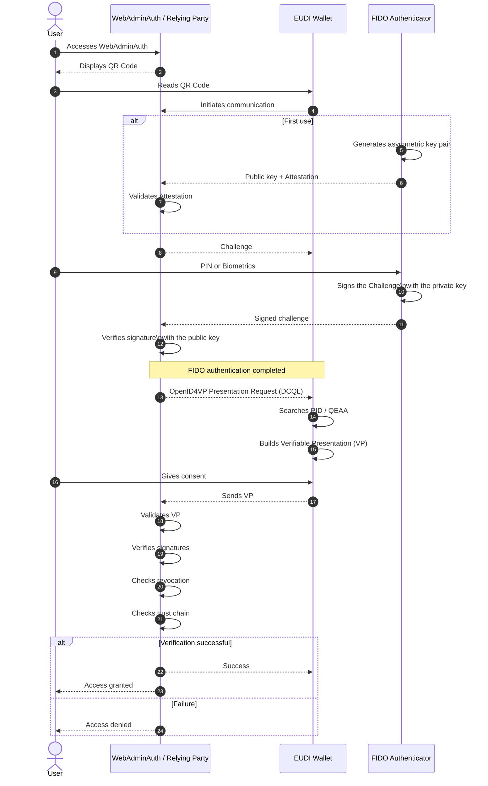
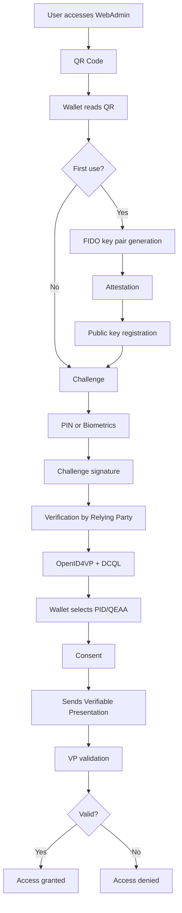

# DC API - Credential Presentation Flow (First Use)

## 1. The user accesses WebAdminAuth
- The user opens the portal (Relying Party).
- The portal displays a QR Code.

## 2. The Wallet reads the QR Code
- The Wallet reads the QR Code.
- The QR Code contains a Deep Link (openid4vp:// or another scheme defined by the implementation).
- The Wallet initiates communication with the Relying Party.

## 3. FIDO registration (if it is the first use)
- If no FIDO credential is registered for that service:
    - The FIDO authenticator generates a new asymmetric key pair.
    - The private key remains protected on the device.
    - The public key is sent to the Relying Party during registration.

## 4. FIDO attestation
- The authenticator sends an attestation.
- The attestation proves the key was created by a valid authenticator.
- The Relying Party validates that attestation.

## 5. FIDO challenge
- The Relying Party generates a random challenge.
- The challenge is sent to the Wallet.

## 6. Authentication
- The user authenticates locally (PIN or biometrics).
- The authenticator signs the challenge using the private key.
- The signature is sent to the Relying Party.

## 7. Verification
- The Relying Party verifies the signature using the registered public key.
- If authentication is valid, the credential request begins.

## 8. Credential request (DC API + OpenID4VP)
- The Relying Party sends a request using:
    - Digital Credentials API (DC API)
    - OpenID4VP
    - DCQL (Digital Credentials Query Language)

## 9. Credential selection
- The Wallet searches for the requested credentials (PID, QEAA, etc.).
- The Wallet builds a Verifiable Presentation (VP).

## 10. Consent
- The user reviews the credentials to be shared.
- The user gives their consent.

## 11. Sending the Verifiable Presentation
- The Wallet sends the VP to the Relying Party.

## 12. Validation
The Relying Party verifies:
- The VP signature;
- Credential signatures;
- Revocation status;
- Temporal validity;
- Issuer trust chain.

## 13. Result
- If all verifications succeed, authentication is completed.
- The user gains access to the service.

# Sequence Diagram

