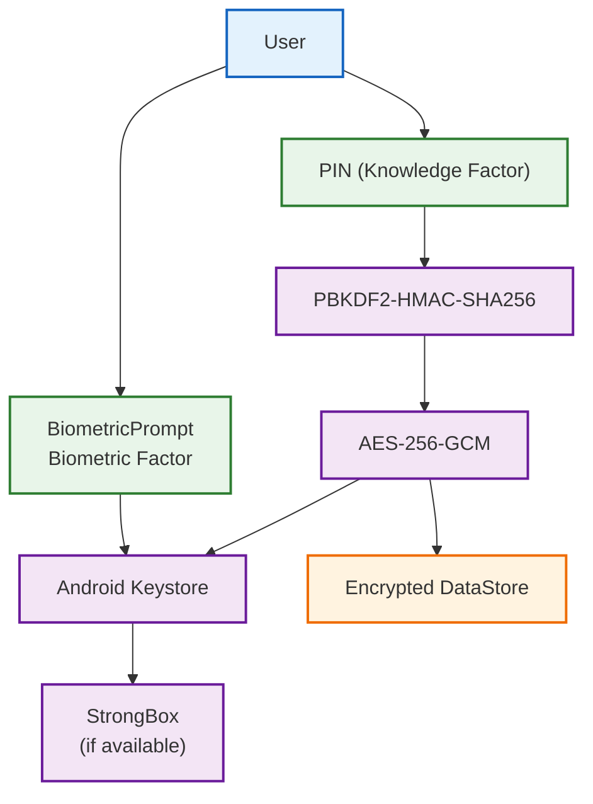
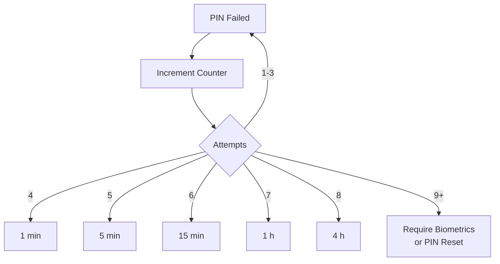
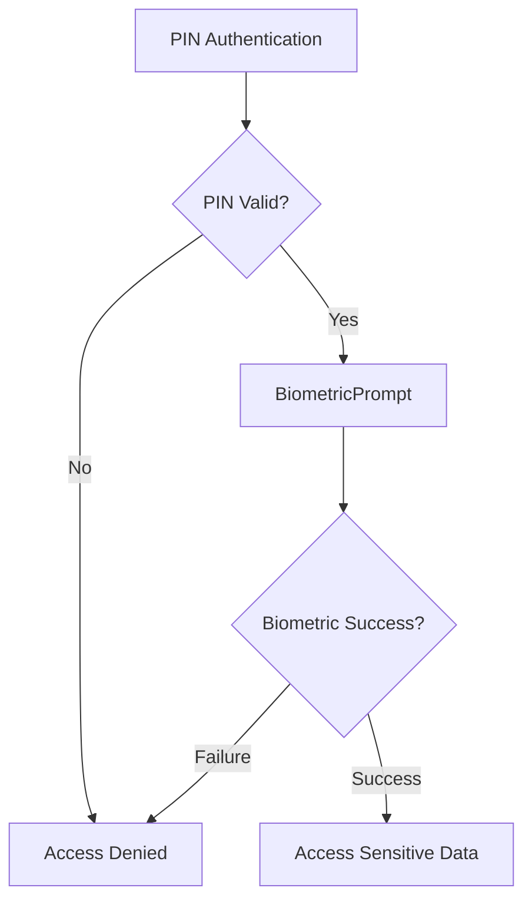
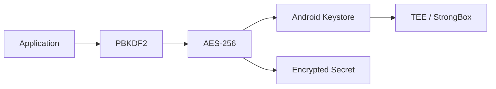
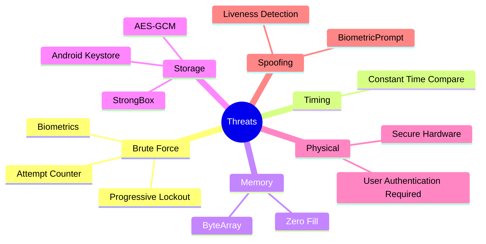
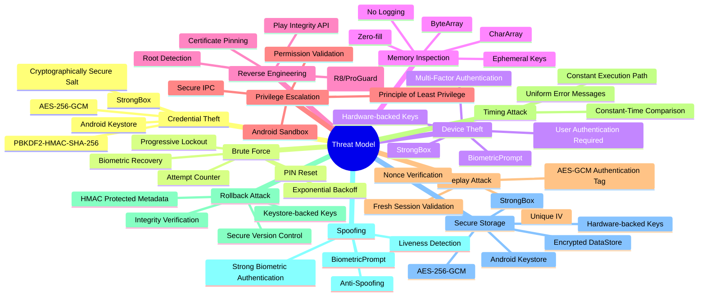

# Security Architecture - MFA and Storage

##  Android Security Architecture

The security architecture relies on the following Android security components:

- **BiometricPrompt API** – Provides secure biometric authentication using fingerprint, face recognition, or other supported biometric modalities.
- **Jetpack DataStore** (or **EncryptedSharedPreferences** for legacy compatibility) – Securely stores application metadata and non-sensitive encrypted configuration data.
- **Android Keystore System** – Generates, stores, and protects cryptographic keys within secure hardware whenever available (Trusted Execution Environment or StrongBox).

### Multi-Factor Authentication (MFA)

The application implements a **Multi-Factor Authentication (MFA)** scheme combining two independent authentication factors:

- **8-digit Numeric PIN** – *Something the user knows.*
- **Biometric Authentication** – *Something the user is.*

This layered authentication model significantly improves resistance against unauthorized access by requiring both knowledge-based and biometric verification for sensitive operations.

#### Pin

The PIN authentication process consists of the following stages:
1. **User enters the 8-digit PIN.**
2. **The PIN is processed using PBKDF2-HMAC-SHA-256 together with the previously generated cryptographic salt.**
3. **A cryptographic key is re-derived using the original derivation parameters.**
4. **The derived key is used to perform a cryptographic validation through AES-256-GCM.**
5. **If required, biometric authentication is requested using the BiometricPrompt API.**
6. **Upon successful validation, access to protected resources is granted.**
7. **Security controls are applied, including brute-force protection, integrity verification and authentication logging (excluding sensitive information).**

```mermaid
flowchart LR

    classDef input fill:#E3F2FD,stroke:#1565C0,stroke-width:2px,color:#000
    classDef stage fill:#E8F5E9,stroke:#2E7D32,stroke-width:2px,color:#000
    classDef decision fill:#FFF3E0,stroke:#E65100,stroke-width:2px,color:#000
    classDef output fill:#F3E5F5,stroke:#6A1B9A,stroke-width:2px,color:#000
    classDef noteNode fill:#F5F5F5,stroke:#9E9E9E,stroke-width:1px,stroke-dasharray: 5 5,color:#333


    subgraph ColunaEsquerda [ ]
        direction TB
  
        subgraph UI [UI Layer]
            direction TB
            InputPIN["User enters 6-8 digit PIN"]:::input
            SanitizePIN["Validate format & length<br>(only digits, 6-8 chars)"]:::stage
        end

        subgraph Security [Security Layer]
            direction TB
            RetrieveSalt["Retrieve stored Salt<br>(from credential enrollment)"]:::stage
            PBKDF2Derive["Derive key using PBKDF2-HMAC-SHA256<br>(100,000+ iterations, 256-bit)"]:::stage
            CreateCipher["Create Cipher (AES-256/GCM/NoPadding)"]:::stage
        end
    end

    style ColunaEsquerda fill:none,stroke:none


    subgraph ColunaDireita [ ]
        direction TB

        subgraph Auth [Authentication Layer]
            direction TB
            CryptoOperation["Attempt Cryptographic Operation<br>(Decrypt Data)"]:::output
            ValidateTag["Evaluate Auth Tag<br>(Implicit PIN Validation)"]:::decision
        end
    end

    style ColunaDireita fill:none,stroke:none


    InputPIN --> SanitizePIN
    SanitizePIN -- "Valid PIN" --> RetrieveSalt
    RetrieveSalt -- "Salt retrieved" --> PBKDF2Derive
    PBKDF2Derive -- "Derived key ready" --> CreateCipher
  

    CreateCipher -- "Cipher initialized" --> CryptoOperation
    CryptoOperation -- "Execute Operation" --> ValidateTag


    N_PBKDF2["<div style='text-align:left'>• PBKDF2 iteration count must align with current standards<br>• Extracted Salt must exactly match the enrollment phase<br>• Output vector utilized directly as AES-256 key<br>• The derived key is strictly volatile</div>"]:::noteNode
  
    N_Cipher["<div style='text-align:left'>• Algorithm: AES-256-GCM<br>• Authenticated encryption protocol<br>• Requires the specific IV generated during encryption</div>"]:::noteNode
  
    N_Tag["<div style='text-align:left'>• Verification relies purely on the AES-GCM Auth Tag<br>• Matching tag confirms the PIN accuracy inherently<br>• Eliminates the requirement for a separate verifier hash</div>"]:::noteNode

    PBKDF2Derive -.- N_PBKDF2
    CreateCipher -.- N_Cipher
    ValidateTag -.- N_Tag
```

## PIN Characteristics

- **8-digit numeric PIN** (10⁸ possible combinations)
- **Approximately 26.6 bits of maximum entropy**, requiring additional cryptographic and operational security controls

### Key Derivation Process

1. **Cryptographically secure salt** (minimum 16 bytes / 128 bits)
2. **PBKDF2-HMAC-SHA-256** configured with:
    - **100,000 iterations**
    - **256-bit derived key**
3. **The derived key is never stored in plaintext**
4. **The derived key is used to access cryptographic material protected by the Android Keystore System**

The device implements a **Multi-Factor Authentication (MFA)** scheme combining a numeric PIN (*something the user knows*) and biometric authentication (*something the user is*). The authentication PIN consists of eight decimal digits, providing **10⁸ possible combinations**, corresponding to approximately **26.6 bits of maximum entropy**. Because this entropy is significantly lower than that of a strong alphanumeric password, the security architecture compensates through layered cryptographic and operational controls that increase the computational cost of guessing attacks while reducing the exploitation window in the event of device compromise.

During PIN enrollment, a cryptographically secure random **salt** of at least **16 bytes (128 bits)** is generated. This salt is combined with the user's PIN and processed using the **PBKDF2-HMAC-SHA-256** password-based key derivation function configured with **100,000 iterations** to generate a **256-bit derived key**. The output of PBKDF2 is never stored in plaintext or persisted as a credential. Instead, it is used transiently to perform cryptographic operations involving a symmetric key managed by the **Android Keystore System**, preferably protected by **StrongBox** or the **Trusted Execution Environment (TEE)** whenever hardware-backed security is available. Any encrypted authentication metadata or protected application secrets are securely stored using **Jetpack DataStore** (or **EncryptedSharedPreferences** for legacy implementations).

During authentication, the application retrieves the original salt and performs the key derivation process again using the user-supplied PIN and the exact parameters defined during enrollment. Authentication succeeds only if the derived key can successfully perform the expected cryptographic operation, such as validating the **AES-256-GCM Authentication Tag**. This design eliminates the need to store a password verifier or hash while preventing offline credential recovery from persisted application data.

To mitigate brute-force attacks and other local threats, the authentication subsystem incorporates multiple defensive mechanisms, including persistent failed-attempt counters, progressive lockout policies, secure storage of authentication metadata, and mandatory biometric authentication for sensitive operations. The failed-attempt counter is preserved across application restarts and device reboots, preventing trivial bypass of lockout restrictions.

PIN management is performed through a secure update procedure requiring successful verification of the current PIN before allowing credential changes. Whenever the PIN is modified, all dependent cryptographic material is re-derived and associated encryption keys are rotated, ensuring that obsolete keys become permanently unusable.

From a secure memory management perspective, sensitive values such as PINs, cryptographic salts, initialization vectors (IVs), derived keys, and intermediate secrets are never written to application logs or diagnostic output. Instead of immutable `String` objects, mutable structures such as `ByteArray` and `CharArray` are used whenever possible. Immediately after use, these buffers are overwritten using zero-fill techniques to minimize the exposure window within the managed heap and reduce the risk of memory disclosure attacks.

Overall, the authentication architecture preserves user convenience by employing an eight-digit numeric PIN while maintaining a high level of security through computationally expensive key derivation, hardware-backed cryptographic protection provided by the Android Keystore, secure key lifecycle management, biometric verification, and operational controls specifically designed to prevent, detect, and limit unauthorized authentication attempts.

---

## Security Mechanisms

The PIN authentication mechanism incorporates multiple layers of protection to ensure confidentiality, integrity, and resistance against common attack vectors.

- **Key re-derivation using identical cryptographic parameters**
- **Constant-time authentication validation**
- **Protection against timing attacks**
- **No direct storage or comparison of user credentials**
- **Hardware-backed key protection through Android Keystore**
- **PBKDF2-HMAC-SHA-256 key derivation**
- **AES-256-GCM authenticated encryption**
- **Progressive brute-force protection**
- **Persistent failed-attempt counter**
- **Automatic cryptographic key rotation after PIN updates**
- **Secure memory handling using ByteArray and CharArray**
- **Zero-fill of sensitive buffers after use**
- **No logging of cryptographic secrets or authentication material**

---

# Biometric Authentication

## Biometric Authentication Mechanism

The biometric authentication subsystem provides the second authentication factor within the Multi-Factor Authentication (MFA) architecture. Rather than implementing biometric recognition directly, the application delegates biometric verification to the Android operating system through the **BiometricPrompt API**, ensuring compliance with the Android Security Model and allowing authentication to benefit from hardware-backed security features provided by the device manufacturer.

The biometric subsystem incorporates the following security mechanisms:

- **BiometricPrompt API**
- **BiometricPrompt.CryptoObject** for cryptographic authentication
- **Android Keystore integration**
- **StrongBox hardware-backed key protection (when available)**
- **Trusted Execution Environment (TEE) support**
- **Liveness Detection** (device-dependent)
- **Anti-Spoofing Protection**
- **Hardware-backed biometric verification**

Biometric authentication does not expose or process raw biometric data within the application. Instead, biometric templates remain exclusively under the control of the Android operating system and secure hardware. Upon successful user verification, the operating system authorizes access to cryptographic keys protected by the Android Keystore, enabling sensitive cryptographic operations without revealing biometric information to the application.

Whenever supported by the underlying biometric hardware, the authentication process incorporates **liveness detection** and **anti-spoofing mechanisms** capable of identifying presentation attacks involving photographs, videos, masks, or artificial biometric artifacts. This significantly reduces the likelihood of successful biometric impersonation attacks.

Hardware-backed key protection through **StrongBox** or the **Trusted Execution Environment (TEE)** further strengthens the security architecture by preventing cryptographic key extraction, even if the operating system is partially compromised. Sensitive operations requiring access to protected application data are executed only after successful biometric authentication, ensuring that cryptographic material remains inaccessible to unauthorized users.

By combining PIN-based authentication with hardware-backed biometric verification, the system provides a robust Multi-Factor Authentication architecture that balances usability with strong resistance against credential theft, brute-force attacks, device compromise, and biometric spoofing.

```mermaid
flowchart LR
    classDef input fill:#E3F2FD,stroke:#1565C0,stroke-width:2px,color:#000
    classDef stage fill:#E8F5E9,stroke:#2E7D32,stroke-width:2px,color:#000
    classDef decision fill:#FFF3E0,stroke:#E65100,stroke-width:2px,color:#000
    classDef output fill:#F3E5F5,stroke:#6A1B9A,stroke-width:2px,color:#000
    classDef noteNode fill:#F5F5F5,stroke:#9E9E9E,stroke-width:1px,stroke-dasharray: 5 5,color:#333

    subgraph ColunaEsquerda [ ]
        direction TB
  
        subgraph UI [UI Layer]
            direction TB
            InputPIN["User enters 6-8 digit PIN"]:::input
            SanitizePIN["Validate format & length<br>(only digits, 6-8 chars)"]:::stage
            InputPIN --> SanitizePIN
        end

        subgraph Security [Security Layer]
            direction TB
            RetrieveSalt["Retrieve stored Salt<br>(from credential enrollment)"]:::stage
            PBKDF2Derive["Derive key using PBKDF2-HMAC-SHA256<br>(100,000+ iterations, 256-bit)"]:::stage
            CreateCipher["Create Cipher (AES-256/GCM/NoPadding)"]:::stage
      
  
            N_PBKDF2["<div style='text-align:left; font-size:12px;'>• PBKDF2 iteration count must align with current standards<br>• Extracted Salt must exactly match the enrollment phase<br>• Output vector utilized directly as AES-256 key<br>• The derived key is strictly volatile</div>"]:::noteNode
            N_Cipher["<div style='text-align:left; font-size:12px;'>• Algorithm: AES-256-GCM<br>• Authenticated encryption protocol<br>• Requires the specific IV generated during encryption</div>"]:::noteNode
 
            RetrieveSalt -- "Salt retrieved" --> PBKDF2Derive
            PBKDF2Derive -- "Derived key ready" --> CreateCipher
      
            PBKDF2Derive -.- N_PBKDF2
            CreateCipher -.- N_Cipher
        end
    end
    style ColunaEsquerda fill:none,stroke:none
    subgraph ColunaDireita [ ]
        direction TB

        subgraph Auth [Authentication Layer]
            direction TB
            CryptoOperation["Attempt Cryptographic Operation<br>(Decrypt Data)"]:::output
            ValidateTag["Evaluate Auth Tag<br>(Implicit PIN Validation)"]:::decision
      
            N_Tag["<div style='text-align:left; font-size:12px;'>• Verification relies purely on the AES-GCM Auth Tag<br>• Matching tag confirms the PIN accuracy inherently<br>• Eliminates the requirement for a separate verifier hash</div>"]:::noteNode
      
  
            CryptoOperation -- "Execute Operation" --> ValidateTag
            ValidateTag -.- N_Tag
        end
    end
    style ColunaDireita fill:none,stroke:none

    SanitizePIN -- "Valid PIN" --> RetrieveSalt
    CreateCipher -- "Cipher initialized" --> CryptoOperation
```

## Security Policies

The biometric authentication subsystem enforces a comprehensive set of security policies designed to protect sensitive operations, limit unauthorized authentication attempts, and mitigate both local and physical attacks against the application.

The implemented security policies include:

- **Mandatory biometric authentication for security-critical operations**
- **Maximum of three consecutive biometric authentication failures before temporary lockout**
- **Progressive lockout periods following repeated authentication failures**
- **Automatic detection and mitigation of brute-force attacks**
- **Hardware-backed cryptographic key access through the Android Keystore**
- **User authentication required before protected cryptographic operations**
- **Biometric recovery for legitimate users during temporary lockout**
- **Persistent tracking of failed authentication attempts**

Biometric authentication serves as the second factor within the Multi-Factor Authentication (MFA) architecture by verifying unique physiological characteristics of the legitimate user. The application delegates all biometric verification to the Android operating system through the **BiometricPrompt API**, ensuring compliance with the Android Security Model while benefiting from hardware-backed security features provided by the device manufacturer.

Whenever supported by the underlying hardware, biometric verification incorporates **liveness detection** and **anti-spoofing mechanisms** capable of identifying presentation attacks involving photographs, videos, masks, or artificial biometric artifacts. The application never accesses or stores raw biometric information, as biometric templates remain exclusively managed by the Android operating system.

The authentication process uses **BiometricPrompt** together with **BiometricPrompt.CryptoObject**, allowing cryptographic operations to proceed only after successful biometric verification. Cryptographic keys remain protected by the **Android Keystore System** and, whenever available, by hardware-backed security modules such as **StrongBox** or the **Trusted Execution Environment (TEE)**.

All security-sensitive operations—including access to confidential information, cryptographic key usage, credential modification, and authentication recovery—require successful biometric authentication before execution.

To reduce the effectiveness of brute-force attacks, the application limits the number of consecutive failed biometric authentication attempts. After three unsuccessful attempts, progressively longer lockout periods are enforced, significantly increasing the computational and temporal cost of repeated guessing attacks while preserving usability for legitimate users.

---

# Attack Resistance

The authentication architecture incorporates multiple defensive layers that collectively provide resilience against the most common attack vectors targeting mobile authentication systems.

| Attack Vector | Mitigation Strategy |
|----------------|---------------------|
| **Brute Force Attacks** | Progressive lockout, persistent failed-attempt counter, biometric recovery, mandatory PIN reset after critical failures |
| **Timing Attacks** | Constant-time authentication validation and AES-256-GCM Authentication Tag verification |
| **Memory Inspection** | Secure memory handling using `ByteArray` and `CharArray`, zero-fill of sensitive buffers, no sensitive logging |
| **Credential Theft** | PBKDF2-HMAC-SHA-256, cryptographically secure salt, Android Keystore, AES-256-GCM |
| **Secure Storage Compromise** | Android Keystore, StrongBox, Trusted Execution Environment (TEE), authenticated encryption |
| **Biometric Spoofing** | BiometricPrompt, liveness detection, anti-spoofing mechanisms, hardware-backed biometric verification |
| **Device Theft** | Multi-Factor Authentication, hardware-backed cryptographic keys, mandatory biometric authentication |
| **Replay Attacks** | AES-256-GCM Authentication Tag, unique Initialization Vectors (IVs), cryptographic integrity verification |
| **Rollback Attacks** | HMAC-protected authentication metadata, integrity verification, secure persistent storage |
| **Privilege Escalation** | Principle of Least Privilege, Android Sandbox, permission validation, secure IPC |
| **Reverse Engineering** | R8/ProGuard code obfuscation, Play Integrity API, root detection, runtime integrity verification |

---

# Implementation Recommendations

The following recommendations strengthen the overall security posture of the authentication subsystem and align with Android security best practices.

1. **Use StrongBox hardware-backed cryptographic keys whenever supported by the target device.**
2. **Implement a persistent failed-attempt counter protected by the Android Keystore.**
3. **Apply progressive lockout policies to mitigate brute-force attacks.**
4. **Overwrite sensitive memory buffers using zero-fill immediately after use.**
5. **Avoid logging any authentication secrets, cryptographic keys, salts, initialization vectors, or derived values.**
6. **Protect cryptographic operations using AES-256-GCM authenticated encryption.**
7. **Use `SystemClock.elapsedRealtime()` when enforcing authentication lockout periods.**
8. **Protect persistent authentication metadata using HMAC integrity verification.**
9. **Rotate cryptographic keys whenever the user's PIN is changed.**
10. **Perform regular security testing, including penetration testing, biometric spoofing evaluation, and cryptographic validation.**
11. **Keep Android security patches and application dependencies updated.**
12. **Continuously verify compliance with Android Security Best Practices and OWASP Mobile Application Security recommendations.**

---

# Brute-Force Protection

## Progressive Lockout Policy

To mitigate exhaustive PIN guessing attacks, the application implements a progressive authentication lockout mechanism that significantly increases the time required for repeated authentication attempts.

The failed-attempt counter is maintained securely and persists across application restarts and device reboots. The counter is reset only after successful authentication using either the correct PIN or a valid biometric verification.

### Progressive Lockout Schedule

| Consecutive Failed Attempts | Lockout Duration |
|-----------------------------|------------------|
| **1–3** | No lockout (authentication allowed) |
| **4** | 1 minute |
| **5** | 5 minutes |
| **6** | 15 minutes |
| **7** | 1 hour |
| **8** | 4 hours |
| **9 or more** | Authentication disabled until successful biometric verification or mandatory PIN reset |

The progressive increase in lockout duration substantially reduces the feasibility of online brute-force attacks while maintaining reasonable usability for legitimate users.

Following a successful authentication using either the correct PIN or biometric verification, the failed-attempt counter is immediately reset and the user regains normal access to the authentication system.

## Hardening the Lockout Mechanism Against Tampering

To prevent attackers from bypassing the brute-force protection mechanism through local manipulation of authentication metadata, the lockout subsystem incorporates several layers of protection. These measures ensure the confidentiality, integrity, and persistence of the lockout state while maintaining resilience against device compromise and unauthorized modification.

### Secure Storage of Lockout State

The lockout state—including the number of consecutive failed authentication attempts and the timestamp indicating when authentication may resume—should be securely stored using **Jetpack DataStore** protected by the **Android Keystore System**.

Alternatively, the application may use a hardware-backed symmetric key generated within the Android Keystore to encrypt or authenticate the lockout metadata. On devices running **Android API Level 28 or later**, the Keystore can enforce additional constraints, such as requiring recent user authentication before cryptographic operations are permitted.

Sensitive authentication metadata should **never** be stored in plaintext `SharedPreferences`, unencrypted files, external storage, or any location accessible to other applications.

---

### Tamper-Resistant Time Measurement

Authentication lockout intervals should be calculated using `SystemClock.elapsedRealtime()`, which measures the elapsed time since the device booted.

Unlike the system clock, this timer is monotonic and cannot be manipulated by manually changing the device date or time, making it suitable for enforcing secure authentication lockout periods.

For additional protection against clock manipulation attacks, the application may compare `SystemClock.elapsedRealtime()` with `System.currentTimeMillis()`. Significant discrepancies between both time sources may indicate intentional tampering with the system clock and should trigger additional security checks.

---

### Atomicity and Integrity Protection

Updates to the failed-attempt counter must be performed atomically to prevent race conditions and inconsistent authentication states.

Before incrementing the counter, the application should always retrieve and validate the currently stored value, ensuring that concurrent authentication attempts cannot corrupt the authentication state.

To further protect persistent authentication metadata from external modification, an **HMAC (Hash-based Message Authentication Code)** should be computed over the failed-attempt counter and lockout timestamp using a cryptographic key generated and protected by the **Android Keystore System**.

Before using any persisted authentication metadata, the application should verify its integrity by recomputing the HMAC. Any verification failure must be treated as evidence of possible tampering, causing the authentication process to terminate and optionally requiring complete user re-authentication or regeneration of the authentication state.

---

### Biometric Recovery Mechanism

During temporary lockout periods, legitimate users should be allowed to regain access through successful biometric authentication using the **BiometricPrompt API**.

A successful biometric verification immediately resets the failed-attempt counter, removes the active lockout period, and restores normal authentication functionality without requiring the user to wait for the remaining lockout duration.

After a predefined number of consecutive authentication failures (for example, **nine failed PIN attempts**), the application may require mandatory biometric authentication before permitting any further authentication attempts. Alternatively, the application may enforce a complete PIN reset, ensuring that compromised credentials cannot continue to be exploited.

This recovery mechanism preserves usability for legitimate users while maintaining strong protection against online brute-force attacks.

---

### Protection Against Device Reboots and Recovery Modes

The lockout state must persist across application restarts and device reboots to prevent attackers from bypassing brute-force protections simply by restarting the device.

Consequently, the failed-attempt counter, lockout expiration timestamp, and all associated authentication metadata should be restored immediately during application initialization before processing any authentication request.

If the application detects that the device is operating in **Safe Mode** or another restricted execution environment that may weaken application security guarantees, authentication should either be denied or require an additional biometric verification before granting access to protected resources.

These measures ensure that authentication policies remain consistently enforced regardless of device reboot, execution environment, or attempted recovery-mode attacks.

---

## Security Benefits

The proposed architecture provides multiple layers of protection against local tampering and authentication bypass attempts, including:

- **Encrypted persistence of lockout metadata**
- **Hardware-backed cryptographic key protection through the Android Keystore**
- **StrongBox support whenever available**
- **Tamper detection using HMAC-protected authentication metadata**
- **Monotonic time measurement using `SystemClock.elapsedRealtime()`**
- **Protection against system clock manipulation**
- **Atomic updates preventing race conditions**
- **Persistent failed-attempt counters surviving device reboots**
- **Biometric recovery for legitimate users**
- **Mandatory biometric verification or PIN reset after repeated failures**
- **Protection against reboot-based and Safe Mode bypass attacks**

Together, these mechanisms significantly increase the difficulty of bypassing brute-force protection while ensuring that authentication metadata remains confidential, tamper-resistant, and consistently enforced throughout the application lifecycle.

### MFA

### Android Keystore

#### Threat Model

The application security architecture has been designed following a defense-in-depth strategy to mitigate the most relevant threats affecting local authentication, cryptographic key management, secure storage, and biometric verification. The implementation combines cryptographic controls, hardware-backed security, secure coding practices, and operational safeguards to reduce the attack surface while preserving usability.

- Credential Theft
- Memory Inspection
- Reverse Engineering
- Device Theft
- Brute Force
- Spoofing
- Privilege Escalation
- Replay Attack
- Timing Attack
- Rollback Attack

---

## Brute Force Attacks

The 8-digit PIN is protected through a progressive lockout mechanism that significantly increases the computational and temporal cost of exhaustive guessing attacks.

The authentication system maintains a persistent counter of consecutive failed authentication attempts. Following a predefined number of failures, progressively longer lockout periods are enforced, ultimately requiring biometric authentication or PIN reset after a critical threshold has been reached.

The failed-attempt counter is reset only after a successful authentication, preventing attackers from bypassing the protection through intermittent successful attempts.

Lockout metadata, including the failed-attempt counter and the next unlock timestamp, are securely stored using encrypted application storage protected by the Android Keystore. Whenever possible, the integrity of these values is additionally verified through an HMAC generated using a hardware-backed cryptographic key.

---

## Timing Attacks

PIN verification is performed by re-deriving the cryptographic key using the exact parameters employed during the enrollment phase.

Authentication relies on constant-time cryptographic validation, eliminating execution-time differences that could reveal information about the entered PIN.

When AES-256-GCM is employed, authentication is implicitly verified through validation of the Authentication Tag. Since the authentication tag confirms both confidentiality and integrity, the system does not require storing a separate password hash or verifier, reducing the attack surface against offline attacks.

---

## Memory Inspection Attacks

Sensitive information is retained in memory only for the minimum duration required to complete authentication.

PIN values, cryptographic keys and intermediate secrets are processed using mutable memory structures such as `ByteArray` and `CharArray`, avoiding immutable `String` objects that remain in memory until garbage collection.

Immediately after use, sensitive buffers are overwritten using zero-fill techniques, reducing the likelihood of credential recovery through memory inspection, heap analysis or memory dump attacks.

No sensitive values, including PINs, salts, initialization vectors, cryptographic keys or derived secrets, are written to application logs.

---

## Credential Theft

User credentials are never stored in plaintext.

The PIN serves exclusively as input to the PBKDF2-HMAC-SHA-256 key derivation function together with a cryptographically secure random salt.

The resulting derived key exists only temporarily in volatile memory and is never persisted.

Authentication is based on cryptographic verification rather than direct comparison of stored credentials, preventing credential disclosure even if encrypted application data is extracted.

---

## Secure Storage Attacks

Sensitive application data is protected using authenticated encryption based on AES-256-GCM.

Cryptographic keys are generated and managed exclusively by the Android Keystore System and, whenever available, are protected by hardware-backed security modules such as StrongBox or the Trusted Execution Environment (TEE).

Since private cryptographic material never leaves the secure hardware boundary, key extraction remains infeasible even on partially compromised devices.

Application metadata is stored using encrypted storage mechanisms, ensuring confidentiality and integrity of persisted information.

---

## Biometric Spoofing Attacks

Biometric authentication is implemented using the Android BiometricPrompt API, which delegates biometric verification to the operating system.

Whenever supported by the underlying biometric hardware, the authentication process incorporates liveness detection and anti-spoofing mechanisms capable of identifying presentation attacks using photographs, videos or artificial biometric artifacts.

Sensitive operations require successful biometric authentication before cryptographic keys become accessible.

---

## Device Theft

The application assumes that physical access to a device does not imply authorization.

Access to protected resources requires successful multi-factor authentication composed of a knowledge factor (PIN) and a biometric factor.

Even if an attacker gains physical possession of the device, encrypted data remains inaccessible without successful user authentication and access to hardware-protected cryptographic keys.

Whenever available, hardware-backed key storage through StrongBox provides additional resistance against hardware extraction attacks.

---

## Reverse Engineering

The application mitigates reverse engineering attempts through multiple software protection mechanisms.

Application code should be obfuscated using R8 or ProGuard to complicate static analysis and reduce the exposure of implementation details.

Additional protections such as Play Integrity API, root detection and runtime integrity verification may be employed to identify compromised execution environments.

Critical cryptographic operations remain delegated to the Android Keystore, minimizing the amount of security-sensitive logic exposed within the application code.

---

## Privilege Escalation

The application follows the Principle of Least Privilege.

Only the minimum Android permissions required for application functionality are requested.

Sensitive operations are protected through explicit authorization checks, secure inter-process communication mechanisms and Android application sandbox isolation.

Cryptographic operations requiring protected keys remain inaccessible unless the required authentication policy has been satisfied.

---

## Replay Attacks

Replay attacks are mitigated through authenticated encryption using AES-256-GCM.

Each encryption operation employs a unique Initialization Vector (IV), ensuring cryptographic uniqueness and preventing ciphertext reuse.

Integrity verification performed through the Authentication Tag guarantees that modified or replayed ciphertext cannot be successfully authenticated.

Where session-based authentication is employed, fresh authentication tokens or nonces should be generated for each authentication session.

---

## Rollback Attacks

The application protects against rollback attacks by validating the integrity of authentication metadata before use.

Security-critical information such as failed-attempt counters, lockout timestamps and authentication state may be protected using HMACs generated through Android Keystore-backed cryptographic keys.

Integrity verification prevents attackers from replacing newer protected metadata with older versions in an attempt to bypass security restrictions.

---

## System Clock Manipulation

Progressive lockout intervals are calculated using `SystemClock.elapsedRealtime()`, which measures elapsed time since device boot and is unaffected by manual modifications of the system clock.

Optionally, elapsed real time may be correlated with `System.currentTimeMillis()` to detect abnormal temporal discrepancies that could indicate attempts to manipulate system time.

---

## Application State Integrity

Security-critical application state, including authentication status, failed-attempt counters and lockout metadata, is securely restored during application startup.

Integrity verification is performed before persisted metadata is trusted, preventing unauthorized modification of security-related state information.

Encrypted persistent storage together with hardware-backed cryptographic verification significantly reduces the risk of local tampering.

---

# Threat Mitigation Summary

| Threat | Primary Mitigation |
|----------|--------------------|
| Credential Theft | PBKDF2-HMAC-SHA-256, Cryptographically Secure Salt, Android Keystore, AES-256-GCM |
| Brute Force Attack | Progressive Lockout, Failed Attempt Counter, Biometric Recovery, PIN Reset |
| Timing Attack | Constant-Time Validation, AES-GCM Authentication Tag |
| Memory Inspection | ByteArray, CharArray, Zero-Fill, No Sensitive Logging |
| Secure Storage Compromise | Android Keystore, StrongBox, AES-256-GCM, Hardware-backed Keys |
| Device Theft | Multi-Factor Authentication, Hardware-backed Keys, BiometricPrompt |
| Reverse Engineering | R8/ProGuard, Play Integrity API, Root Detection, Runtime Integrity Verification |
| Privilege Escalation | Least Privilege Principle, Android Sandbox, Permission Validation |
| Replay Attack | AES-256-GCM, Authentication Tag, Unique Initialization Vector, Nonce Validation |
| Rollback Attack | HMAC-Protected Metadata, Integrity Verification, Secure Persistent Storage |
| Biometric Spoofing | BiometricPrompt, Liveness Detection, Anti-Spoofing Mechanisms |
| System Clock Manipulation | SystemClock.elapsedRealtime(), Lockout Integrity Verification |

---

# Complete Threat Model

| Threat Category | Description | Mitigation |
|-----------------|-------------|------------|
| Credential Theft | Unauthorized disclosure of authentication credentials | PBKDF2-HMAC-SHA-256, Secure Salt, Android Keystore |
| Brute Force | Exhaustive PIN guessing attempts | Progressive Lockout, Failed Attempt Counter |
| Timing Attack | Leakage through execution time differences | Constant-Time Validation |
| Memory Inspection | Recovery of secrets from application memory | Zero-Fill, Mutable Buffers, No Logging |
| Secure Storage Compromise | Extraction of encrypted application data | AES-256-GCM, Android Keystore, StrongBox |
| Device Theft | Physical access to the user's device | Multi-Factor Authentication, Hardware-backed Keys |
| Reverse Engineering | Static or dynamic analysis of application code | Code Obfuscation, Play Integrity API, Root Detection |
| Privilege Escalation | Unauthorized execution of privileged operations | Least Privilege, Android Sandbox, Permission Validation |
| Replay Attack | Reuse of previously captured authentication data | Unique IV, Authentication Tag, Nonce Validation |
| Rollback Attack | Restoration of outdated security metadata | Integrity Verification, HMAC, Secure Storage |
| Biometric Spoofing | Presentation attacks against biometric sensors | Liveness Detection, BiometricPrompt, Anti-Spoofing |
| System Clock Manipulation | Circumvention of authentication lockout timers | `SystemClock.elapsedRealtime()` |

