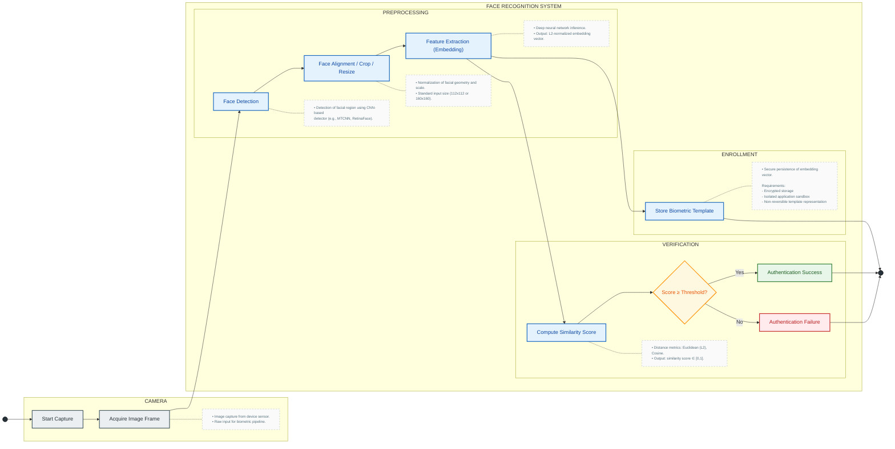

title: Driver's license
version: v1.0.0-draft
status: draft
editor: @hugofr21

# Image Processing: Segmentation and Photometric Normalization

This module describes the processing pipeline responsible for the semantic segmentation and geometric normalization of faces captured for digital identity purposes. The system adopts a modular architecture, where each stage is implemented as a sequential component, allowing scalable maintenance and independent evolution of the computer vision algorithms.

## 1. Semantic Segmentation Pipeline

The processing flow integrates the **ML Kit (Google)** library for primary facial detection, coupled with a convolutional neural network (CNN) model specialized in foreground extraction (the *Selfie Segmenter*).

* **Frame Quality Validation:** Before any heavy processing, the captured image undergoes geometric coverage heuristics and matrix calculations. This screening prevents the costly consumption of processing cycles on captures with zero technical viability.
* **Segmentation and Confidence Mask:** The CNN generates a probability matrix (confidence mask) where each pixel is evaluated regarding its probability **$P_{i}$** of belonging to the subject. Foreground preservation is governed by a strict logical constraint, using an empirical threshold of **$P_{i} \geq 0.85$** (85%). Pixels below this threshold are classified as background and purged (converted to strict white: `#FFFFFF`).

## 2. Geometric Expansion and Anatomical Framing

Following segmentation, the system expands the original bounding box to ensure the complete inclusion of the anatomical context (forehead and chin). This recalibration is vital for the quality of subsequent biometric analysis stages.

The calculation of the new boundary coordinates (**$x_{min}, y_{min}, x_{max}, y_{max}$**) is derived from the center coordinates (**$x_{center}, y_{center}$**) and the original dimensions, applying an expansion factor of 0.2 (20%):

$$
x_{min} = \max\left(0, x_{center} - \frac{width \times (1 + expansion)}{2}\right)
$$

$$
y_{min} = \max\left(0, y_{center} - \frac{height \times (1 + expansion)}{2}\right)
$$

$$
x_{max} = \min\left(image\_width, x_{center} + \frac{width \times (1 + expansion)}{2}\right)
$$

$$
y_{max} = \min\left(image\_height, y_{center} + \frac{height \times (1 + expansion)}{2}\right)
$$

## 3. Aspect Ratio Normalization and Framing

For compliance with official documentation standards (35/45 ratio), the segmented image undergoes a forced crop. This operation recalculates the spatial boundaries keeping the fiducial center **$x$** unchanged, while the **$y$** axis is translated to center the holder's head within the regulatory proportion.

## 4. Recentering and Final Composition

As a final step to ensure photometric uniformity, the system performs an absolute recentering onto a pre-allocated white canvas.

1. **Content Identification:** The algorithm scans the RGB matrix to locate the extremities of the non-white segmented content (where **$R < 240 \lor G < 240 \lor B < 240$**).
2. **Displacement Calculation:** The displacement vectors (**$\Delta x, \Delta y$**) required to align the centroid of the extracted content with the geometric center of the target canvas are determined:

$$
\Delta x = \frac{canvas\_width}{2} - \frac{x_{min} + x_{max}}{2}
$$

$$
\Delta y = \frac{canvas\_height}{2} - \frac{y_{min} + y_{max}}{2}
$$

The application of these displacements results in a standardized final image, with a purely white background and the holder's face perfectly centered. This approach guarantees robustness against lighting variations and complex backgrounds, maximizing the accuracy of the biometric data required for the issuance of secure verifiable credentials.