# Technical Documentation: Image Processing and Biometric Authentication Pipeline

This document describes the architecture of the *pipeline* responsible for face detection, semantic segmentation, geometric normalization, and biometric authentication for digital identity systems in an Android environment. The system adopts a sequential modular architecture, mitigating computational overhead through early validation heuristics and delegating intensive processing to convolutional neural network (CNN) models optimized for mobile devices (ML Kit and TensorFlow Lite).

## 1. Facial Detection and Frame Quality Assessment

The processing flow is initiated with the Google ML Kit (Face Detection) library, responsible for locating the face (generation of the initial  *bounding box* ).

Before deep inference, the *frame* undergoes a Frame Quality Assessment. This stage applies geometric and photometric heuristics (analysis of luminosity, sharpness, and spatial occupation ratio). *Frames* that do not meet the minimum technical viability thresholds are iteratively discarded, optimizing the device's energy and computational consumption.

## 2. Semantic Segmentation and Binarization

The extraction of the *foreground* (face and upper torso) is executed via the ML Kit Selfie Segmenter. This model generates a probability matrix where each pixel **$i$** is quantified by its probability **$P_{i}$** of belonging to the *foreground* class.

The binarization of the mask is governed by a strict confidence threshold of  **$85\%$** . The pixel mapping function **$f(P_{i})$** is defined as:

$$
f(P_{i})=\begin{cases}\text{Original Pixel},&\text{if }P_{i}\geq0.85\\\#FFFFFF\text{ (Pure White)},&\text{if }P_{i}<0.85\end{cases}
$$

## 3. Geometric Expansion and Ratio Normalization

To ensure the inclusion of vital anatomical context (frontal and chin regions), the original *bounding box* detected in Step 1 undergoes a geometric dilation of **$20\%$** ( **$\epsilon=0.2$** ). The new spatial coordinates ( **$x_{min},y_{min},x_{max},y_{max}$** ) are calculated around the centroid ( **$x_{center},y_{center}$** ) of the detected face:

$$
x_{min}=\max\left(0,x_{center}-\frac{width\times(1+\epsilon)}{2}\right)
$$

$$
y_{min}=\max\left(0,y_{center}-\frac{height\times(1+\epsilon)}{2}\right)
$$

$$
x_{max}=\min\left(W_{img},x_{center}+\frac{width\times(1+\epsilon)}{2}\right)
$$

$$
y_{max}=\min\left(H_{img},y_{center}+\frac{height\times(1+\epsilon)}{2}\right)
$$

After expansion, the image undergoes a forced *crop* to comply with the normative identification documentation standard (35:45 proportion, or ratio  **$\approx0.777$** ).

## 4. Recentering and Final Composition

Photometric and spatial stability is guaranteed by realigning the segmented subject onto a pre-allocated white  *canvas* .

**Content Bounding Box Identification:** The algorithm scans the RGB matrix resulting from the segmentation to determine the true limits of the subject, ignoring background pixels. Any pixel where the RGB value meets the empirical tolerance condition for compression artifacts is considered valid content:  **$R<240\lor G<240\lor B<240$** .

**Translation Vector:** Perfect alignment requires calculating the spatial displacement vectors ( **$\Delta x,\Delta y$** ) to align the centroid of the segmented content with the centroid of the destination  *canvas* :

$$
\Delta x=\frac{W_{canvas}}{2}-\frac{x_{min}+x_{max}}{2}
$$

$$
\Delta y=\frac{H_{canvas}}{2}-\frac{y_{min}+y_{max}}{2}
$$

The final generated matrix is geometrically and radiometrically normalized for the biometric abstraction phase.

## 5. Embedding Extraction and Biometric Similarity

The processed image serves as *input* for the TensorFlow Lite (TFLite) inference engine. The underlying model is based on a lightweight convolutional architecture, MobileNet (optimized for Android devices).

**Feature Extraction:** The CNN (MobileNet) acts as a facial topology extractor, transforming the two-dimensional image (pixel matrix) into a high-dimensionality Euclidean vector space. The result is a dense vector (facial  *embedding* )  **$\vec{v}$** .

**Biometric Comparison:** Authentication is determined by measuring the angular distance between the captured *embedding* ( **$\vec{A}$** ) and the template *embedding* stored in the digital credential ( **$\vec{B}$** ). The algorithm utilizes Cosine Similarity ( **$S_{C}$** ):

$$
S_{C}(\vec{A},\vec{B})=\frac{\vec{A}\cdot\vec{B}}{\|\vec{A}\|\|\vec{B}\|}=\frac{\sum_{i=1}^{n}A_{i}B_{i}}{\sqrt{\sum_{i=1}^{n}A_{i}^2}\sqrt{\sum_{i=1}^{n}B_{i}^2}}
$$

The resulting scalar value **$S_{C}\in[-1,1]$** is compared against an acceptance threshold. If  **$S_{C}\geq threshold$** , the identity is confirmed.

## 6. Sequential Pipeline Architecture

1. **Face Detection:** ML Kit locates the primary spatial coordinates of the face.
2. **Frame Quality Assessment:** Heuristic evaluation of capture viability.
3. **Active Liveness Detection:** *Anti-spoofing* mechanism to validate the user's physical presence, executed early to abort fraud attempts.
4. **Semantic Segmentation:** Application of the Selfie Segmenter for *foreground/background* separation.
5. **Bounding Box Expansion:** Mathematical expansion ( **$+20\%$** ) to retain peripheral anatomical features.
6. **Crop & Aspect Ratio Normalization:** Strict framing to the 35:45 standard.
7. **Canvas Recentering:** Application of the spatial translation matrix for perfect centralization on a `#FFFFFF` background.
8. **Embedding Extraction:** TensorFlow Lite (MobileNet) converts the final normalized image into a latent biometric vector.
9. **Similarity Computation:** Calculation of the Cosine Similarity between vectors for the authentication decision.

```mermaid
flowchart LR

classDef terminal fill:#263238,color:#fff,stroke:#000,stroke-width:2px
classDef activity fill:#F9F9F9,stroke:#333,stroke-width:1.5px
classDef decision fill:#FFF8E1,stroke:#FF8F00,stroke-width:2px
classDef success fill:#E8F5E9,stroke:#2E7D32,stroke-width:2px
classDef failure fill:#FFEBEE,stroke:#C62828,stroke-width:2px

Start(( )):::terminal
Stop(( )):::terminal

subgraph Camera["IMAGE ACQUISITION"]
direction TB
Capture["Acquire Image Frame"]:::activity
Detect["Face Detection (ML Kit)"]:::activity
Quality["Frame Quality Assessment"]:::activity
Capture --> Detect --> Quality
end

subgraph Processing["IMAGE PREPROCESSING"]
direction TB
Segment["Semantic Segmentation"]:::activity
Expand["Bounding Box Expansion"]:::activity
Crop["Crop & Aspect Ratio Normalization"]:::activity
Center["Canvas Recentering"]:::activity
Segment --> Expand --> Crop --> Center
end

subgraph Liveness["ACTIVE LIVENESS DETECTION"]
direction TB
Challenge["Random Challenge Selection (3 of 5)"]:::activity
FSM["Finite State Machine"]:::activity
Validate["Challenge Validation"]:::activity
Live{"Liveness Successful?"}:::decision

Challenge --> FSM --> Validate --> Live
Live -- No --> Reject
Live -- Retry --> FSM
end

subgraph Verification["BIOMETRIC VERIFICATION"]
direction TB
Embedding["Embedding Extraction"]:::activity
Template["Stored Biometric Template"]:::activity
Similarity["Similarity Computation"]:::activity
Decision{"Similarity ≥ Threshold?"}:::decision

Embedding --> Similarity
Template --> Similarity
Similarity --> Decision
end

Accept["Verification Approved"]:::success
Reject["Verification Rejected"]:::failure

Start --> Capture
Quality --> Segment
Center --> Challenge

Live -- Yes --> Embedding

Decision -- Yes --> Accept
Decision -- No --> Reject

Accept --> Stop
Reject --> Stop
```

## 7. Rationale of the Topological Extractor (MobileNet)

### 7.1. The Foundation of MobileNet: Depthwise Separable Convolutions

What makes MobileNet ideal for Android is its replacement of standard spatial convolutions with  *Depthwise Separable Convolutions* . This technique factors the standard convolution into two distinct layers:

* **Depthwise Convolution:** Applies a single spatial filter (usually  **$3\times3$** ) to each input channel (RGB) separately.
* **Pointwise Convolution:** Applies a **$1\times1$** convolution to linearly combine the outputs of the previous step.

This factorization drastically reduces the network's number of parameters (weights) and computational cost (FLOPs), operating in real-time (low latency) without draining the mobile device's battery.

### 7.2. The Model's Role in the Biometric Pipeline

For MobileNet to serve the purpose described in Step 5 of the documentation, the model undergoes an architectural adaptation known as "Decapitation" ( *Headless CNN* ):

* **Softmax Layer Removal:** The final dense classification layer (which outputs class probabilities) is removed.
* **Latent Space Exposure:** The model now outputs the result of the final global pooling layer ( *Global Average Pooling* ). This *output* is the Biometric *Embedding* ( **$\vec{v}$** ).

**The Mathematical Transformation:**

Mathematically, MobileNet acts as a complex non-linear function **$F$** that maps an image tensor (the normalized and centered **$35\times45$** matrix generated in Step 4) to a dense vector in a Euclidean space of dimensionality **$d$** (often  **$d=128,256\text{ or }512$** ):

$$
F:\mathbb{R}^{H\times W\times C}\rightarrow\mathbb{R}^d
$$

Where:

* **$H,W$** are the spatial dimensions of the cropped image.
* **$C$** is the number of channels (usually 3 for RGB).
* **$\mathbb{R}^d$** is the latent vector space.

The pre-training of this model (typically with loss functions like *Triplet Loss* or  *ArcFace* ) ensures that images of the same person generate geometrically very close vectors in this **$\mathbb{R}^d$** space, while different people generate orthogonal or distant vectors.

### 7.3. Advantages of TensorFlow Lite Integration on Android

The transition from the trained model (TensorFlow) to Android inference (TFLite) introduces critical optimizations for the mobile ecosystem:

* **Weight Quantization:** TFLite models allow the reduction of tensor precision from Float32 to Int8 (post-training quantization). This reduces the model's physical weight (e.g., from 16MB to 4MB) and accelerates inference on ARM processors, penalizing biometric accuracy by residual margins (often  **$<1\%$** ).
* **Hardware Acceleration (Delegates):** TFLite allows routing the intensive mathematical execution of MobileNet to the smartphone's GPU, or to dedicated DSPs/NPUs via the NNAPI (Android Neural Networks API), ensuring that the calculation for extracting vector **$\vec{A}$** occurs in a few milliseconds.

### 7.4. The Similarity Flow (Where MobileNet Ends)

Once MobileNet concludes the inference and returns the *embedding*  **$\vec{A}$** , its role ends. The resulting vector is typically normalized (unit length  **$\|\vec{A}\|=1$** ) by the model itself or via post-processing.

It is this dense vector—inviolable from a reverse engineering standpoint (it is impossible to recreate the original face solely from the vector) and highly compacted—that is fed into the Cosine Similarity ( **$S_{C}$** ) equation to be compared with the stored digital credential ( **$\vec{B}$** ).
