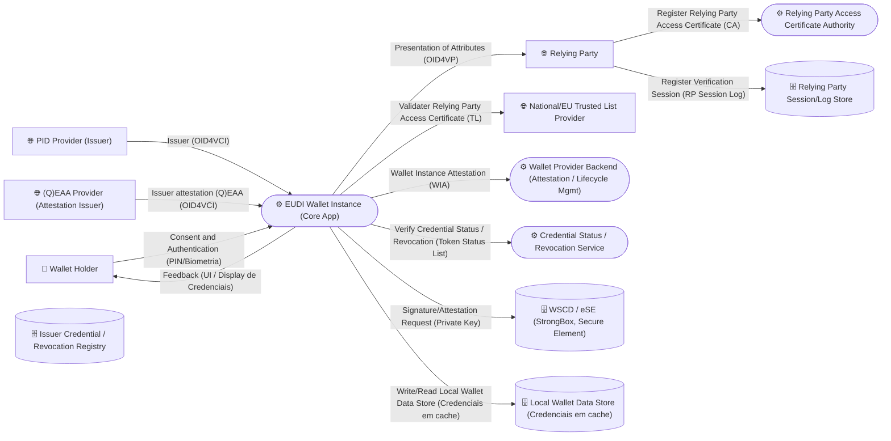

# Threat Modeling Report - EUDI_Wallet_eIDAS2_ARF

**Architecture Description:** Architectural Threat Model of EUDI Wallet (European Digital Identity Wallet), according to the eIDAS2 Architecture Reference Framework (ARF). Master's Dissertation.

## Contents

- Executive Summary
- Architecture Inventory
- Data Flow Diagram
- Data Flows
- Risk Summary
- Threat Analysis

---

## Executive Summary

- **Actors:** 1
- **Trust Boundaries:** 6
- **Assets:** 31
- **Data Flows:** 12
- **Findings:** 192

---

## Data Flow Diagram


---

## Architecture Inventory

### Actors

- **Wallet Holder** (User Mobile Device)

### Trust Boundaries

- User Mobile Device
- Wallet Secure Cryptographic Device (WSCD / eSE)
- Wallet Provider Domain
- Public Internet
- EU Trust Infrastructure (PID/Attestation Providers, Trusted Lists)
- Relying Party Domain

### Assets

- **EUDI Wallet Instance (Core App)** (Process) - Boundary: User Mobile Device
- **Wallet Provider Backend (Attestation / Lifecycle Mgmt)** (Process) - Boundary: Wallet Provider Domain
- **Relying Party Access Certificate Authority** (Process) - Boundary: EU Trust Infrastructure (PID/Attestation Providers, Trusted Lists)
- **Credential Status / Revocation Service** (Process) - Boundary: EU Trust Infrastructure (PID/Attestation Providers, Trusted Lists)
- **WSCD / eSE (StrongBox, Secure Element)** (Datastore) - Boundary: Wallet Secure Cryptographic Device (WSCD / eSE)
- **Local Wallet Data Store (Credenciais em cache)** (Datastore) - Boundary: User Mobile Device
- **Issuer Credential / Revocation Registry** (Datastore) - Boundary: EU Trust Infrastructure (PID/Attestation Providers, Trusted Lists)
- **Relying Party Session/Log Store** (Datastore) - Boundary: Relying Party Domain

---

## Data Flows

| Flow                                                      | Source                               | Destination                                            | Protocol                      | Encryption | Authentication | Data                                                  |
| --------------------------------------------------------- | ------------------------------------ | ------------------------------------------------------ | ----------------------------- | ---------- | -------------- | ----------------------------------------------------- |
| Consent and Authentication (PIN/Biometria)                | Wallet Holder                        | EUDI Wallet Instance (Core App)                        | `HTTPS/mTLS (OID4VCI)`      | Yes        | Yes / No       | -                                                     |
| Feedback (UI / Display de Credenciais)                    | EUDI Wallet Instance (Core App)      | Wallet Holder                                          | `-`                         | No         | No / Yes       | -                                                     |
| Issuer (OID4VCI)                                          | PID Provider (Issuer)                | EUDI Wallet Instance (Core App)                        | `HTTPS/mTLS (OID4VCI)`      | Yes        | Yes / Yes      | Person Identification Data (PID)                      |
| Issuer attestation (Q)EAA (OID4VCI)                       | (Q)EAA Provider (Attestation Issuer) | EUDI Wallet Instance (Core App)                        | `HTTPS/mTLS (OID4VCI)`      | Yes        | Yes / Yes      | Qualified Electronic Attestation of Attributes (QEAA) |
| Presentation of Attributes (OID4VP)                       | EUDI Wallet Instance (Core App)      | Relying Party                                          | `HTTPS/mTLS (OID4VP)`       | Yes        | No / Yes       | Person Identification Data (PID)                      |
| Signature/Attestation Request (Private Key)               | EUDI Wallet Instance (Core App)      | WSCD / eSE (StrongBox, Secure Element)                 | `Local IPC / Keystore API`  | Yes        | Yes / Yes      | Wallet Instance Cryptographic Key Material            |
| Wallet Instance Attestation (WIA)                         | EUDI Wallet Instance (Core App)      | Wallet Provider Backend (Attestation / Lifecycle Mgmt) | `HTTPS/mTLS`                | Yes        | Yes / Yes      | -                                                     |
| Validater Relying Party Access Certificate (TL)           | EUDI Wallet Instance (Core App)      | National/EU Trusted List Provider                      | `HTTPS`                     | Yes        | No / Yes       | -                                                     |
| Verify Credential Status / Revocation (Token Status List) | EUDI Wallet Instance (Core App)      | Credential Status / Revocation Service                 | `HTTPS (Token Status List)` | Yes        | No / Yes       | -                                                     |
| Register Relying Party Access Certificate (CA)            | Relying Party                        | Relying Party Access Certificate Authority             | `HTTPS/mTLS`                | Yes        | Yes / Yes      | -                                                     |
| Write/Read Local Wallet Data Store (Credenciais em cache) | EUDI Wallet Instance (Core App)      | Local Wallet Data Store (Credenciais em cache)         | `Local Storage API`         | Yes        | No / Yes       | -                                                     |
| Register Verification Session (RP Session Log)            | Relying Party                        | Relying Party Session/Log Store                        | `Internal DB write`         | No         | No / Yes       | -                                                     |

---

## Risk Summary

**Total Findings:** 192

| Severity     | Count |
| ------------ | ----: |
| 🔴 Very High |    26 |
| 🟠 High      |    86 |
| 🟡 Medium    |    76 |
| 🟢 Low       |     4 |
| ⚪ Very Low  |     0 |

---

## STRIDE Summary

| STRIDE Category        | Findings |
| ---------------------- | -------: |
| Spoofing               |        0 |
| Tampering              |        0 |
| Repudiation            |        0 |
| Information Disclosure |       78 |
| Denial of Service      |       43 |
| Elevation of Privilege |        0 |

---

**Severity:** Low

**STRIDE Category:** Unknown

**Target:** Relying Party Session/Log Store

## Threat Analysis

## 🔴 [INP02] Finding #1

**Severity:** Very High

**Target:** EUDI Wallet Instance (Core App)

**Component:** EUDI Wallet Instance (Core App)

**Likelihood:** High

### Description

Overflow Buffers

### Technical Details

Buffer Overflow attacks target improper or missing bounds checking on buffer operations, typically triggered by input injected by an adversary. As a consequence, an adversary is able to write past the boundaries of allocated buffer regions in memory, causing a program crash or potentially redirection of execution as per the adversaries' choice.

### Detection Rule

```
target.controls.checksInputBounds is False
```

### Mitigation

Use a language or compiler that performs automatic bounds checking. Use secure functions not vulnerable to buffer overflow. If you have to use dangerous functions, make sure that you do boundary checking. Compiler-based canary mechanisms such as StackGuard, ProPolice and the Microsoft Visual Studio /GS flag. Unless this provides automatic bounds checking, it is not a complete solution. Use OS-level preventative functionality. Not a complete solution. Utilize static source code analysis tools to identify potential buffer overflow weaknesses in the software.

### References

- https://capec.mitre.org/data/definitions/100.html
- http://cwe.mitre.org/data/definitions/120.html
- http://cwe.mitre.org/data/definitions/119.html
- http://cwe.mitre.org/data/definitions/680.html

---

## 🔴 [INP07] Finding #5

**Severity:** Very High

**Target:** EUDI Wallet Instance (Core App)

**Component:** EUDI Wallet Instance (Core App)

**Likelihood:** High

### Description

Buffer Manipulation

### Technical Details

An adversary manipulates an application's interaction with a buffer in an attempt to read or modify data they shouldn't have access to. Buffer attacks are distinguished in that it is the buffer space itself that is the target of the attack rather than any code responsible for interpreting the content of the buffer. In virtually all buffer attacks the content that is placed in the buffer is immaterial. Instead, most buffer attacks involve retrieving or providing more input than can be stored in the allocated buffer, resulting in the reading or overwriting of other unintended program memory.

### Detection Rule

```
target.controls.usesSecureFunctions is False
```

### Mitigation

To help protect an application from buffer manipulation attacks, a number of potential mitigations can be leveraged. Before starting the development of the application, consider using a code language (e.g., Java) or compiler that limits the ability of developers to act beyond the bounds of a buffer. If the chosen language is susceptible to buffer related issues (e.g., C) then consider using secure functions instead of those vulnerable to buffer manipulations. If a potentially dangerous function must be used, make sure that proper boundary checking is performed. Additionally, there are often a number of compiler-based mechanisms (e.g., StackGuard, ProPolice and the Microsoft Visual Studio /GS flag) that can help identify and protect against potential buffer issues. Finally, there may be operating system level preventative functionality that can be applied.

### References

- https://capec.mitre.org/data/definitions/123.html
- http://cwe.mitre.org/data/definitions/119.html

---

## 🔴 [INP23] Finding #15

**Severity:** Very High

**Target:** EUDI Wallet Instance (Core App)

**Component:** EUDI Wallet Instance (Core App)

**Likelihood:** High

### Description

File Content Injection

### Technical Details

An attack of this type exploits the host's trust in executing remote content, including binary files. The files are poisoned with a malicious payload (targeting the file systems accessible by the target software) by the adversary and may be passed through standard channels such as via email, and standard web content like PDF and multimedia files. The adversary exploits known vulnerabilities or handling routines in the target processes. Vulnerabilities of this type have been found in a wide variety of commercial applications from Microsoft Office to Adobe Acrobat and Apple Safari web browser. When the adversary knows the standard handling routines and can identify vulnerabilities and entry points, they can be exploited by otherwise seemingly normal content. Once the attack is executed, the adversary's program can access relative directories such as C:Program Files or other standard system directories to launch further attacks. In a worst case scenario, these programs are combined with other propagation logic and work as a virus.

### Detection Rule

```
target.controls.hasAccessControl is False and (target.controls.sanitizesInput is False or target.controls.validatesInput is False)
```

### Mitigation

Design: Enforce principle of least privilegeDesign: Validate all input for content including files. Ensure that if files and remote content must be accepted that once accepted, they are placed in a sandbox type location so that lower assurance clients cannot write up to higher assurance processes (like Web server processes for example)Design: Execute programs with constrained privileges, so parent process does not open up further vulnerabilities. Ensure that all directories, temporary directories and files, and memory are executing with limited privileges to protect against remote execution.Design: Proxy communication to host, so that communications are terminated at the proxy, sanitizing the requests before forwarding to server host.Implementation: Virus scanning on hostImplementation: Host integrity monitoring for critical files, directories, and processes. The goal of host integrity monitoring is to be aware when a security issue has occurred so that incident response and other forensic activities can begin.

### References

- https://capec.mitre.org/data/definitions/23.html
- http://cwe.mitre.org/data/definitions/20.html

---

## 🔴 [AC14] Finding #18

**Severity:** Very High

**Target:** EUDI Wallet Instance (Core App)

**Component:** EUDI Wallet Instance (Core App)

**Likelihood:** Low

### Description

Catching exception throw/signal from privileged block

### Technical Details

Attackers can sometimes hijack a privileged thread from the underlying system through synchronous (calling a privileged function that returns incorrectly) or asynchronous (callbacks, signal handlers, and similar) means. Having done so, the Attacker may not only likely access functionality the system's designer didn't intend for them, but they may also go undetected or deny other users essential service in a catastrophic (or insidiously subtle) way.

### Detection Rule

```
target.controls.implementsPOLP is False and (target.usesEnvironmentVariables is True or target.controls.validatesInput is False)
```

### Mitigation

Application Architects must be careful to design callback, signal, and similar asynchronous constructs such that they shed excess privilege prior to handing control to user-written (thus untrusted) code.Application Architects must be careful to design privileged code blocks such that upon return (successful, failed, or unpredicted) that privilege is shed prior to leaving the block/scope.

### References

- https://capec.mitre.org/data/definitions/236.html
- http://cwe.mitre.org/data/definitions/270.html

---

## 🔴 [AC18] Finding #31

**Severity:** Very High

**Target:** EUDI Wallet Instance (Core App)

**Component:** EUDI Wallet Instance (Core App)

**Likelihood:** High

### Description

Session Hijacking - ClientSide

### Technical Details

This type of attack involves an adversary that exploits weaknesses in an application's use of sessions in performing authentication. The advarsary is able to steal or manipulate an active session and use it to gain unathorized access to the application.

### Detection Rule

```
(target.controls.usesStrongSessionIdentifiers is False or target.controls.encryptsCookies is False) and target.controls.definesConnectionTimeout is False
```

### Mitigation

Properly encrypt and sign identity tokens in transit, and use industry standard session key generation mechanisms that utilize high amount of entropy to generate the session key. Many standard web and application servers will perform this task on your behalf. Utilize a session timeout for all sessions. If the user does not explicitly logout, terminate their session after this period of inactivity. If the user logs back in then a new session key should be generated.

### References

- https://capec.mitre.org/data/definitions/593.html

---

## 🔴 [AC21] Finding #34

**Severity:** Very High

**Target:** EUDI Wallet Instance (Core App)

**Component:** EUDI Wallet Instance (Core App)

**Likelihood:** High

### Description

Cross Site Request Forgery

### Technical Details

An attacker crafts malicious web links and distributes them (via web pages, email, etc.), typically in a targeted manner, hoping to induce users to click on the link and execute the malicious action against some third-party application. If successful, the action embedded in the malicious link will be processed and accepted by the targeted application with the users' privilege level. This type of attack leverages the persistence and implicit trust placed in user session cookies by many web applications today. In such an architecture, once the user authenticates to an application and a session cookie is created on the user's system, all following transactions for that session are authenticated using that cookie including potential actions initiated by an attacker and simply riding the existing session cookie.

### Detection Rule

```
target.controls.implementsCSRFToken is False or target.controls.verifySessionIdentifiers is False
```

### Mitigation

Use cryptographic tokens to associate a request with a specific action. The token can be regenerated at every request so that if a request with an invalid token is encountered, it can be reliably discarded. The token is considered invalid if it arrived with a request other than the action it was supposed to be associated with.Although less reliable, the use of the optional HTTP Referrer header can also be used to determine whether an incoming request was actually one that the user is authorized for, in the current context.Additionally, the user can also be prompted to confirm an action every time an action concerning potentially sensitive data is invoked. This way, even if the attacker manages to get the user to click on a malicious link and request the desired action, the user has a chance to recover by denying confirmation. This solution is also implicitly tied to using a second factor of authentication before performing such actions.In general, every request must be checked for the appropriate authentication token as well as authorization in the current session context.

### References

- https://capec.mitre.org/data/definitions/62.html

---

## 🔴 [INP02] Finding #35

**Severity:** Very High

**Target:** Wallet Provider Backend (Attestation / Lifecycle Mgmt)

**Component:** Wallet Provider Backend (Attestation / Lifecycle Mgmt)

**Likelihood:** High

### Description

Overflow Buffers

### Technical Details

Buffer Overflow attacks target improper or missing bounds checking on buffer operations, typically triggered by input injected by an adversary. As a consequence, an adversary is able to write past the boundaries of allocated buffer regions in memory, causing a program crash or potentially redirection of execution as per the adversaries' choice.

### Detection Rule

```
target.controls.checksInputBounds is False
```

### Mitigation

Use a language or compiler that performs automatic bounds checking. Use secure functions not vulnerable to buffer overflow. If you have to use dangerous functions, make sure that you do boundary checking. Compiler-based canary mechanisms such as StackGuard, ProPolice and the Microsoft Visual Studio /GS flag. Unless this provides automatic bounds checking, it is not a complete solution. Use OS-level preventative functionality. Not a complete solution. Utilize static source code analysis tools to identify potential buffer overflow weaknesses in the software.

### References

- https://capec.mitre.org/data/definitions/100.html
- http://cwe.mitre.org/data/definitions/120.html
- http://cwe.mitre.org/data/definitions/119.html
- http://cwe.mitre.org/data/definitions/680.html

---

## 🔴 [INP07] Finding #38

**Severity:** Very High

**Target:** Wallet Provider Backend (Attestation / Lifecycle Mgmt)

**Component:** Wallet Provider Backend (Attestation / Lifecycle Mgmt)

**Likelihood:** High

### Description

Buffer Manipulation

### Technical Details

An adversary manipulates an application's interaction with a buffer in an attempt to read or modify data they shouldn't have access to. Buffer attacks are distinguished in that it is the buffer space itself that is the target of the attack rather than any code responsible for interpreting the content of the buffer. In virtually all buffer attacks the content that is placed in the buffer is immaterial. Instead, most buffer attacks involve retrieving or providing more input than can be stored in the allocated buffer, resulting in the reading or overwriting of other unintended program memory.

### Detection Rule

```
target.controls.usesSecureFunctions is False
```

### Mitigation

To help protect an application from buffer manipulation attacks, a number of potential mitigations can be leveraged. Before starting the development of the application, consider using a code language (e.g., Java) or compiler that limits the ability of developers to act beyond the bounds of a buffer. If the chosen language is susceptible to buffer related issues (e.g., C) then consider using secure functions instead of those vulnerable to buffer manipulations. If a potentially dangerous function must be used, make sure that proper boundary checking is performed. Additionally, there are often a number of compiler-based mechanisms (e.g., StackGuard, ProPolice and the Microsoft Visual Studio /GS flag) that can help identify and protect against potential buffer issues. Finally, there may be operating system level preventative functionality that can be applied.

### References

- https://capec.mitre.org/data/definitions/123.html
- http://cwe.mitre.org/data/definitions/119.html

---

## 🔴 [AC14] Finding #49

**Severity:** Very High

**Target:** Wallet Provider Backend (Attestation / Lifecycle Mgmt)

**Component:** Wallet Provider Backend (Attestation / Lifecycle Mgmt)

**Likelihood:** Low

### Description

Catching exception throw/signal from privileged block

### Technical Details

Attackers can sometimes hijack a privileged thread from the underlying system through synchronous (calling a privileged function that returns incorrectly) or asynchronous (callbacks, signal handlers, and similar) means. Having done so, the Attacker may not only likely access functionality the system's designer didn't intend for them, but they may also go undetected or deny other users essential service in a catastrophic (or insidiously subtle) way.

### Detection Rule

```
target.controls.implementsPOLP is False and (target.usesEnvironmentVariables is True or target.controls.validatesInput is False)
```

### Mitigation

Application Architects must be careful to design callback, signal, and similar asynchronous constructs such that they shed excess privilege prior to handing control to user-written (thus untrusted) code.Application Architects must be careful to design privileged code blocks such that upon return (successful, failed, or unpredicted) that privilege is shed prior to leaving the block/scope.

### References

- https://capec.mitre.org/data/definitions/236.html
- http://cwe.mitre.org/data/definitions/270.html

---

## 🔴 [AC18] Finding #62

**Severity:** Very High

**Target:** Wallet Provider Backend (Attestation / Lifecycle Mgmt)

**Component:** Wallet Provider Backend (Attestation / Lifecycle Mgmt)

**Likelihood:** High

### Description

Session Hijacking - ClientSide

### Technical Details

This type of attack involves an adversary that exploits weaknesses in an application's use of sessions in performing authentication. The advarsary is able to steal or manipulate an active session and use it to gain unathorized access to the application.

### Detection Rule

```
(target.controls.usesStrongSessionIdentifiers is False or target.controls.encryptsCookies is False) and target.controls.definesConnectionTimeout is False
```

### Mitigation

Properly encrypt and sign identity tokens in transit, and use industry standard session key generation mechanisms that utilize high amount of entropy to generate the session key. Many standard web and application servers will perform this task on your behalf. Utilize a session timeout for all sessions. If the user does not explicitly logout, terminate their session after this period of inactivity. If the user logs back in then a new session key should be generated.

### References

- https://capec.mitre.org/data/definitions/593.html

---

## 🔴 [AC21] Finding #65

**Severity:** Very High

**Target:** Wallet Provider Backend (Attestation / Lifecycle Mgmt)

**Component:** Wallet Provider Backend (Attestation / Lifecycle Mgmt)

**Likelihood:** High

### Description

Cross Site Request Forgery

### Technical Details

An attacker crafts malicious web links and distributes them (via web pages, email, etc.), typically in a targeted manner, hoping to induce users to click on the link and execute the malicious action against some third-party application. If successful, the action embedded in the malicious link will be processed and accepted by the targeted application with the users' privilege level. This type of attack leverages the persistence and implicit trust placed in user session cookies by many web applications today. In such an architecture, once the user authenticates to an application and a session cookie is created on the user's system, all following transactions for that session are authenticated using that cookie including potential actions initiated by an attacker and simply riding the existing session cookie.

### Detection Rule

```
target.controls.implementsCSRFToken is False or target.controls.verifySessionIdentifiers is False
```

### Mitigation

Use cryptographic tokens to associate a request with a specific action. The token can be regenerated at every request so that if a request with an invalid token is encountered, it can be reliably discarded. The token is considered invalid if it arrived with a request other than the action it was supposed to be associated with.Although less reliable, the use of the optional HTTP Referrer header can also be used to determine whether an incoming request was actually one that the user is authorized for, in the current context.Additionally, the user can also be prompted to confirm an action every time an action concerning potentially sensitive data is invoked. This way, even if the attacker manages to get the user to click on a malicious link and request the desired action, the user has a chance to recover by denying confirmation. This solution is also implicitly tied to using a second factor of authentication before performing such actions.In general, every request must be checked for the appropriate authentication token as well as authorization in the current session context.

### References

- https://capec.mitre.org/data/definitions/62.html

---

## 🔴 [INP02] Finding #66

**Severity:** Very High

**Target:** Relying Party Access Certificate Authority

**Component:** Relying Party Access Certificate Authority

**Likelihood:** High

### Description

Overflow Buffers

### Technical Details

Buffer Overflow attacks target improper or missing bounds checking on buffer operations, typically triggered by input injected by an adversary. As a consequence, an adversary is able to write past the boundaries of allocated buffer regions in memory, causing a program crash or potentially redirection of execution as per the adversaries' choice.

### Detection Rule

```
target.controls.checksInputBounds is False
```

### Mitigation

Use a language or compiler that performs automatic bounds checking. Use secure functions not vulnerable to buffer overflow. If you have to use dangerous functions, make sure that you do boundary checking. Compiler-based canary mechanisms such as StackGuard, ProPolice and the Microsoft Visual Studio /GS flag. Unless this provides automatic bounds checking, it is not a complete solution. Use OS-level preventative functionality. Not a complete solution. Utilize static source code analysis tools to identify potential buffer overflow weaknesses in the software.

### References

- https://capec.mitre.org/data/definitions/100.html
- http://cwe.mitre.org/data/definitions/120.html
- http://cwe.mitre.org/data/definitions/119.html
- http://cwe.mitre.org/data/definitions/680.html

---

## 🔴 [INP07] Finding #70

**Severity:** Very High

**Target:** Relying Party Access Certificate Authority

**Component:** Relying Party Access Certificate Authority

**Likelihood:** High

### Description

Buffer Manipulation

### Technical Details

An adversary manipulates an application's interaction with a buffer in an attempt to read or modify data they shouldn't have access to. Buffer attacks are distinguished in that it is the buffer space itself that is the target of the attack rather than any code responsible for interpreting the content of the buffer. In virtually all buffer attacks the content that is placed in the buffer is immaterial. Instead, most buffer attacks involve retrieving or providing more input than can be stored in the allocated buffer, resulting in the reading or overwriting of other unintended program memory.

### Detection Rule

```
target.controls.usesSecureFunctions is False
```

### Mitigation

To help protect an application from buffer manipulation attacks, a number of potential mitigations can be leveraged. Before starting the development of the application, consider using a code language (e.g., Java) or compiler that limits the ability of developers to act beyond the bounds of a buffer. If the chosen language is susceptible to buffer related issues (e.g., C) then consider using secure functions instead of those vulnerable to buffer manipulations. If a potentially dangerous function must be used, make sure that proper boundary checking is performed. Additionally, there are often a number of compiler-based mechanisms (e.g., StackGuard, ProPolice and the Microsoft Visual Studio /GS flag) that can help identify and protect against potential buffer issues. Finally, there may be operating system level preventative functionality that can be applied.

### References

- https://capec.mitre.org/data/definitions/123.html
- http://cwe.mitre.org/data/definitions/119.html

---

## 🔴 [AC14] Finding #82

**Severity:** Very High

**Target:** Relying Party Access Certificate Authority

**Component:** Relying Party Access Certificate Authority

**Likelihood:** Low

### Description

Catching exception throw/signal from privileged block

### Technical Details

Attackers can sometimes hijack a privileged thread from the underlying system through synchronous (calling a privileged function that returns incorrectly) or asynchronous (callbacks, signal handlers, and similar) means. Having done so, the Attacker may not only likely access functionality the system's designer didn't intend for them, but they may also go undetected or deny other users essential service in a catastrophic (or insidiously subtle) way.

### Detection Rule

```
target.controls.implementsPOLP is False and (target.usesEnvironmentVariables is True or target.controls.validatesInput is False)
```

### Mitigation

Application Architects must be careful to design callback, signal, and similar asynchronous constructs such that they shed excess privilege prior to handing control to user-written (thus untrusted) code.Application Architects must be careful to design privileged code blocks such that upon return (successful, failed, or unpredicted) that privilege is shed prior to leaving the block/scope.

### References

- https://capec.mitre.org/data/definitions/236.html
- http://cwe.mitre.org/data/definitions/270.html

---

## 🔴 [AC18] Finding #95

**Severity:** Very High

**Target:** Relying Party Access Certificate Authority

**Component:** Relying Party Access Certificate Authority

**Likelihood:** High

### Description

Session Hijacking - ClientSide

### Technical Details

This type of attack involves an adversary that exploits weaknesses in an application's use of sessions in performing authentication. The advarsary is able to steal or manipulate an active session and use it to gain unathorized access to the application.

### Detection Rule

```
(target.controls.usesStrongSessionIdentifiers is False or target.controls.encryptsCookies is False) and target.controls.definesConnectionTimeout is False
```

### Mitigation

Properly encrypt and sign identity tokens in transit, and use industry standard session key generation mechanisms that utilize high amount of entropy to generate the session key. Many standard web and application servers will perform this task on your behalf. Utilize a session timeout for all sessions. If the user does not explicitly logout, terminate their session after this period of inactivity. If the user logs back in then a new session key should be generated.

### References

- https://capec.mitre.org/data/definitions/593.html

---

## 🔴 [AC21] Finding #98

**Severity:** Very High

**Target:** Relying Party Access Certificate Authority

**Component:** Relying Party Access Certificate Authority

**Likelihood:** High

### Description

Cross Site Request Forgery

### Technical Details

An attacker crafts malicious web links and distributes them (via web pages, email, etc.), typically in a targeted manner, hoping to induce users to click on the link and execute the malicious action against some third-party application. If successful, the action embedded in the malicious link will be processed and accepted by the targeted application with the users' privilege level. This type of attack leverages the persistence and implicit trust placed in user session cookies by many web applications today. In such an architecture, once the user authenticates to an application and a session cookie is created on the user's system, all following transactions for that session are authenticated using that cookie including potential actions initiated by an attacker and simply riding the existing session cookie.

### Detection Rule

```
target.controls.implementsCSRFToken is False or target.controls.verifySessionIdentifiers is False
```

### Mitigation

Use cryptographic tokens to associate a request with a specific action. The token can be regenerated at every request so that if a request with an invalid token is encountered, it can be reliably discarded. The token is considered invalid if it arrived with a request other than the action it was supposed to be associated with.Although less reliable, the use of the optional HTTP Referrer header can also be used to determine whether an incoming request was actually one that the user is authorized for, in the current context.Additionally, the user can also be prompted to confirm an action every time an action concerning potentially sensitive data is invoked. This way, even if the attacker manages to get the user to click on a malicious link and request the desired action, the user has a chance to recover by denying confirmation. This solution is also implicitly tied to using a second factor of authentication before performing such actions.In general, every request must be checked for the appropriate authentication token as well as authorization in the current session context.

### References

- https://capec.mitre.org/data/definitions/62.html

---

## 🔴 [INP02] Finding #99

**Severity:** Very High

**Target:** Credential Status / Revocation Service

**Component:** Credential Status / Revocation Service

**Likelihood:** High

### Description

Overflow Buffers

### Technical Details

Buffer Overflow attacks target improper or missing bounds checking on buffer operations, typically triggered by input injected by an adversary. As a consequence, an adversary is able to write past the boundaries of allocated buffer regions in memory, causing a program crash or potentially redirection of execution as per the adversaries' choice.

### Detection Rule

```
target.controls.checksInputBounds is False
```

### Mitigation

Use a language or compiler that performs automatic bounds checking. Use secure functions not vulnerable to buffer overflow. If you have to use dangerous functions, make sure that you do boundary checking. Compiler-based canary mechanisms such as StackGuard, ProPolice and the Microsoft Visual Studio /GS flag. Unless this provides automatic bounds checking, it is not a complete solution. Use OS-level preventative functionality. Not a complete solution. Utilize static source code analysis tools to identify potential buffer overflow weaknesses in the software.

### References

- https://capec.mitre.org/data/definitions/100.html
- http://cwe.mitre.org/data/definitions/120.html
- http://cwe.mitre.org/data/definitions/119.html
- http://cwe.mitre.org/data/definitions/680.html

---

## 🔴 [INP07] Finding #103

**Severity:** Very High

**Target:** Credential Status / Revocation Service

**Component:** Credential Status / Revocation Service

**Likelihood:** High

### Description

Buffer Manipulation

### Technical Details

An adversary manipulates an application's interaction with a buffer in an attempt to read or modify data they shouldn't have access to. Buffer attacks are distinguished in that it is the buffer space itself that is the target of the attack rather than any code responsible for interpreting the content of the buffer. In virtually all buffer attacks the content that is placed in the buffer is immaterial. Instead, most buffer attacks involve retrieving or providing more input than can be stored in the allocated buffer, resulting in the reading or overwriting of other unintended program memory.

### Detection Rule

```
target.controls.usesSecureFunctions is False
```

### Mitigation

To help protect an application from buffer manipulation attacks, a number of potential mitigations can be leveraged. Before starting the development of the application, consider using a code language (e.g., Java) or compiler that limits the ability of developers to act beyond the bounds of a buffer. If the chosen language is susceptible to buffer related issues (e.g., C) then consider using secure functions instead of those vulnerable to buffer manipulations. If a potentially dangerous function must be used, make sure that proper boundary checking is performed. Additionally, there are often a number of compiler-based mechanisms (e.g., StackGuard, ProPolice and the Microsoft Visual Studio /GS flag) that can help identify and protect against potential buffer issues. Finally, there may be operating system level preventative functionality that can be applied.

### References

- https://capec.mitre.org/data/definitions/123.html
- http://cwe.mitre.org/data/definitions/119.html

---

## 🔴 [INP23] Finding #113

**Severity:** Very High

**Target:** Credential Status / Revocation Service

**Component:** Credential Status / Revocation Service

**Likelihood:** High

### Description

File Content Injection

### Technical Details

An attack of this type exploits the host's trust in executing remote content, including binary files. The files are poisoned with a malicious payload (targeting the file systems accessible by the target software) by the adversary and may be passed through standard channels such as via email, and standard web content like PDF and multimedia files. The adversary exploits known vulnerabilities or handling routines in the target processes. Vulnerabilities of this type have been found in a wide variety of commercial applications from Microsoft Office to Adobe Acrobat and Apple Safari web browser. When the adversary knows the standard handling routines and can identify vulnerabilities and entry points, they can be exploited by otherwise seemingly normal content. Once the attack is executed, the adversary's program can access relative directories such as C:Program Files or other standard system directories to launch further attacks. In a worst case scenario, these programs are combined with other propagation logic and work as a virus.

### Detection Rule

```
target.controls.hasAccessControl is False and (target.controls.sanitizesInput is False or target.controls.validatesInput is False)
```

### Mitigation

Design: Enforce principle of least privilegeDesign: Validate all input for content including files. Ensure that if files and remote content must be accepted that once accepted, they are placed in a sandbox type location so that lower assurance clients cannot write up to higher assurance processes (like Web server processes for example)Design: Execute programs with constrained privileges, so parent process does not open up further vulnerabilities. Ensure that all directories, temporary directories and files, and memory are executing with limited privileges to protect against remote execution.Design: Proxy communication to host, so that communications are terminated at the proxy, sanitizing the requests before forwarding to server host.Implementation: Virus scanning on hostImplementation: Host integrity monitoring for critical files, directories, and processes. The goal of host integrity monitoring is to be aware when a security issue has occurred so that incident response and other forensic activities can begin.

### References

- https://capec.mitre.org/data/definitions/23.html
- http://cwe.mitre.org/data/definitions/20.html

---

## 🔴 [AC14] Finding #116

**Severity:** Very High

**Target:** Credential Status / Revocation Service

**Component:** Credential Status / Revocation Service

**Likelihood:** Low

### Description

Catching exception throw/signal from privileged block

### Technical Details

Attackers can sometimes hijack a privileged thread from the underlying system through synchronous (calling a privileged function that returns incorrectly) or asynchronous (callbacks, signal handlers, and similar) means. Having done so, the Attacker may not only likely access functionality the system's designer didn't intend for them, but they may also go undetected or deny other users essential service in a catastrophic (or insidiously subtle) way.

### Detection Rule

```
target.controls.implementsPOLP is False and (target.usesEnvironmentVariables is True or target.controls.validatesInput is False)
```

### Mitigation

Application Architects must be careful to design callback, signal, and similar asynchronous constructs such that they shed excess privilege prior to handing control to user-written (thus untrusted) code.Application Architects must be careful to design privileged code blocks such that upon return (successful, failed, or unpredicted) that privilege is shed prior to leaving the block/scope.

### References

- https://capec.mitre.org/data/definitions/236.html
- http://cwe.mitre.org/data/definitions/270.html

---

## 🔴 [AC18] Finding #129

**Severity:** Very High

**Target:** Credential Status / Revocation Service

**Component:** Credential Status / Revocation Service

**Likelihood:** High

### Description

Session Hijacking - ClientSide

### Technical Details

This type of attack involves an adversary that exploits weaknesses in an application's use of sessions in performing authentication. The advarsary is able to steal or manipulate an active session and use it to gain unathorized access to the application.

### Detection Rule

```
(target.controls.usesStrongSessionIdentifiers is False or target.controls.encryptsCookies is False) and target.controls.definesConnectionTimeout is False
```

### Mitigation

Properly encrypt and sign identity tokens in transit, and use industry standard session key generation mechanisms that utilize high amount of entropy to generate the session key. Many standard web and application servers will perform this task on your behalf. Utilize a session timeout for all sessions. If the user does not explicitly logout, terminate their session after this period of inactivity. If the user logs back in then a new session key should be generated.

### References

- https://capec.mitre.org/data/definitions/593.html

---

## 🔴 [AC21] Finding #132

**Severity:** Very High

**Target:** Credential Status / Revocation Service

**Component:** Credential Status / Revocation Service

**Likelihood:** High

### Description

Cross Site Request Forgery

### Technical Details

An attacker crafts malicious web links and distributes them (via web pages, email, etc.), typically in a targeted manner, hoping to induce users to click on the link and execute the malicious action against some third-party application. If successful, the action embedded in the malicious link will be processed and accepted by the targeted application with the users' privilege level. This type of attack leverages the persistence and implicit trust placed in user session cookies by many web applications today. In such an architecture, once the user authenticates to an application and a session cookie is created on the user's system, all following transactions for that session are authenticated using that cookie including potential actions initiated by an attacker and simply riding the existing session cookie.

### Detection Rule

```
target.controls.implementsCSRFToken is False or target.controls.verifySessionIdentifiers is False
```

### Mitigation

Use cryptographic tokens to associate a request with a specific action. The token can be regenerated at every request so that if a request with an invalid token is encountered, it can be reliably discarded. The token is considered invalid if it arrived with a request other than the action it was supposed to be associated with.Although less reliable, the use of the optional HTTP Referrer header can also be used to determine whether an incoming request was actually one that the user is authorized for, in the current context.Additionally, the user can also be prompted to confirm an action every time an action concerning potentially sensitive data is invoked. This way, even if the attacker manages to get the user to click on a malicious link and request the desired action, the user has a chance to recover by denying confirmation. This solution is also implicitly tied to using a second factor of authentication before performing such actions.In general, every request must be checked for the appropriate authentication token as well as authorization in the current session context.

### References

- https://capec.mitre.org/data/definitions/62.html

---

## 🔴 [DS06] Finding #153

**Severity:** Very High

**Target:** Issuer (OID4VCI)

**Component:** Issuer (OID4VCI)

**Likelihood:** High

### Description

Data Leak

### Technical Details

An attacker can access data in transit or at rest that is not sufficiently protected. If an attacker can decrypt a stored password, it might be used to authenticate against different services.

### Detection Rule

```
target.hasDataLeaks()
```

### Mitigation

All data should be encrypted in transit. All PII and restricted data must be encrypted at rest. If a service is storing credentials used to authenticate users or incoming connections, it must only store hashes of them created using cryptographic functions, so it is only possible to compare them against user input, without fully decoding them. If a client is storing credentials in either files or other data store, access to them must be as restrictive as possible, including using proper file permissions, database users with restricted access or separate storage.

### References

- https://cwe.mitre.org/data/definitions/311.html
- https://cwe.mitre.org/data/definitions/312.html
- https://cwe.mitre.org/data/definitions/916.html
- https://cwe.mitre.org/data/definitions/653.html

---

## 🔴 [DS06] Finding #158

**Severity:** Very High

**Target:** Issuer attestation (Q)EAA (OID4VCI)

**Component:** Issuer attestation (Q)EAA (OID4VCI)

**Likelihood:** High

### Description

Data Leak

### Technical Details

An attacker can access data in transit or at rest that is not sufficiently protected. If an attacker can decrypt a stored password, it might be used to authenticate against different services.

### Detection Rule

```
target.hasDataLeaks()
```

### Mitigation

All data should be encrypted in transit. All PII and restricted data must be encrypted at rest. If a service is storing credentials used to authenticate users or incoming connections, it must only store hashes of them created using cryptographic functions, so it is only possible to compare them against user input, without fully decoding them. If a client is storing credentials in either files or other data store, access to them must be as restrictive as possible, including using proper file permissions, database users with restricted access or separate storage.

### References

- https://cwe.mitre.org/data/definitions/311.html
- https://cwe.mitre.org/data/definitions/312.html
- https://cwe.mitre.org/data/definitions/916.html
- https://cwe.mitre.org/data/definitions/653.html

---

## 🔴 [DS06] Finding #161

**Severity:** Very High

**Target:** Presentation of Attributes (OID4VP)

**Component:** Presentation of Attributes (OID4VP)

**Likelihood:** High

### Description

Data Leak

### Technical Details

An attacker can access data in transit or at rest that is not sufficiently protected. If an attacker can decrypt a stored password, it might be used to authenticate against different services.

### Detection Rule

```
target.hasDataLeaks()
```

### Mitigation

All data should be encrypted in transit. All PII and restricted data must be encrypted at rest. If a service is storing credentials used to authenticate users or incoming connections, it must only store hashes of them created using cryptographic functions, so it is only possible to compare them against user input, without fully decoding them. If a client is storing credentials in either files or other data store, access to them must be as restrictive as possible, including using proper file permissions, database users with restricted access or separate storage.

### References

- https://cwe.mitre.org/data/definitions/311.html
- https://cwe.mitre.org/data/definitions/312.html
- https://cwe.mitre.org/data/definitions/916.html
- https://cwe.mitre.org/data/definitions/653.html

---

## 🔴 [DS06] Finding #164

**Severity:** Very High

**Target:** Signature/Attestation Request (Private Key)

**Component:** Signature/Attestation Request (Private Key)

**Likelihood:** High

### Description

Data Leak

### Technical Details

An attacker can access data in transit or at rest that is not sufficiently protected. If an attacker can decrypt a stored password, it might be used to authenticate against different services.

### Detection Rule

```
target.hasDataLeaks()
```

### Mitigation

All data should be encrypted in transit. All PII and restricted data must be encrypted at rest. If a service is storing credentials used to authenticate users or incoming connections, it must only store hashes of them created using cryptographic functions, so it is only possible to compare them against user input, without fully decoding them. If a client is storing credentials in either files or other data store, access to them must be as restrictive as possible, including using proper file permissions, database users with restricted access or separate storage.

### References

- https://cwe.mitre.org/data/definitions/311.html
- https://cwe.mitre.org/data/definitions/312.html
- https://cwe.mitre.org/data/definitions/916.html
- https://cwe.mitre.org/data/definitions/653.html

---

## 🟠 [INP08] Finding #8

**Severity:** High

**Target:** EUDI Wallet Instance (Core App)

**Component:** EUDI Wallet Instance (Core App)

**Likelihood:** High

### Description

Format String Injection

### Technical Details

An adversary includes formatting characters in a string input field on the target application. Most applications assume that users will provide static text and may respond unpredictably to the presence of formatting character. For example, in certain functions of the C programming languages such as printf, the formatting character %s will print the contents of a memory location expecting this location to identify a string and the formatting character %n prints the number of DWORD written in the memory. An adversary can use this to read or write to memory locations or files, or simply to manipulate the value of the resulting text in unexpected ways. Reading or writing memory may result in program crashes and writing memory could result in the execution of arbitrary code if the adversary can write to the program stack.

### Detection Rule

```
target.controls.validatesInput is False or target.controls.sanitizesInput is False
```

### Mitigation

Limit the usage of formatting string functions. Strong input validation - All user-controllable input must be validated and filtered for illegal formatting characters.

### References

- https://capec.mitre.org/data/definitions/135.html
- http://cwe.mitre.org/data/definitions/134.html
- http://cwe.mitre.org/data/definitions/133.html

---

## 🟠 [INP12] Finding #9

**Severity:** High

**Target:** EUDI Wallet Instance (Core App)

**Component:** EUDI Wallet Instance (Core App)

**Likelihood:** Medium

### Description

Client-side Injection-induced Buffer Overflow

### Technical Details

This type of attack exploits a buffer overflow vulnerability in targeted client software through injection of malicious content from a custom-built hostile service.

### Detection Rule

```
target.controls.checksInputBounds is False and target.controls.validatesInput is False
```

### Mitigation

The client software should not install untrusted code from a non-authenticated server. The client software should have the latest patches and should be audited for vulnerabilities before being used to communicate with potentially hostile servers. Perform input validation for length of buffer inputs. Use a language or compiler that performs automatic bounds checking. Use an abstraction library to abstract away risky APIs. Not a complete solution. Compiler-based canary mechanisms such as StackGuard, ProPolice and the Microsoft Visual Studio /GS flag. Unless this provides automatic bounds checking, it is not a complete solution. Ensure all buffer uses are consistently bounds-checked. Use OS-level preventative functionality. Not a complete solution.

### References

- https://capec.mitre.org/data/definitions/14.html
- http://cwe.mitre.org/data/definitions/74.html
- http://cwe.mitre.org/data/definitions/353.html

---

## 🟠 [INP13] Finding #10

**Severity:** High

**Target:** EUDI Wallet Instance (Core App)

**Component:** EUDI Wallet Instance (Core App)

**Likelihood:** High

### Description

Command Delimiters

### Technical Details

An attack of this type exploits a programs' vulnerabilities that allows an attacker's commands to be concatenated onto a legitimate command with the intent of targeting other resources such as the file system or database. The system that uses a filter or a blacklist input validation, as opposed to whitelist validation is vulnerable to an attacker who predicts delimiters (or combinations of delimiters) not present in the filter or blacklist. As with other injection attacks, the attacker uses the command delimiter payload as an entry point to tunnel through the application and activate additional attacks through SQL queries, shell commands, network scanning, and so on.

### Detection Rule

```
target.controls.validatesInput is False
```

### Mitigation

Design: Perform whitelist validation against a positive specification for command length, type, and parameters.Design: Limit program privileges, so if commands circumvent program input validation or filter routines then commands do not running under a privileged accountImplementation: Perform input validation for all remote content.Implementation: Use type conversions such as JDBC prepared statements.

### References

- https://capec.mitre.org/data/definitions/15.html
- http://cwe.mitre.org/data/definitions/146.html
- http://cwe.mitre.org/data/definitions/77.html
- http://cwe.mitre.org/data/definitions/157.html
- http://cwe.mitre.org/data/definitions/154.html

---

## 🟠 [CR03] Finding #12

**Severity:** High

**Target:** EUDI Wallet Instance (Core App)

**Component:** EUDI Wallet Instance (Core App)

**Likelihood:** Medium

### Description

Dictionary-based Password Attack

### Technical Details

An attacker tries each of the words in a dictionary as passwords to gain access to the system via some user's account. If the password chosen by the user was a word within the dictionary, this attack will be successful (in the absence of other mitigations). This is a specific instance of the password brute forcing attack pattern.

### Detection Rule

```
target.controls.implementsAuthenticationScheme is False
```

### Mitigation

Create a strong password policy and ensure that your system enforces this policy.Implement an intelligent password throttling mechanism. Care must be taken to assure that these mechanisms do not excessively enable account lockout attacks such as CAPEC-02.

### References

- https://capec.mitre.org/data/definitions/16.html
- http://cwe.mitre.org/data/definitions/521.html
- http://cwe.mitre.org/data/definitions/262.html
- http://cwe.mitre.org/data/definitions/263.html

---

## 🟠 [INP20] Finding #14

**Severity:** High

**Target:** EUDI Wallet Instance (Core App)

**Component:** EUDI Wallet Instance (Core App)

**Likelihood:** Medium

### Description

iFrame Overlay

### Technical Details

In an iFrame overlay attack the victim is tricked into unknowingly initiating some action in one system while interacting with the UI from seemingly completely different system. While being logged in to some target system, the victim visits the attackers' malicious site which displays a UI that the victim wishes to interact with. In reality, the iFrame overlay page has a transparent layer above the visible UI with action controls that the attacker wishes the victim to execute. The victim clicks on buttons or other UI elements they see on the page which actually triggers the action controls in the transparent overlaying layer. Depending on what that action control is, the attacker may have just tricked the victim into executing some potentially privileged (and most undesired) functionality in the target system to which the victim is authenticated. The basic problem here is that there is a dichotomy between what the victim thinks he or she is clicking on versus what he or she is actually clicking on.

### Detection Rule

```
target.controls.disablesiFrames is False
```

### Mitigation

Configuration: Disable iFrames in the Web browser.Operation: When maintaining an authenticated session with a privileged target system, do not use the same browser to navigate to unfamiliar sites to perform other activities. Finish working with the target system and logout first before proceeding to other tasks.Operation: If using the Firefox browser, use the NoScript plug-in that will help forbid iFrames.

### References

- https://capec.mitre.org/data/definitions/222.html
- http://cwe.mitre.org/data/definitions/1021.html

---

## 🟠 [AC12] Finding #16

**Severity:** High

**Target:** EUDI Wallet Instance (Core App)

**Component:** EUDI Wallet Instance (Core App)

**Likelihood:** Medium

### Description

Privilege Escalation

### Technical Details

An adversary exploits a weakness enabling them to elevate their privilege and perform an action that they are not supposed to be authorized to perform.

### Detection Rule

```
target.controls.hasAccessControl is False or target.controls.implementsPOLP is False
```

### Mitigation

Very carefully manage the setting, management, and handling of privileges. Explicitly manage trust zones in the software. Follow the principle of least privilege when assigning access rights to entities in a software system. Implement separation of privilege - Require multiple conditions to be met before permitting access to a system resource.

### References

- https://capec.mitre.org/data/definitions/233.html
- http://cwe.mitre.org/data/definitions/269.html

---

## 🟠 [INP24] Finding #19

**Severity:** High

**Target:** EUDI Wallet Instance (Core App)

**Component:** EUDI Wallet Instance (Core App)

**Likelihood:** High

### Description

Filter Failure through Buffer Overflow

### Technical Details

In this attack, the idea is to cause an active filter to fail by causing an oversized transaction. An attacker may try to feed overly long input strings to the program in an attempt to overwhelm the filter (by causing a buffer overflow) and hoping that the filter does not fail securely (i.e. the user input is let into the system unfiltered).

### Detection Rule

```
target.controls.checksInputBounds is False or target.controls.validatesInput is False
```

### Mitigation

Make sure that ANY failure occurring in the filtering or input validation routine is properly handled and that offending input is NOT allowed to go through. Basically make sure that the vault is closed when failure occurs.Pre-design: Use a language or compiler that performs automatic bounds checking.Pre-design through Build: Compiler-based canary mechanisms such as StackGuard, ProPolice and the Microsoft Visual Studio /GS flag. Unless this provides automatic bounds checking, it is not a complete solution.Operational: Use OS-level preventative functionality. Not a complete solution.Design: Use an abstraction library to abstract away risky APIs. Not a complete solution.

### References

- https://capec.mitre.org/data/definitions/24.html
- http://cwe.mitre.org/data/definitions/120.html
- http://cwe.mitre.org/data/definitions/680.html
- http://cwe.mitre.org/data/definitions/20.html

---

## 🟠 [INP25] Finding #20

**Severity:** High

**Target:** EUDI Wallet Instance (Core App)

**Component:** EUDI Wallet Instance (Core App)

**Likelihood:** High

### Description

Resource Injection

### Technical Details

An adversary exploits weaknesses in input validation by manipulating resource identifiers enabling the unintended modification or specification of a resource.

### Detection Rule

```
target.controls.validatesInput is False or target.controls.sanitizesInput is False
```

### Mitigation

Ensure all input content that is delivered to client is sanitized against an acceptable content specification.Perform input validation for all content.Enforce regular patching of software.

### References

- https://capec.mitre.org/data/definitions/240.html
- https://capec.mitre.org/data/definitions/240.html

---

## 🟠 [INP26] Finding #21

**Severity:** High

**Target:** EUDI Wallet Instance (Core App)

**Component:** EUDI Wallet Instance (Core App)

**Likelihood:** High

### Description

Code Injection

### Technical Details

An adversary exploits a weakness in input validation on the target to inject new code into that which is currently executing. This differs from code inclusion in that code inclusion involves the addition or replacement of a reference to a code file, which is subsequently loaded by the target and used as part of the code of some application.

### Detection Rule

```
target.controls.validatesInput is False or target.controls.sanitizesInput is False
```

### Mitigation

Utilize strict type, character, and encoding enforcementEnsure all input content that is delivered to client is sanitized against an acceptable content specification.Perform input validation for all content.Enforce regular patching of software.

### References

- https://capec.mitre.org/data/definitions/242.html
- http://cwe.mitre.org/data/definitions/94.html

---

## 🟠 [INP28] Finding #23

**Severity:** High

**Target:** EUDI Wallet Instance (Core App)

**Component:** EUDI Wallet Instance (Core App)

**Likelihood:** High

### Description

XSS Targeting URI Placeholders

### Technical Details

An attack of this type exploits the ability of most browsers to interpret data, javascript or other URI schemes as client-side executable content placeholders. This attack consists of passing a malicious URI in an anchor tag HREF attribute or any other similar attributes in other HTML tags. Such malicious URI contains, for example, a base64 encoded HTML content with an embedded cross-site scripting payload. The attack is executed when the browser interprets the malicious content i.e., for example, when the victim clicks on the malicious link.

### Detection Rule

```
target.controls.validatesInput is False or target.controls.sanitizesInput is False or target.controls.encodesOutput is False
```

### Mitigation

Design: Use browser technologies that do not allow client side scripting.Design: Utilize strict type, character, and encoding enforcement.Implementation: Ensure all content that is delivered to client is sanitized against an acceptable content specification.Implementation: Ensure all content coming from the client is using the same encoding; if not, the server-side application must canonicalize the data before applying any filtering.Implementation: Perform input validation for all remote content, including remote and user-generated contentImplementation: Perform output validation for all remote content.Implementation: Disable scripting languages such as JavaScript in browserImplementation: Patching software. There are many attack vectors for XSS on the client side and the server side. Many vulnerabilities are fixed in service packs for browser, web servers, and plug in technologies, staying current on patch release that deal with XSS countermeasures mitigates this.

### References

- https://capec.mitre.org/data/definitions/244.html
- http://cwe.mitre.org/data/definitions/83.html

---

## 🟠 [INP31] Finding #26

**Severity:** High

**Target:** EUDI Wallet Instance (Core App)

**Component:** EUDI Wallet Instance (Core App)

**Likelihood:** Medium

### Description

Command Injection

### Technical Details

An adversary looking to execute a command of their choosing, injects new items into an existing command thus modifying interpretation away from what was intended. Commands in this context are often standalone strings that are interpreted by a downstream component and cause specific responses. This type of attack is possible when untrusted values are used to build these command strings. Weaknesses in input validation or command construction can enable the attack and lead to successful exploitation.

### Detection Rule

```
target.controls.usesParameterizedInput is False and (target.controls.validatesInput is False or target.controls.sanitizesInput is False)
```

### Mitigation

All user-controllable input should be validated and filtered for potentially unwanted characters. Whitelisting input is desired, but if a blacklisting approach is necessary, then focusing on command related terms and delimiters is necessary.Input should be encoded prior to use in commands to make sure command related characters are not treated as part of the command. For example, quotation characters may need to be encoded so that the application does not treat the quotation as a delimiter.Input should be parameterized, or restricted to data sections of a command, thus removing the chance that the input will be treated as part of the command itself.

### References

- https://capec.mitre.org/data/definitions/248.html

---

## 🟠 [INP32] Finding #27

**Severity:** High

**Target:** EUDI Wallet Instance (Core App)

**Component:** EUDI Wallet Instance (Core App)

**Likelihood:** High

### Description

XML Injection

### Technical Details

An attacker utilizes crafted XML user-controllable input to probe, attack, and inject data into the XML database, using techniques similar to SQL injection. The user-controllable input can allow for unauthorized viewing of data, bypassing authentication or the front-end application for direct XML database access, and possibly altering database information.

### Detection Rule

```
target.controls.validatesInput is False or target.controls.sanitizesInput is False or target.controls.encodesOutput is False
```

### Mitigation

Strong input validation - All user-controllable input must be validated and filtered for illegal characters as well as content that can be interpreted in the context of an XML data or a query. Use of custom error pages - Attackers can glean information about the nature of queries from descriptive error messages. Input validation must be coupled with customized error pages that inform about an error without disclosing information about the database or application.

### References

- https://capec.mitre.org/data/definitions/250.html

---

## 🟠 [INP33] Finding #28

**Severity:** High

**Target:** EUDI Wallet Instance (Core App)

**Component:** EUDI Wallet Instance (Core App)

**Likelihood:** Medium

### Description

Remote Code Inclusion

### Technical Details

The attacker forces an application to load arbitrary code files from a remote location. The attacker could use this to try to load old versions of library files that have known vulnerabilities, to load malicious files that the attacker placed on the remote machine, or to otherwise change the functionality of the targeted application in unexpected ways.

### Detection Rule

```
target.controls.validatesInput is False or target.controls.sanitizesInput is False
```

### Mitigation

Minimize attacks by input validation and sanitization of any user data that will be used by the target application to locate a remote file to be included.

### References

- https://capec.mitre.org/data/definitions/253.html

---

## 🟠 [INP35] Finding #29

**Severity:** High

**Target:** EUDI Wallet Instance (Core App)

**Component:** EUDI Wallet Instance (Core App)

**Likelihood:** High

### Description

Leverage Alternate Encoding

### Technical Details

An adversary leverages the possibility to encode potentially harmful input or content used by applications such that the applications are ineffective at validating this encoding standard.

### Detection Rule

```
target.controls.validatesInput is False or target.controls.sanitizesInput is False
```

### Mitigation

Assume all input might use an improper representation. Use canonicalized data inside the application; all data must be converted into the representation used inside the application (UTF-8, UTF-16, etc.)Assume all input is malicious. Create a white list that defines all valid input to the software system based on the requirements specifications. Input that does not match against the white list should not be permitted to enter into the system. Test your decoding process against malicious input.

### References

- https://capec.mitre.org/data/definitions/267.html

---

## 🟠 [AC15] Finding #30

**Severity:** High

**Target:** EUDI Wallet Instance (Core App)

**Component:** EUDI Wallet Instance (Core App)

**Likelihood:** Low

### Description

Schema Poisoning

### Technical Details

An adversary corrupts or modifies the content of a schema for the purpose of undermining the security of the target. Schemas provide the structure and content definitions for resources used by an application. By replacing or modifying a schema, the adversary can affect how the application handles or interprets a resource, often leading to possible denial of service, entering into an unexpected state, or recording incomplete data.

### Detection Rule

```
target.controls.implementsPOLP is False
```

### Mitigation

Design: Protect the schema against unauthorized modification.Implementation: For applications that use a known schema, use a local copy or a known good repository instead of the schema reference supplied in the schema document.Implementation: For applications that leverage remote schemas, use the HTTPS protocol to prevent modification of traffic in transit and to avoid unauthorized modification.

### References

- https://capec.mitre.org/data/definitions/271.html

---

## 🟠 [INP41] Finding #32

**Severity:** High

**Target:** EUDI Wallet Instance (Core App)

**Component:** EUDI Wallet Instance (Core App)

**Likelihood:** High

### Description

Argument Injection

### Technical Details

An attacker changes the behavior or state of a targeted application through injecting data or command syntax through the targets use of non-validated and non-filtered arguments of exposed services or methods.

### Detection Rule

```
target.controls.validatesInput is False or target.controls.sanitizesInput is False
```

### Mitigation

Design: Do not program input values directly on command shell, instead treat user input as guilty until proven innocent. Build a function that takes user input and converts it to applications specific types and values, stripping or filtering out all unauthorized commands and characters in the process.Design: Limit program privileges, so if metacharacters or other methods circumvent program input validation routines and shell access is attained then it is not running under a privileged account. chroot jails create a sandbox for the application to execute in, making it more difficult for an attacker to elevate privilege even in the case that a compromise has occurred.Implementation: Implement an audit log that is written to a separate host, in the event of a compromise the audit log may be able to provide evidence and details of the compromise.

### References

- https://capec.mitre.org/data/definitions/6.html

---

## 🟠 [AC20] Finding #33

**Severity:** High

**Target:** EUDI Wallet Instance (Core App)

**Component:** EUDI Wallet Instance (Core App)

**Likelihood:** High

### Description

Reusing Session IDs (aka Session Replay) - ClientSide

### Technical Details

This attack targets the reuse of valid session ID to spoof the target system in order to gain privileges. The attacker tries to reuse a stolen session ID used previously during a transaction to perform spoofing and session hijacking. Another name for this type of attack is Session Replay.

### Detection Rule

```
target.controls.definesConnectionTimeout is False and (target.controls.usesMFA is False or target.controls.encryptsSessionData is False)
```

### Mitigation

Always invalidate a session ID after the user logout.Setup a session time out for the session IDs.Protect the communication between the client and server. For instance it is best practice to use SSL to mitigate man in the middle attack.Do not code send session ID with GET method, otherwise the session ID will be copied to the URL. In general avoid writing session IDs in the URLs. URLs can get logged in log files, which are vulnerable to an attacker.Encrypt the session data associated with the session ID.Use multifactor authentication.

### References

- https://capec.mitre.org/data/definitions/60.html

---

## 🟠 [INP08] Finding #41

**Severity:** High

**Target:** Wallet Provider Backend (Attestation / Lifecycle Mgmt)

**Component:** Wallet Provider Backend (Attestation / Lifecycle Mgmt)

**Likelihood:** High

### Description

Format String Injection

### Technical Details

An adversary includes formatting characters in a string input field on the target application. Most applications assume that users will provide static text and may respond unpredictably to the presence of formatting character. For example, in certain functions of the C programming languages such as printf, the formatting character %s will print the contents of a memory location expecting this location to identify a string and the formatting character %n prints the number of DWORD written in the memory. An adversary can use this to read or write to memory locations or files, or simply to manipulate the value of the resulting text in unexpected ways. Reading or writing memory may result in program crashes and writing memory could result in the execution of arbitrary code if the adversary can write to the program stack.

### Detection Rule

```
target.controls.validatesInput is False or target.controls.sanitizesInput is False
```

### Mitigation

Limit the usage of formatting string functions. Strong input validation - All user-controllable input must be validated and filtered for illegal formatting characters.

### References

- https://capec.mitre.org/data/definitions/135.html
- http://cwe.mitre.org/data/definitions/134.html
- http://cwe.mitre.org/data/definitions/133.html

---

## 🟠 [INP12] Finding #42

**Severity:** High

**Target:** Wallet Provider Backend (Attestation / Lifecycle Mgmt)

**Component:** Wallet Provider Backend (Attestation / Lifecycle Mgmt)

**Likelihood:** Medium

### Description

Client-side Injection-induced Buffer Overflow

### Technical Details

This type of attack exploits a buffer overflow vulnerability in targeted client software through injection of malicious content from a custom-built hostile service.

### Detection Rule

```
target.controls.checksInputBounds is False and target.controls.validatesInput is False
```

### Mitigation

The client software should not install untrusted code from a non-authenticated server. The client software should have the latest patches and should be audited for vulnerabilities before being used to communicate with potentially hostile servers. Perform input validation for length of buffer inputs. Use a language or compiler that performs automatic bounds checking. Use an abstraction library to abstract away risky APIs. Not a complete solution. Compiler-based canary mechanisms such as StackGuard, ProPolice and the Microsoft Visual Studio /GS flag. Unless this provides automatic bounds checking, it is not a complete solution. Ensure all buffer uses are consistently bounds-checked. Use OS-level preventative functionality. Not a complete solution.

### References

- https://capec.mitre.org/data/definitions/14.html
- http://cwe.mitre.org/data/definitions/74.html
- http://cwe.mitre.org/data/definitions/353.html

---

## 🟠 [INP13] Finding #43

**Severity:** High

**Target:** Wallet Provider Backend (Attestation / Lifecycle Mgmt)

**Component:** Wallet Provider Backend (Attestation / Lifecycle Mgmt)

**Likelihood:** High

### Description

Command Delimiters

### Technical Details

An attack of this type exploits a programs' vulnerabilities that allows an attacker's commands to be concatenated onto a legitimate command with the intent of targeting other resources such as the file system or database. The system that uses a filter or a blacklist input validation, as opposed to whitelist validation is vulnerable to an attacker who predicts delimiters (or combinations of delimiters) not present in the filter or blacklist. As with other injection attacks, the attacker uses the command delimiter payload as an entry point to tunnel through the application and activate additional attacks through SQL queries, shell commands, network scanning, and so on.

### Detection Rule

```
target.controls.validatesInput is False
```

### Mitigation

Design: Perform whitelist validation against a positive specification for command length, type, and parameters.Design: Limit program privileges, so if commands circumvent program input validation or filter routines then commands do not running under a privileged accountImplementation: Perform input validation for all remote content.Implementation: Use type conversions such as JDBC prepared statements.

### References

- https://capec.mitre.org/data/definitions/15.html
- http://cwe.mitre.org/data/definitions/146.html
- http://cwe.mitre.org/data/definitions/77.html
- http://cwe.mitre.org/data/definitions/157.html
- http://cwe.mitre.org/data/definitions/154.html

---

## 🟠 [CR03] Finding #45

**Severity:** High

**Target:** Wallet Provider Backend (Attestation / Lifecycle Mgmt)

**Component:** Wallet Provider Backend (Attestation / Lifecycle Mgmt)

**Likelihood:** Medium

### Description

Dictionary-based Password Attack

### Technical Details

An attacker tries each of the words in a dictionary as passwords to gain access to the system via some user's account. If the password chosen by the user was a word within the dictionary, this attack will be successful (in the absence of other mitigations). This is a specific instance of the password brute forcing attack pattern.

### Detection Rule

```
target.controls.implementsAuthenticationScheme is False
```

### Mitigation

Create a strong password policy and ensure that your system enforces this policy.Implement an intelligent password throttling mechanism. Care must be taken to assure that these mechanisms do not excessively enable account lockout attacks such as CAPEC-02.

### References

- https://capec.mitre.org/data/definitions/16.html
- http://cwe.mitre.org/data/definitions/521.html
- http://cwe.mitre.org/data/definitions/262.html
- http://cwe.mitre.org/data/definitions/263.html

---

## 🟠 [INP20] Finding #46

**Severity:** High

**Target:** Wallet Provider Backend (Attestation / Lifecycle Mgmt)

**Component:** Wallet Provider Backend (Attestation / Lifecycle Mgmt)

**Likelihood:** Medium

### Description

iFrame Overlay

### Technical Details

In an iFrame overlay attack the victim is tricked into unknowingly initiating some action in one system while interacting with the UI from seemingly completely different system. While being logged in to some target system, the victim visits the attackers' malicious site which displays a UI that the victim wishes to interact with. In reality, the iFrame overlay page has a transparent layer above the visible UI with action controls that the attacker wishes the victim to execute. The victim clicks on buttons or other UI elements they see on the page which actually triggers the action controls in the transparent overlaying layer. Depending on what that action control is, the attacker may have just tricked the victim into executing some potentially privileged (and most undesired) functionality in the target system to which the victim is authenticated. The basic problem here is that there is a dichotomy between what the victim thinks he or she is clicking on versus what he or she is actually clicking on.

### Detection Rule

```
target.controls.disablesiFrames is False
```

### Mitigation

Configuration: Disable iFrames in the Web browser.Operation: When maintaining an authenticated session with a privileged target system, do not use the same browser to navigate to unfamiliar sites to perform other activities. Finish working with the target system and logout first before proceeding to other tasks.Operation: If using the Firefox browser, use the NoScript plug-in that will help forbid iFrames.

### References

- https://capec.mitre.org/data/definitions/222.html
- http://cwe.mitre.org/data/definitions/1021.html

---

## 🟠 [AC12] Finding #47

**Severity:** High

**Target:** Wallet Provider Backend (Attestation / Lifecycle Mgmt)

**Component:** Wallet Provider Backend (Attestation / Lifecycle Mgmt)

**Likelihood:** Medium

### Description

Privilege Escalation

### Technical Details

An adversary exploits a weakness enabling them to elevate their privilege and perform an action that they are not supposed to be authorized to perform.

### Detection Rule

```
target.controls.hasAccessControl is False or target.controls.implementsPOLP is False
```

### Mitigation

Very carefully manage the setting, management, and handling of privileges. Explicitly manage trust zones in the software. Follow the principle of least privilege when assigning access rights to entities in a software system. Implement separation of privilege - Require multiple conditions to be met before permitting access to a system resource.

### References

- https://capec.mitre.org/data/definitions/233.html
- http://cwe.mitre.org/data/definitions/269.html

---

## 🟠 [INP24] Finding #50

**Severity:** High

**Target:** Wallet Provider Backend (Attestation / Lifecycle Mgmt)

**Component:** Wallet Provider Backend (Attestation / Lifecycle Mgmt)

**Likelihood:** High

### Description

Filter Failure through Buffer Overflow

### Technical Details

In this attack, the idea is to cause an active filter to fail by causing an oversized transaction. An attacker may try to feed overly long input strings to the program in an attempt to overwhelm the filter (by causing a buffer overflow) and hoping that the filter does not fail securely (i.e. the user input is let into the system unfiltered).

### Detection Rule

```
target.controls.checksInputBounds is False or target.controls.validatesInput is False
```

### Mitigation

Make sure that ANY failure occurring in the filtering or input validation routine is properly handled and that offending input is NOT allowed to go through. Basically make sure that the vault is closed when failure occurs.Pre-design: Use a language or compiler that performs automatic bounds checking.Pre-design through Build: Compiler-based canary mechanisms such as StackGuard, ProPolice and the Microsoft Visual Studio /GS flag. Unless this provides automatic bounds checking, it is not a complete solution.Operational: Use OS-level preventative functionality. Not a complete solution.Design: Use an abstraction library to abstract away risky APIs. Not a complete solution.

### References

- https://capec.mitre.org/data/definitions/24.html
- http://cwe.mitre.org/data/definitions/120.html
- http://cwe.mitre.org/data/definitions/680.html
- http://cwe.mitre.org/data/definitions/20.html

---

## 🟠 [INP25] Finding #51

**Severity:** High

**Target:** Wallet Provider Backend (Attestation / Lifecycle Mgmt)

**Component:** Wallet Provider Backend (Attestation / Lifecycle Mgmt)

**Likelihood:** High

### Description

Resource Injection

### Technical Details

An adversary exploits weaknesses in input validation by manipulating resource identifiers enabling the unintended modification or specification of a resource.

### Detection Rule

```
target.controls.validatesInput is False or target.controls.sanitizesInput is False
```

### Mitigation

Ensure all input content that is delivered to client is sanitized against an acceptable content specification.Perform input validation for all content.Enforce regular patching of software.

### References

- https://capec.mitre.org/data/definitions/240.html
- https://capec.mitre.org/data/definitions/240.html

---

## 🟠 [INP26] Finding #52

**Severity:** High

**Target:** Wallet Provider Backend (Attestation / Lifecycle Mgmt)

**Component:** Wallet Provider Backend (Attestation / Lifecycle Mgmt)

**Likelihood:** High

### Description

Code Injection

### Technical Details

An adversary exploits a weakness in input validation on the target to inject new code into that which is currently executing. This differs from code inclusion in that code inclusion involves the addition or replacement of a reference to a code file, which is subsequently loaded by the target and used as part of the code of some application.

### Detection Rule

```
target.controls.validatesInput is False or target.controls.sanitizesInput is False
```

### Mitigation

Utilize strict type, character, and encoding enforcementEnsure all input content that is delivered to client is sanitized against an acceptable content specification.Perform input validation for all content.Enforce regular patching of software.

### References

- https://capec.mitre.org/data/definitions/242.html
- http://cwe.mitre.org/data/definitions/94.html

---

## 🟠 [INP28] Finding #54

**Severity:** High

**Target:** Wallet Provider Backend (Attestation / Lifecycle Mgmt)

**Component:** Wallet Provider Backend (Attestation / Lifecycle Mgmt)

**Likelihood:** High

### Description

XSS Targeting URI Placeholders

### Technical Details

An attack of this type exploits the ability of most browsers to interpret data, javascript or other URI schemes as client-side executable content placeholders. This attack consists of passing a malicious URI in an anchor tag HREF attribute or any other similar attributes in other HTML tags. Such malicious URI contains, for example, a base64 encoded HTML content with an embedded cross-site scripting payload. The attack is executed when the browser interprets the malicious content i.e., for example, when the victim clicks on the malicious link.

### Detection Rule

```
target.controls.validatesInput is False or target.controls.sanitizesInput is False or target.controls.encodesOutput is False
```

### Mitigation

Design: Use browser technologies that do not allow client side scripting.Design: Utilize strict type, character, and encoding enforcement.Implementation: Ensure all content that is delivered to client is sanitized against an acceptable content specification.Implementation: Ensure all content coming from the client is using the same encoding; if not, the server-side application must canonicalize the data before applying any filtering.Implementation: Perform input validation for all remote content, including remote and user-generated contentImplementation: Perform output validation for all remote content.Implementation: Disable scripting languages such as JavaScript in browserImplementation: Patching software. There are many attack vectors for XSS on the client side and the server side. Many vulnerabilities are fixed in service packs for browser, web servers, and plug in technologies, staying current on patch release that deal with XSS countermeasures mitigates this.

### References

- https://capec.mitre.org/data/definitions/244.html
- http://cwe.mitre.org/data/definitions/83.html

---

## 🟠 [INP31] Finding #57

**Severity:** High

**Target:** Wallet Provider Backend (Attestation / Lifecycle Mgmt)

**Component:** Wallet Provider Backend (Attestation / Lifecycle Mgmt)

**Likelihood:** Medium

### Description

Command Injection

### Technical Details

An adversary looking to execute a command of their choosing, injects new items into an existing command thus modifying interpretation away from what was intended. Commands in this context are often standalone strings that are interpreted by a downstream component and cause specific responses. This type of attack is possible when untrusted values are used to build these command strings. Weaknesses in input validation or command construction can enable the attack and lead to successful exploitation.

### Detection Rule

```
target.controls.usesParameterizedInput is False and (target.controls.validatesInput is False or target.controls.sanitizesInput is False)
```

### Mitigation

All user-controllable input should be validated and filtered for potentially unwanted characters. Whitelisting input is desired, but if a blacklisting approach is necessary, then focusing on command related terms and delimiters is necessary.Input should be encoded prior to use in commands to make sure command related characters are not treated as part of the command. For example, quotation characters may need to be encoded so that the application does not treat the quotation as a delimiter.Input should be parameterized, or restricted to data sections of a command, thus removing the chance that the input will be treated as part of the command itself.

### References

- https://capec.mitre.org/data/definitions/248.html

---

## 🟠 [INP32] Finding #58

**Severity:** High

**Target:** Wallet Provider Backend (Attestation / Lifecycle Mgmt)

**Component:** Wallet Provider Backend (Attestation / Lifecycle Mgmt)

**Likelihood:** High

### Description

XML Injection

### Technical Details

An attacker utilizes crafted XML user-controllable input to probe, attack, and inject data into the XML database, using techniques similar to SQL injection. The user-controllable input can allow for unauthorized viewing of data, bypassing authentication or the front-end application for direct XML database access, and possibly altering database information.

### Detection Rule

```
target.controls.validatesInput is False or target.controls.sanitizesInput is False or target.controls.encodesOutput is False
```

### Mitigation

Strong input validation - All user-controllable input must be validated and filtered for illegal characters as well as content that can be interpreted in the context of an XML data or a query. Use of custom error pages - Attackers can glean information about the nature of queries from descriptive error messages. Input validation must be coupled with customized error pages that inform about an error without disclosing information about the database or application.

### References

- https://capec.mitre.org/data/definitions/250.html

---

## 🟠 [INP33] Finding #59

**Severity:** High

**Target:** Wallet Provider Backend (Attestation / Lifecycle Mgmt)

**Component:** Wallet Provider Backend (Attestation / Lifecycle Mgmt)

**Likelihood:** Medium

### Description

Remote Code Inclusion

### Technical Details

The attacker forces an application to load arbitrary code files from a remote location. The attacker could use this to try to load old versions of library files that have known vulnerabilities, to load malicious files that the attacker placed on the remote machine, or to otherwise change the functionality of the targeted application in unexpected ways.

### Detection Rule

```
target.controls.validatesInput is False or target.controls.sanitizesInput is False
```

### Mitigation

Minimize attacks by input validation and sanitization of any user data that will be used by the target application to locate a remote file to be included.

### References

- https://capec.mitre.org/data/definitions/253.html

---

## 🟠 [INP35] Finding #60

**Severity:** High

**Target:** Wallet Provider Backend (Attestation / Lifecycle Mgmt)

**Component:** Wallet Provider Backend (Attestation / Lifecycle Mgmt)

**Likelihood:** High

### Description

Leverage Alternate Encoding

### Technical Details

An adversary leverages the possibility to encode potentially harmful input or content used by applications such that the applications are ineffective at validating this encoding standard.

### Detection Rule

```
target.controls.validatesInput is False or target.controls.sanitizesInput is False
```

### Mitigation

Assume all input might use an improper representation. Use canonicalized data inside the application; all data must be converted into the representation used inside the application (UTF-8, UTF-16, etc.)Assume all input is malicious. Create a white list that defines all valid input to the software system based on the requirements specifications. Input that does not match against the white list should not be permitted to enter into the system. Test your decoding process against malicious input.

### References

- https://capec.mitre.org/data/definitions/267.html

---

## 🟠 [AC15] Finding #61

**Severity:** High

**Target:** Wallet Provider Backend (Attestation / Lifecycle Mgmt)

**Component:** Wallet Provider Backend (Attestation / Lifecycle Mgmt)

**Likelihood:** Low

### Description

Schema Poisoning

### Technical Details

An adversary corrupts or modifies the content of a schema for the purpose of undermining the security of the target. Schemas provide the structure and content definitions for resources used by an application. By replacing or modifying a schema, the adversary can affect how the application handles or interprets a resource, often leading to possible denial of service, entering into an unexpected state, or recording incomplete data.

### Detection Rule

```
target.controls.implementsPOLP is False
```

### Mitigation

Design: Protect the schema against unauthorized modification.Implementation: For applications that use a known schema, use a local copy or a known good repository instead of the schema reference supplied in the schema document.Implementation: For applications that leverage remote schemas, use the HTTPS protocol to prevent modification of traffic in transit and to avoid unauthorized modification.

### References

- https://capec.mitre.org/data/definitions/271.html

---

## 🟠 [INP41] Finding #63

**Severity:** High

**Target:** Wallet Provider Backend (Attestation / Lifecycle Mgmt)

**Component:** Wallet Provider Backend (Attestation / Lifecycle Mgmt)

**Likelihood:** High

### Description

Argument Injection

### Technical Details

An attacker changes the behavior or state of a targeted application through injecting data or command syntax through the targets use of non-validated and non-filtered arguments of exposed services or methods.

### Detection Rule

```
target.controls.validatesInput is False or target.controls.sanitizesInput is False
```

### Mitigation

Design: Do not program input values directly on command shell, instead treat user input as guilty until proven innocent. Build a function that takes user input and converts it to applications specific types and values, stripping or filtering out all unauthorized commands and characters in the process.Design: Limit program privileges, so if metacharacters or other methods circumvent program input validation routines and shell access is attained then it is not running under a privileged account. chroot jails create a sandbox for the application to execute in, making it more difficult for an attacker to elevate privilege even in the case that a compromise has occurred.Implementation: Implement an audit log that is written to a separate host, in the event of a compromise the audit log may be able to provide evidence and details of the compromise.

### References

- https://capec.mitre.org/data/definitions/6.html

---

## 🟠 [AC20] Finding #64

**Severity:** High

**Target:** Wallet Provider Backend (Attestation / Lifecycle Mgmt)

**Component:** Wallet Provider Backend (Attestation / Lifecycle Mgmt)

**Likelihood:** High

### Description

Reusing Session IDs (aka Session Replay) - ClientSide

### Technical Details

This attack targets the reuse of valid session ID to spoof the target system in order to gain privileges. The attacker tries to reuse a stolen session ID used previously during a transaction to perform spoofing and session hijacking. Another name for this type of attack is Session Replay.

### Detection Rule

```
target.controls.definesConnectionTimeout is False and (target.controls.usesMFA is False or target.controls.encryptsSessionData is False)
```

### Mitigation

Always invalidate a session ID after the user logout.Setup a session time out for the session IDs.Protect the communication between the client and server. For instance it is best practice to use SSL to mitigate man in the middle attack.Do not code send session ID with GET method, otherwise the session ID will be copied to the URL. In general avoid writing session IDs in the URLs. URLs can get logged in log files, which are vulnerable to an attacker.Encrypt the session data associated with the session ID.Use multifactor authentication.

### References

- https://capec.mitre.org/data/definitions/60.html

---

## 🟠 [INP08] Finding #73

**Severity:** High

**Target:** Relying Party Access Certificate Authority

**Component:** Relying Party Access Certificate Authority

**Likelihood:** High

### Description

Format String Injection

### Technical Details

An adversary includes formatting characters in a string input field on the target application. Most applications assume that users will provide static text and may respond unpredictably to the presence of formatting character. For example, in certain functions of the C programming languages such as printf, the formatting character %s will print the contents of a memory location expecting this location to identify a string and the formatting character %n prints the number of DWORD written in the memory. An adversary can use this to read or write to memory locations or files, or simply to manipulate the value of the resulting text in unexpected ways. Reading or writing memory may result in program crashes and writing memory could result in the execution of arbitrary code if the adversary can write to the program stack.

### Detection Rule

```
target.controls.validatesInput is False or target.controls.sanitizesInput is False
```

### Mitigation

Limit the usage of formatting string functions. Strong input validation - All user-controllable input must be validated and filtered for illegal formatting characters.

### References

- https://capec.mitre.org/data/definitions/135.html
- http://cwe.mitre.org/data/definitions/134.html
- http://cwe.mitre.org/data/definitions/133.html

---

## 🟠 [INP12] Finding #74

**Severity:** High

**Target:** Relying Party Access Certificate Authority

**Component:** Relying Party Access Certificate Authority

**Likelihood:** Medium

### Description

Client-side Injection-induced Buffer Overflow

### Technical Details

This type of attack exploits a buffer overflow vulnerability in targeted client software through injection of malicious content from a custom-built hostile service.

### Detection Rule

```
target.controls.checksInputBounds is False and target.controls.validatesInput is False
```

### Mitigation

The client software should not install untrusted code from a non-authenticated server. The client software should have the latest patches and should be audited for vulnerabilities before being used to communicate with potentially hostile servers. Perform input validation for length of buffer inputs. Use a language or compiler that performs automatic bounds checking. Use an abstraction library to abstract away risky APIs. Not a complete solution. Compiler-based canary mechanisms such as StackGuard, ProPolice and the Microsoft Visual Studio /GS flag. Unless this provides automatic bounds checking, it is not a complete solution. Ensure all buffer uses are consistently bounds-checked. Use OS-level preventative functionality. Not a complete solution.

### References

- https://capec.mitre.org/data/definitions/14.html
- http://cwe.mitre.org/data/definitions/74.html
- http://cwe.mitre.org/data/definitions/353.html

---

## 🟠 [INP13] Finding #75

**Severity:** High

**Target:** Relying Party Access Certificate Authority

**Component:** Relying Party Access Certificate Authority

**Likelihood:** High

### Description

Command Delimiters

### Technical Details

An attack of this type exploits a programs' vulnerabilities that allows an attacker's commands to be concatenated onto a legitimate command with the intent of targeting other resources such as the file system or database. The system that uses a filter or a blacklist input validation, as opposed to whitelist validation is vulnerable to an attacker who predicts delimiters (or combinations of delimiters) not present in the filter or blacklist. As with other injection attacks, the attacker uses the command delimiter payload as an entry point to tunnel through the application and activate additional attacks through SQL queries, shell commands, network scanning, and so on.

### Detection Rule

```
target.controls.validatesInput is False
```

### Mitigation

Design: Perform whitelist validation against a positive specification for command length, type, and parameters.Design: Limit program privileges, so if commands circumvent program input validation or filter routines then commands do not running under a privileged accountImplementation: Perform input validation for all remote content.Implementation: Use type conversions such as JDBC prepared statements.

### References

- https://capec.mitre.org/data/definitions/15.html
- http://cwe.mitre.org/data/definitions/146.html
- http://cwe.mitre.org/data/definitions/77.html
- http://cwe.mitre.org/data/definitions/157.html
- http://cwe.mitre.org/data/definitions/154.html

---

## 🟠 [CR03] Finding #77

**Severity:** High

**Target:** Relying Party Access Certificate Authority

**Component:** Relying Party Access Certificate Authority

**Likelihood:** Medium

### Description

Dictionary-based Password Attack

### Technical Details

An attacker tries each of the words in a dictionary as passwords to gain access to the system via some user's account. If the password chosen by the user was a word within the dictionary, this attack will be successful (in the absence of other mitigations). This is a specific instance of the password brute forcing attack pattern.

### Detection Rule

```
target.controls.implementsAuthenticationScheme is False
```

### Mitigation

Create a strong password policy and ensure that your system enforces this policy.Implement an intelligent password throttling mechanism. Care must be taken to assure that these mechanisms do not excessively enable account lockout attacks such as CAPEC-02.

### References

- https://capec.mitre.org/data/definitions/16.html
- http://cwe.mitre.org/data/definitions/521.html
- http://cwe.mitre.org/data/definitions/262.html
- http://cwe.mitre.org/data/definitions/263.html

---

## 🟠 [INP20] Finding #79

**Severity:** High

**Target:** Relying Party Access Certificate Authority

**Component:** Relying Party Access Certificate Authority

**Likelihood:** Medium

### Description

iFrame Overlay

### Technical Details

In an iFrame overlay attack the victim is tricked into unknowingly initiating some action in one system while interacting with the UI from seemingly completely different system. While being logged in to some target system, the victim visits the attackers' malicious site which displays a UI that the victim wishes to interact with. In reality, the iFrame overlay page has a transparent layer above the visible UI with action controls that the attacker wishes the victim to execute. The victim clicks on buttons or other UI elements they see on the page which actually triggers the action controls in the transparent overlaying layer. Depending on what that action control is, the attacker may have just tricked the victim into executing some potentially privileged (and most undesired) functionality in the target system to which the victim is authenticated. The basic problem here is that there is a dichotomy between what the victim thinks he or she is clicking on versus what he or she is actually clicking on.

### Detection Rule

```
target.controls.disablesiFrames is False
```

### Mitigation

Configuration: Disable iFrames in the Web browser.Operation: When maintaining an authenticated session with a privileged target system, do not use the same browser to navigate to unfamiliar sites to perform other activities. Finish working with the target system and logout first before proceeding to other tasks.Operation: If using the Firefox browser, use the NoScript plug-in that will help forbid iFrames.

### References

- https://capec.mitre.org/data/definitions/222.html
- http://cwe.mitre.org/data/definitions/1021.html

---

## 🟠 [AC12] Finding #80

**Severity:** High

**Target:** Relying Party Access Certificate Authority

**Component:** Relying Party Access Certificate Authority

**Likelihood:** Medium

### Description

Privilege Escalation

### Technical Details

An adversary exploits a weakness enabling them to elevate their privilege and perform an action that they are not supposed to be authorized to perform.

### Detection Rule

```
target.controls.hasAccessControl is False or target.controls.implementsPOLP is False
```

### Mitigation

Very carefully manage the setting, management, and handling of privileges. Explicitly manage trust zones in the software. Follow the principle of least privilege when assigning access rights to entities in a software system. Implement separation of privilege - Require multiple conditions to be met before permitting access to a system resource.

### References

- https://capec.mitre.org/data/definitions/233.html
- http://cwe.mitre.org/data/definitions/269.html

---

## 🟠 [INP24] Finding #83

**Severity:** High

**Target:** Relying Party Access Certificate Authority

**Component:** Relying Party Access Certificate Authority

**Likelihood:** High

### Description

Filter Failure through Buffer Overflow

### Technical Details

In this attack, the idea is to cause an active filter to fail by causing an oversized transaction. An attacker may try to feed overly long input strings to the program in an attempt to overwhelm the filter (by causing a buffer overflow) and hoping that the filter does not fail securely (i.e. the user input is let into the system unfiltered).

### Detection Rule

```
target.controls.checksInputBounds is False or target.controls.validatesInput is False
```

### Mitigation

Make sure that ANY failure occurring in the filtering or input validation routine is properly handled and that offending input is NOT allowed to go through. Basically make sure that the vault is closed when failure occurs.Pre-design: Use a language or compiler that performs automatic bounds checking.Pre-design through Build: Compiler-based canary mechanisms such as StackGuard, ProPolice and the Microsoft Visual Studio /GS flag. Unless this provides automatic bounds checking, it is not a complete solution.Operational: Use OS-level preventative functionality. Not a complete solution.Design: Use an abstraction library to abstract away risky APIs. Not a complete solution.

### References

- https://capec.mitre.org/data/definitions/24.html
- http://cwe.mitre.org/data/definitions/120.html
- http://cwe.mitre.org/data/definitions/680.html
- http://cwe.mitre.org/data/definitions/20.html

---

## 🟠 [INP25] Finding #84

**Severity:** High

**Target:** Relying Party Access Certificate Authority

**Component:** Relying Party Access Certificate Authority

**Likelihood:** High

### Description

Resource Injection

### Technical Details

An adversary exploits weaknesses in input validation by manipulating resource identifiers enabling the unintended modification or specification of a resource.

### Detection Rule

```
target.controls.validatesInput is False or target.controls.sanitizesInput is False
```

### Mitigation

Ensure all input content that is delivered to client is sanitized against an acceptable content specification.Perform input validation for all content.Enforce regular patching of software.

### References

- https://capec.mitre.org/data/definitions/240.html
- https://capec.mitre.org/data/definitions/240.html

---

## 🟠 [INP26] Finding #85

**Severity:** High

**Target:** Relying Party Access Certificate Authority

**Component:** Relying Party Access Certificate Authority

**Likelihood:** High

### Description

Code Injection

### Technical Details

An adversary exploits a weakness in input validation on the target to inject new code into that which is currently executing. This differs from code inclusion in that code inclusion involves the addition or replacement of a reference to a code file, which is subsequently loaded by the target and used as part of the code of some application.

### Detection Rule

```
target.controls.validatesInput is False or target.controls.sanitizesInput is False
```

### Mitigation

Utilize strict type, character, and encoding enforcementEnsure all input content that is delivered to client is sanitized against an acceptable content specification.Perform input validation for all content.Enforce regular patching of software.

### References

- https://capec.mitre.org/data/definitions/242.html
- http://cwe.mitre.org/data/definitions/94.html

---

## 🟠 [INP28] Finding #87

**Severity:** High

**Target:** Relying Party Access Certificate Authority

**Component:** Relying Party Access Certificate Authority

**Likelihood:** High

### Description

XSS Targeting URI Placeholders

### Technical Details

An attack of this type exploits the ability of most browsers to interpret data, javascript or other URI schemes as client-side executable content placeholders. This attack consists of passing a malicious URI in an anchor tag HREF attribute or any other similar attributes in other HTML tags. Such malicious URI contains, for example, a base64 encoded HTML content with an embedded cross-site scripting payload. The attack is executed when the browser interprets the malicious content i.e., for example, when the victim clicks on the malicious link.

### Detection Rule

```
target.controls.validatesInput is False or target.controls.sanitizesInput is False or target.controls.encodesOutput is False
```

### Mitigation

Design: Use browser technologies that do not allow client side scripting.Design: Utilize strict type, character, and encoding enforcement.Implementation: Ensure all content that is delivered to client is sanitized against an acceptable content specification.Implementation: Ensure all content coming from the client is using the same encoding; if not, the server-side application must canonicalize the data before applying any filtering.Implementation: Perform input validation for all remote content, including remote and user-generated contentImplementation: Perform output validation for all remote content.Implementation: Disable scripting languages such as JavaScript in browserImplementation: Patching software. There are many attack vectors for XSS on the client side and the server side. Many vulnerabilities are fixed in service packs for browser, web servers, and plug in technologies, staying current on patch release that deal with XSS countermeasures mitigates this.

### References

- https://capec.mitre.org/data/definitions/244.html
- http://cwe.mitre.org/data/definitions/83.html

---

## 🟠 [INP31] Finding #90

**Severity:** High

**Target:** Relying Party Access Certificate Authority

**Component:** Relying Party Access Certificate Authority

**Likelihood:** Medium

### Description

Command Injection

### Technical Details

An adversary looking to execute a command of their choosing, injects new items into an existing command thus modifying interpretation away from what was intended. Commands in this context are often standalone strings that are interpreted by a downstream component and cause specific responses. This type of attack is possible when untrusted values are used to build these command strings. Weaknesses in input validation or command construction can enable the attack and lead to successful exploitation.

### Detection Rule

```
target.controls.usesParameterizedInput is False and (target.controls.validatesInput is False or target.controls.sanitizesInput is False)
```

### Mitigation

All user-controllable input should be validated and filtered for potentially unwanted characters. Whitelisting input is desired, but if a blacklisting approach is necessary, then focusing on command related terms and delimiters is necessary.Input should be encoded prior to use in commands to make sure command related characters are not treated as part of the command. For example, quotation characters may need to be encoded so that the application does not treat the quotation as a delimiter.Input should be parameterized, or restricted to data sections of a command, thus removing the chance that the input will be treated as part of the command itself.

### References

- https://capec.mitre.org/data/definitions/248.html

---

## 🟠 [INP32] Finding #91

**Severity:** High

**Target:** Relying Party Access Certificate Authority

**Component:** Relying Party Access Certificate Authority

**Likelihood:** High

### Description

XML Injection

### Technical Details

An attacker utilizes crafted XML user-controllable input to probe, attack, and inject data into the XML database, using techniques similar to SQL injection. The user-controllable input can allow for unauthorized viewing of data, bypassing authentication or the front-end application for direct XML database access, and possibly altering database information.

### Detection Rule

```
target.controls.validatesInput is False or target.controls.sanitizesInput is False or target.controls.encodesOutput is False
```

### Mitigation

Strong input validation - All user-controllable input must be validated and filtered for illegal characters as well as content that can be interpreted in the context of an XML data or a query. Use of custom error pages - Attackers can glean information about the nature of queries from descriptive error messages. Input validation must be coupled with customized error pages that inform about an error without disclosing information about the database or application.

### References

- https://capec.mitre.org/data/definitions/250.html

---

## 🟠 [INP33] Finding #92

**Severity:** High

**Target:** Relying Party Access Certificate Authority

**Component:** Relying Party Access Certificate Authority

**Likelihood:** Medium

### Description

Remote Code Inclusion

### Technical Details

The attacker forces an application to load arbitrary code files from a remote location. The attacker could use this to try to load old versions of library files that have known vulnerabilities, to load malicious files that the attacker placed on the remote machine, or to otherwise change the functionality of the targeted application in unexpected ways.

### Detection Rule

```
target.controls.validatesInput is False or target.controls.sanitizesInput is False
```

### Mitigation

Minimize attacks by input validation and sanitization of any user data that will be used by the target application to locate a remote file to be included.

### References

- https://capec.mitre.org/data/definitions/253.html

---

## 🟠 [INP35] Finding #93

**Severity:** High

**Target:** Relying Party Access Certificate Authority

**Component:** Relying Party Access Certificate Authority

**Likelihood:** High

### Description

Leverage Alternate Encoding

### Technical Details

An adversary leverages the possibility to encode potentially harmful input or content used by applications such that the applications are ineffective at validating this encoding standard.

### Detection Rule

```
target.controls.validatesInput is False or target.controls.sanitizesInput is False
```

### Mitigation

Assume all input might use an improper representation. Use canonicalized data inside the application; all data must be converted into the representation used inside the application (UTF-8, UTF-16, etc.)Assume all input is malicious. Create a white list that defines all valid input to the software system based on the requirements specifications. Input that does not match against the white list should not be permitted to enter into the system. Test your decoding process against malicious input.

### References

- https://capec.mitre.org/data/definitions/267.html

---

## 🟠 [AC15] Finding #94

**Severity:** High

**Target:** Relying Party Access Certificate Authority

**Component:** Relying Party Access Certificate Authority

**Likelihood:** Low

### Description

Schema Poisoning

### Technical Details

An adversary corrupts or modifies the content of a schema for the purpose of undermining the security of the target. Schemas provide the structure and content definitions for resources used by an application. By replacing or modifying a schema, the adversary can affect how the application handles or interprets a resource, often leading to possible denial of service, entering into an unexpected state, or recording incomplete data.

### Detection Rule

```
target.controls.implementsPOLP is False
```

### Mitigation

Design: Protect the schema against unauthorized modification.Implementation: For applications that use a known schema, use a local copy or a known good repository instead of the schema reference supplied in the schema document.Implementation: For applications that leverage remote schemas, use the HTTPS protocol to prevent modification of traffic in transit and to avoid unauthorized modification.

### References

- https://capec.mitre.org/data/definitions/271.html

---

## 🟠 [INP41] Finding #96

**Severity:** High

**Target:** Relying Party Access Certificate Authority

**Component:** Relying Party Access Certificate Authority

**Likelihood:** High

### Description

Argument Injection

### Technical Details

An attacker changes the behavior or state of a targeted application through injecting data or command syntax through the targets use of non-validated and non-filtered arguments of exposed services or methods.

### Detection Rule

```
target.controls.validatesInput is False or target.controls.sanitizesInput is False
```

### Mitigation

Design: Do not program input values directly on command shell, instead treat user input as guilty until proven innocent. Build a function that takes user input and converts it to applications specific types and values, stripping or filtering out all unauthorized commands and characters in the process.Design: Limit program privileges, so if metacharacters or other methods circumvent program input validation routines and shell access is attained then it is not running under a privileged account. chroot jails create a sandbox for the application to execute in, making it more difficult for an attacker to elevate privilege even in the case that a compromise has occurred.Implementation: Implement an audit log that is written to a separate host, in the event of a compromise the audit log may be able to provide evidence and details of the compromise.

### References

- https://capec.mitre.org/data/definitions/6.html

---

## 🟠 [AC20] Finding #97

**Severity:** High

**Target:** Relying Party Access Certificate Authority

**Component:** Relying Party Access Certificate Authority

**Likelihood:** High

### Description

Reusing Session IDs (aka Session Replay) - ClientSide

### Technical Details

This attack targets the reuse of valid session ID to spoof the target system in order to gain privileges. The attacker tries to reuse a stolen session ID used previously during a transaction to perform spoofing and session hijacking. Another name for this type of attack is Session Replay.

### Detection Rule

```
target.controls.definesConnectionTimeout is False and (target.controls.usesMFA is False or target.controls.encryptsSessionData is False)
```

### Mitigation

Always invalidate a session ID after the user logout.Setup a session time out for the session IDs.Protect the communication between the client and server. For instance it is best practice to use SSL to mitigate man in the middle attack.Do not code send session ID with GET method, otherwise the session ID will be copied to the URL. In general avoid writing session IDs in the URLs. URLs can get logged in log files, which are vulnerable to an attacker.Encrypt the session data associated with the session ID.Use multifactor authentication.

### References

- https://capec.mitre.org/data/definitions/60.html

---

## 🟠 [INP08] Finding #106

**Severity:** High

**Target:** Credential Status / Revocation Service

**Component:** Credential Status / Revocation Service

**Likelihood:** High

### Description

Format String Injection

### Technical Details

An adversary includes formatting characters in a string input field on the target application. Most applications assume that users will provide static text and may respond unpredictably to the presence of formatting character. For example, in certain functions of the C programming languages such as printf, the formatting character %s will print the contents of a memory location expecting this location to identify a string and the formatting character %n prints the number of DWORD written in the memory. An adversary can use this to read or write to memory locations or files, or simply to manipulate the value of the resulting text in unexpected ways. Reading or writing memory may result in program crashes and writing memory could result in the execution of arbitrary code if the adversary can write to the program stack.

### Detection Rule

```
target.controls.validatesInput is False or target.controls.sanitizesInput is False
```

### Mitigation

Limit the usage of formatting string functions. Strong input validation - All user-controllable input must be validated and filtered for illegal formatting characters.

### References

- https://capec.mitre.org/data/definitions/135.html
- http://cwe.mitre.org/data/definitions/134.html
- http://cwe.mitre.org/data/definitions/133.html

---

## 🟠 [INP12] Finding #107

**Severity:** High

**Target:** Credential Status / Revocation Service

**Component:** Credential Status / Revocation Service

**Likelihood:** Medium

### Description

Client-side Injection-induced Buffer Overflow

### Technical Details

This type of attack exploits a buffer overflow vulnerability in targeted client software through injection of malicious content from a custom-built hostile service.

### Detection Rule

```
target.controls.checksInputBounds is False and target.controls.validatesInput is False
```

### Mitigation

The client software should not install untrusted code from a non-authenticated server. The client software should have the latest patches and should be audited for vulnerabilities before being used to communicate with potentially hostile servers. Perform input validation for length of buffer inputs. Use a language or compiler that performs automatic bounds checking. Use an abstraction library to abstract away risky APIs. Not a complete solution. Compiler-based canary mechanisms such as StackGuard, ProPolice and the Microsoft Visual Studio /GS flag. Unless this provides automatic bounds checking, it is not a complete solution. Ensure all buffer uses are consistently bounds-checked. Use OS-level preventative functionality. Not a complete solution.

### References

- https://capec.mitre.org/data/definitions/14.html
- http://cwe.mitre.org/data/definitions/74.html
- http://cwe.mitre.org/data/definitions/353.html

---

## 🟠 [INP13] Finding #108

**Severity:** High

**Target:** Credential Status / Revocation Service

**Component:** Credential Status / Revocation Service

**Likelihood:** High

### Description

Command Delimiters

### Technical Details

An attack of this type exploits a programs' vulnerabilities that allows an attacker's commands to be concatenated onto a legitimate command with the intent of targeting other resources such as the file system or database. The system that uses a filter or a blacklist input validation, as opposed to whitelist validation is vulnerable to an attacker who predicts delimiters (or combinations of delimiters) not present in the filter or blacklist. As with other injection attacks, the attacker uses the command delimiter payload as an entry point to tunnel through the application and activate additional attacks through SQL queries, shell commands, network scanning, and so on.

### Detection Rule

```
target.controls.validatesInput is False
```

### Mitigation

Design: Perform whitelist validation against a positive specification for command length, type, and parameters.Design: Limit program privileges, so if commands circumvent program input validation or filter routines then commands do not running under a privileged accountImplementation: Perform input validation for all remote content.Implementation: Use type conversions such as JDBC prepared statements.

### References

- https://capec.mitre.org/data/definitions/15.html
- http://cwe.mitre.org/data/definitions/146.html
- http://cwe.mitre.org/data/definitions/77.html
- http://cwe.mitre.org/data/definitions/157.html
- http://cwe.mitre.org/data/definitions/154.html

---

## 🟠 [CR03] Finding #110

**Severity:** High

**Target:** Credential Status / Revocation Service

**Component:** Credential Status / Revocation Service

**Likelihood:** Medium

### Description

Dictionary-based Password Attack

### Technical Details

An attacker tries each of the words in a dictionary as passwords to gain access to the system via some user's account. If the password chosen by the user was a word within the dictionary, this attack will be successful (in the absence of other mitigations). This is a specific instance of the password brute forcing attack pattern.

### Detection Rule

```
target.controls.implementsAuthenticationScheme is False
```

### Mitigation

Create a strong password policy and ensure that your system enforces this policy.Implement an intelligent password throttling mechanism. Care must be taken to assure that these mechanisms do not excessively enable account lockout attacks such as CAPEC-02.

### References

- https://capec.mitre.org/data/definitions/16.html
- http://cwe.mitre.org/data/definitions/521.html
- http://cwe.mitre.org/data/definitions/262.html
- http://cwe.mitre.org/data/definitions/263.html

---

## 🟠 [INP20] Finding #112

**Severity:** High

**Target:** Credential Status / Revocation Service

**Component:** Credential Status / Revocation Service

**Likelihood:** Medium

### Description

iFrame Overlay

### Technical Details

In an iFrame overlay attack the victim is tricked into unknowingly initiating some action in one system while interacting with the UI from seemingly completely different system. While being logged in to some target system, the victim visits the attackers' malicious site which displays a UI that the victim wishes to interact with. In reality, the iFrame overlay page has a transparent layer above the visible UI with action controls that the attacker wishes the victim to execute. The victim clicks on buttons or other UI elements they see on the page which actually triggers the action controls in the transparent overlaying layer. Depending on what that action control is, the attacker may have just tricked the victim into executing some potentially privileged (and most undesired) functionality in the target system to which the victim is authenticated. The basic problem here is that there is a dichotomy between what the victim thinks he or she is clicking on versus what he or she is actually clicking on.

### Detection Rule

```
target.controls.disablesiFrames is False
```

### Mitigation

Configuration: Disable iFrames in the Web browser.Operation: When maintaining an authenticated session with a privileged target system, do not use the same browser to navigate to unfamiliar sites to perform other activities. Finish working with the target system and logout first before proceeding to other tasks.Operation: If using the Firefox browser, use the NoScript plug-in that will help forbid iFrames.

### References

- https://capec.mitre.org/data/definitions/222.html
- http://cwe.mitre.org/data/definitions/1021.html

---

## 🟠 [AC12] Finding #114

**Severity:** High

**Target:** Credential Status / Revocation Service

**Component:** Credential Status / Revocation Service

**Likelihood:** Medium

### Description

Privilege Escalation

### Technical Details

An adversary exploits a weakness enabling them to elevate their privilege and perform an action that they are not supposed to be authorized to perform.

### Detection Rule

```
target.controls.hasAccessControl is False or target.controls.implementsPOLP is False
```

### Mitigation

Very carefully manage the setting, management, and handling of privileges. Explicitly manage trust zones in the software. Follow the principle of least privilege when assigning access rights to entities in a software system. Implement separation of privilege - Require multiple conditions to be met before permitting access to a system resource.

### References

- https://capec.mitre.org/data/definitions/233.html
- http://cwe.mitre.org/data/definitions/269.html

---

## 🟠 [INP24] Finding #117

**Severity:** High

**Target:** Credential Status / Revocation Service

**Component:** Credential Status / Revocation Service

**Likelihood:** High

### Description

Filter Failure through Buffer Overflow

### Technical Details

In this attack, the idea is to cause an active filter to fail by causing an oversized transaction. An attacker may try to feed overly long input strings to the program in an attempt to overwhelm the filter (by causing a buffer overflow) and hoping that the filter does not fail securely (i.e. the user input is let into the system unfiltered).

### Detection Rule

```
target.controls.checksInputBounds is False or target.controls.validatesInput is False
```

### Mitigation

Make sure that ANY failure occurring in the filtering or input validation routine is properly handled and that offending input is NOT allowed to go through. Basically make sure that the vault is closed when failure occurs.Pre-design: Use a language or compiler that performs automatic bounds checking.Pre-design through Build: Compiler-based canary mechanisms such as StackGuard, ProPolice and the Microsoft Visual Studio /GS flag. Unless this provides automatic bounds checking, it is not a complete solution.Operational: Use OS-level preventative functionality. Not a complete solution.Design: Use an abstraction library to abstract away risky APIs. Not a complete solution.

### References

- https://capec.mitre.org/data/definitions/24.html
- http://cwe.mitre.org/data/definitions/120.html
- http://cwe.mitre.org/data/definitions/680.html
- http://cwe.mitre.org/data/definitions/20.html

---

## 🟠 [INP25] Finding #118

**Severity:** High

**Target:** Credential Status / Revocation Service

**Component:** Credential Status / Revocation Service

**Likelihood:** High

### Description

Resource Injection

### Technical Details

An adversary exploits weaknesses in input validation by manipulating resource identifiers enabling the unintended modification or specification of a resource.

### Detection Rule

```
target.controls.validatesInput is False or target.controls.sanitizesInput is False
```

### Mitigation

Ensure all input content that is delivered to client is sanitized against an acceptable content specification.Perform input validation for all content.Enforce regular patching of software.

### References

- https://capec.mitre.org/data/definitions/240.html
- https://capec.mitre.org/data/definitions/240.html

---

## 🟠 [INP26] Finding #119

**Severity:** High

**Target:** Credential Status / Revocation Service

**Component:** Credential Status / Revocation Service

**Likelihood:** High

### Description

Code Injection

### Technical Details

An adversary exploits a weakness in input validation on the target to inject new code into that which is currently executing. This differs from code inclusion in that code inclusion involves the addition or replacement of a reference to a code file, which is subsequently loaded by the target and used as part of the code of some application.

### Detection Rule

```
target.controls.validatesInput is False or target.controls.sanitizesInput is False
```

### Mitigation

Utilize strict type, character, and encoding enforcementEnsure all input content that is delivered to client is sanitized against an acceptable content specification.Perform input validation for all content.Enforce regular patching of software.

### References

- https://capec.mitre.org/data/definitions/242.html
- http://cwe.mitre.org/data/definitions/94.html

---

## 🟠 [INP28] Finding #121

**Severity:** High

**Target:** Credential Status / Revocation Service

**Component:** Credential Status / Revocation Service

**Likelihood:** High

### Description

XSS Targeting URI Placeholders

### Technical Details

An attack of this type exploits the ability of most browsers to interpret data, javascript or other URI schemes as client-side executable content placeholders. This attack consists of passing a malicious URI in an anchor tag HREF attribute or any other similar attributes in other HTML tags. Such malicious URI contains, for example, a base64 encoded HTML content with an embedded cross-site scripting payload. The attack is executed when the browser interprets the malicious content i.e., for example, when the victim clicks on the malicious link.

### Detection Rule

```
target.controls.validatesInput is False or target.controls.sanitizesInput is False or target.controls.encodesOutput is False
```

### Mitigation

Design: Use browser technologies that do not allow client side scripting.Design: Utilize strict type, character, and encoding enforcement.Implementation: Ensure all content that is delivered to client is sanitized against an acceptable content specification.Implementation: Ensure all content coming from the client is using the same encoding; if not, the server-side application must canonicalize the data before applying any filtering.Implementation: Perform input validation for all remote content, including remote and user-generated contentImplementation: Perform output validation for all remote content.Implementation: Disable scripting languages such as JavaScript in browserImplementation: Patching software. There are many attack vectors for XSS on the client side and the server side. Many vulnerabilities are fixed in service packs for browser, web servers, and plug in technologies, staying current on patch release that deal with XSS countermeasures mitigates this.

### References

- https://capec.mitre.org/data/definitions/244.html
- http://cwe.mitre.org/data/definitions/83.html

---

## 🟠 [INP31] Finding #124

**Severity:** High

**Target:** Credential Status / Revocation Service

**Component:** Credential Status / Revocation Service

**Likelihood:** Medium

### Description

Command Injection

### Technical Details

An adversary looking to execute a command of their choosing, injects new items into an existing command thus modifying interpretation away from what was intended. Commands in this context are often standalone strings that are interpreted by a downstream component and cause specific responses. This type of attack is possible when untrusted values are used to build these command strings. Weaknesses in input validation or command construction can enable the attack and lead to successful exploitation.

### Detection Rule

```
target.controls.usesParameterizedInput is False and (target.controls.validatesInput is False or target.controls.sanitizesInput is False)
```

### Mitigation

All user-controllable input should be validated and filtered for potentially unwanted characters. Whitelisting input is desired, but if a blacklisting approach is necessary, then focusing on command related terms and delimiters is necessary.Input should be encoded prior to use in commands to make sure command related characters are not treated as part of the command. For example, quotation characters may need to be encoded so that the application does not treat the quotation as a delimiter.Input should be parameterized, or restricted to data sections of a command, thus removing the chance that the input will be treated as part of the command itself.

### References

- https://capec.mitre.org/data/definitions/248.html

---

## 🟠 [INP32] Finding #125

**Severity:** High

**Target:** Credential Status / Revocation Service

**Component:** Credential Status / Revocation Service

**Likelihood:** High

### Description

XML Injection

### Technical Details

An attacker utilizes crafted XML user-controllable input to probe, attack, and inject data into the XML database, using techniques similar to SQL injection. The user-controllable input can allow for unauthorized viewing of data, bypassing authentication or the front-end application for direct XML database access, and possibly altering database information.

### Detection Rule

```
target.controls.validatesInput is False or target.controls.sanitizesInput is False or target.controls.encodesOutput is False
```

### Mitigation

Strong input validation - All user-controllable input must be validated and filtered for illegal characters as well as content that can be interpreted in the context of an XML data or a query. Use of custom error pages - Attackers can glean information about the nature of queries from descriptive error messages. Input validation must be coupled with customized error pages that inform about an error without disclosing information about the database or application.

### References

- https://capec.mitre.org/data/definitions/250.html

---

## 🟠 [INP33] Finding #126

**Severity:** High

**Target:** Credential Status / Revocation Service

**Component:** Credential Status / Revocation Service

**Likelihood:** Medium

### Description

Remote Code Inclusion

### Technical Details

The attacker forces an application to load arbitrary code files from a remote location. The attacker could use this to try to load old versions of library files that have known vulnerabilities, to load malicious files that the attacker placed on the remote machine, or to otherwise change the functionality of the targeted application in unexpected ways.

### Detection Rule

```
target.controls.validatesInput is False or target.controls.sanitizesInput is False
```

### Mitigation

Minimize attacks by input validation and sanitization of any user data that will be used by the target application to locate a remote file to be included.

### References

- https://capec.mitre.org/data/definitions/253.html

---

## 🟠 [INP35] Finding #127

**Severity:** High

**Target:** Credential Status / Revocation Service

**Component:** Credential Status / Revocation Service

**Likelihood:** High

### Description

Leverage Alternate Encoding

### Technical Details

An adversary leverages the possibility to encode potentially harmful input or content used by applications such that the applications are ineffective at validating this encoding standard.

### Detection Rule

```
target.controls.validatesInput is False or target.controls.sanitizesInput is False
```

### Mitigation

Assume all input might use an improper representation. Use canonicalized data inside the application; all data must be converted into the representation used inside the application (UTF-8, UTF-16, etc.)Assume all input is malicious. Create a white list that defines all valid input to the software system based on the requirements specifications. Input that does not match against the white list should not be permitted to enter into the system. Test your decoding process against malicious input.

### References

- https://capec.mitre.org/data/definitions/267.html

---

## 🟠 [AC15] Finding #128

**Severity:** High

**Target:** Credential Status / Revocation Service

**Component:** Credential Status / Revocation Service

**Likelihood:** Low

### Description

Schema Poisoning

### Technical Details

An adversary corrupts or modifies the content of a schema for the purpose of undermining the security of the target. Schemas provide the structure and content definitions for resources used by an application. By replacing or modifying a schema, the adversary can affect how the application handles or interprets a resource, often leading to possible denial of service, entering into an unexpected state, or recording incomplete data.

### Detection Rule

```
target.controls.implementsPOLP is False
```

### Mitigation

Design: Protect the schema against unauthorized modification.Implementation: For applications that use a known schema, use a local copy or a known good repository instead of the schema reference supplied in the schema document.Implementation: For applications that leverage remote schemas, use the HTTPS protocol to prevent modification of traffic in transit and to avoid unauthorized modification.

### References

- https://capec.mitre.org/data/definitions/271.html

---

## 🟠 [INP41] Finding #130

**Severity:** High

**Target:** Credential Status / Revocation Service

**Component:** Credential Status / Revocation Service

**Likelihood:** High

### Description

Argument Injection

### Technical Details

An attacker changes the behavior or state of a targeted application through injecting data or command syntax through the targets use of non-validated and non-filtered arguments of exposed services or methods.

### Detection Rule

```
target.controls.validatesInput is False or target.controls.sanitizesInput is False
```

### Mitigation

Design: Do not program input values directly on command shell, instead treat user input as guilty until proven innocent. Build a function that takes user input and converts it to applications specific types and values, stripping or filtering out all unauthorized commands and characters in the process.Design: Limit program privileges, so if metacharacters or other methods circumvent program input validation routines and shell access is attained then it is not running under a privileged account. chroot jails create a sandbox for the application to execute in, making it more difficult for an attacker to elevate privilege even in the case that a compromise has occurred.Implementation: Implement an audit log that is written to a separate host, in the event of a compromise the audit log may be able to provide evidence and details of the compromise.

### References

- https://capec.mitre.org/data/definitions/6.html

---

## 🟠 [AC20] Finding #131

**Severity:** High

**Target:** Credential Status / Revocation Service

**Component:** Credential Status / Revocation Service

**Likelihood:** High

### Description

Reusing Session IDs (aka Session Replay) - ClientSide

### Technical Details

This attack targets the reuse of valid session ID to spoof the target system in order to gain privileges. The attacker tries to reuse a stolen session ID used previously during a transaction to perform spoofing and session hijacking. Another name for this type of attack is Session Replay.

### Detection Rule

```
target.controls.definesConnectionTimeout is False and (target.controls.usesMFA is False or target.controls.encryptsSessionData is False)
```

### Mitigation

Always invalidate a session ID after the user logout.Setup a session time out for the session IDs.Protect the communication between the client and server. For instance it is best practice to use SSL to mitigate man in the middle attack.Do not code send session ID with GET method, otherwise the session ID will be copied to the URL. In general avoid writing session IDs in the URLs. URLs can get logged in log files, which are vulnerable to an attacker.Encrypt the session data associated with the session ID.Use multifactor authentication.

### References

- https://capec.mitre.org/data/definitions/60.html

---

## 🟠 [DE04] Finding #136

**Severity:** High

**Target:** WSCD / eSE (StrongBox, Secure Element)

**Component:** WSCD / eSE (StrongBox, Secure Element)

**Likelihood:** High

### Description

Audit Log Manipulation

### Technical Details

The attacker injects, manipulates, deletes, or forges malicious log entries into the log file, in an attempt to mislead an audit of the log file or cover tracks of an attack. Due to either insufficient access controls of the log files or the logging mechanism, the attacker is able to perform such actions.

### Detection Rule

```
target.controls.validatesInput is False or target.controls.implementsPOLP is False
```

### Mitigation

Use Principle of Least Privilege to avoid unauthorized access to log files leading to manipulation/injection on those files. Do not allow tainted data to be written in the log file without prior input validation. Whitelisting may be used to properly validate the data. Use synchronization to control the flow of execution. Use static analysis tool to identify log forging vulnerabilities. Avoid viewing logs with tools that may interpret control characters in the file, such as command-line shells.

### References

- https://capec.mitre.org/data/definitions/268.html
- https://capec.mitre.org/data/definitions/93.html

---

## 🟠 [DE04] Finding #140

**Severity:** High

**Target:** Local Wallet Data Store (Credenciais em cache)

**Component:** Local Wallet Data Store (Credenciais em cache)

**Likelihood:** High

### Description

Audit Log Manipulation

### Technical Details

The attacker injects, manipulates, deletes, or forges malicious log entries into the log file, in an attempt to mislead an audit of the log file or cover tracks of an attack. Due to either insufficient access controls of the log files or the logging mechanism, the attacker is able to perform such actions.

### Detection Rule

```
target.controls.validatesInput is False or target.controls.implementsPOLP is False
```

### Mitigation

Use Principle of Least Privilege to avoid unauthorized access to log files leading to manipulation/injection on those files. Do not allow tainted data to be written in the log file without prior input validation. Whitelisting may be used to properly validate the data. Use synchronization to control the flow of execution. Use static analysis tool to identify log forging vulnerabilities. Avoid viewing logs with tools that may interpret control characters in the file, such as command-line shells.

### References

- https://capec.mitre.org/data/definitions/268.html
- https://capec.mitre.org/data/definitions/93.html

---

## 🟠 [DE04] Finding #144

**Severity:** High

**Target:** Issuer Credential / Revocation Registry

**Component:** Issuer Credential / Revocation Registry

**Likelihood:** High

### Description

Audit Log Manipulation

### Technical Details

The attacker injects, manipulates, deletes, or forges malicious log entries into the log file, in an attempt to mislead an audit of the log file or cover tracks of an attack. Due to either insufficient access controls of the log files or the logging mechanism, the attacker is able to perform such actions.

### Detection Rule

```
target.controls.validatesInput is False or target.controls.implementsPOLP is False
```

### Mitigation

Use Principle of Least Privilege to avoid unauthorized access to log files leading to manipulation/injection on those files. Do not allow tainted data to be written in the log file without prior input validation. Whitelisting may be used to properly validate the data. Use synchronization to control the flow of execution. Use static analysis tool to identify log forging vulnerabilities. Avoid viewing logs with tools that may interpret control characters in the file, such as command-line shells.

### References

- https://capec.mitre.org/data/definitions/268.html
- https://capec.mitre.org/data/definitions/93.html

---

## 🟠 [DE04] Finding #148

**Severity:** High

**Target:** Relying Party Session/Log Store

**Component:** Relying Party Session/Log Store

**Likelihood:** High

### Description

Audit Log Manipulation

### Technical Details

The attacker injects, manipulates, deletes, or forges malicious log entries into the log file, in an attempt to mislead an audit of the log file or cover tracks of an attack. Due to either insufficient access controls of the log files or the logging mechanism, the attacker is able to perform such actions.

### Detection Rule

```
target.controls.validatesInput is False or target.controls.implementsPOLP is False
```

### Mitigation

Use Principle of Least Privilege to avoid unauthorized access to log files leading to manipulation/injection on those files. Do not allow tainted data to be written in the log file without prior input validation. Whitelisting may be used to properly validate the data. Use synchronization to control the flow of execution. Use static analysis tool to identify log forging vulnerabilities. Avoid viewing logs with tools that may interpret control characters in the file, such as command-line shells.

### References

- https://capec.mitre.org/data/definitions/268.html
- https://capec.mitre.org/data/definitions/93.html

---

## 🟠 [CR06] Finding #152

**Severity:** High

**Target:** Issuer (OID4VCI)

**Component:** Issuer (OID4VCI)

**Likelihood:** Medium

### Description

Communication Channel Manipulation

### Technical Details

An adversary manipulates a setting or parameter on communications channel in order to compromise its security. This can result in information exposure, insertion/removal of information from the communications stream, and/or potentially system compromise.

### Detection Rule

```
(target.protocol != 'HTTPS' or target.usesVPN is False) and (target.controls.implementsAuthenticationScheme is False or target.controls.authorizesSource is False)
```

### Mitigation

Encrypt all sensitive communications using properly-configured cryptography.Design the communication system such that it associates proper authentication/authorization with each channel/message.

### References

- https://capec.mitre.org/data/definitions/216.html

---

## 🟠 [CR06] Finding #157

**Severity:** High

**Target:** Issuer attestation (Q)EAA (OID4VCI)

**Component:** Issuer attestation (Q)EAA (OID4VCI)

**Likelihood:** Medium

### Description

Communication Channel Manipulation

### Technical Details

An adversary manipulates a setting or parameter on communications channel in order to compromise its security. This can result in information exposure, insertion/removal of information from the communications stream, and/or potentially system compromise.

### Detection Rule

```
(target.protocol != 'HTTPS' or target.usesVPN is False) and (target.controls.implementsAuthenticationScheme is False or target.controls.authorizesSource is False)
```

### Mitigation

Encrypt all sensitive communications using properly-configured cryptography.Design the communication system such that it associates proper authentication/authorization with each channel/message.

### References

- https://capec.mitre.org/data/definitions/216.html

---

## 🟠 [CR06] Finding #160

**Severity:** High

**Target:** Presentation of Attributes (OID4VP)

**Component:** Presentation of Attributes (OID4VP)

**Likelihood:** Medium

### Description

Communication Channel Manipulation

### Technical Details

An adversary manipulates a setting or parameter on communications channel in order to compromise its security. This can result in information exposure, insertion/removal of information from the communications stream, and/or potentially system compromise.

### Detection Rule

```
(target.protocol != 'HTTPS' or target.usesVPN is False) and (target.controls.implementsAuthenticationScheme is False or target.controls.authorizesSource is False)
```

### Mitigation

Encrypt all sensitive communications using properly-configured cryptography.Design the communication system such that it associates proper authentication/authorization with each channel/message.

### References

- https://capec.mitre.org/data/definitions/216.html

---

## 🟠 [CR06] Finding #163

**Severity:** High

**Target:** Signature/Attestation Request (Private Key)

**Component:** Signature/Attestation Request (Private Key)

**Likelihood:** Medium

### Description

Communication Channel Manipulation

### Technical Details

An adversary manipulates a setting or parameter on communications channel in order to compromise its security. This can result in information exposure, insertion/removal of information from the communications stream, and/or potentially system compromise.

### Detection Rule

```
(target.protocol != 'HTTPS' or target.usesVPN is False) and (target.controls.implementsAuthenticationScheme is False or target.controls.authorizesSource is False)
```

### Mitigation

Encrypt all sensitive communications using properly-configured cryptography.Design the communication system such that it associates proper authentication/authorization with each channel/message.

### References

- https://capec.mitre.org/data/definitions/216.html

---

## 🟠 [DR01] Finding #165

**Severity:** High

**Target:** Signature/Attestation Request (Private Key)

**Component:** Signature/Attestation Request (Private Key)

**Likelihood:** Low

### Description

Unprotected Sensitive Data

### Technical Details

An attacker can access data in transit or at rest that is not sufficiently protected. If an attacker can decrypt a stored password, it might be used to authenticate against different services.

### Detection Rule

```
(target.hasDataLeaks() or any(d.isCredentials or d.isPII for d in target.data)) and (not target.controls.isEncrypted or (not target.isResponse and any(d.isStored and d.isDestEncryptedAtRest for d in target.data)) or (target.isResponse and any(d.isStored and d.isSourceEncryptedAtRest for d in target.data)))
```

### Mitigation

All data should be encrypted in transit. All PII and restricted data must be encrypted at rest. If a service is storing credentials used to authenticate users or incoming connections, it must only store hashes of them created using cryptographic functions, so it is only possible to compare them against user input, without fully decoding them. If a client is storing credentials in either files or other data store, access to them must be as restrictive as possible, including using proper file permissions, database users with restricted access or separate storage.

### References

- https://cwe.mitre.org/data/definitions/311.html
- https://cwe.mitre.org/data/definitions/312.html
- https://cwe.mitre.org/data/definitions/916.html
- https://cwe.mitre.org/data/definitions/653.html

---

## 🟠 [AC23] Finding #166

**Severity:** High

**Target:** Signature/Attestation Request (Private Key)

**Component:** Signature/Attestation Request (Private Key)

**Likelihood:** Medium

### Description

Credentials Disclosure

### Technical Details

If credentials (passwords or certificates) have a long lifetime their disclosure can have severe consequences, if the credentials cannot quickly be revoked and/or rotated.

### Detection Rule

```
any(d.isCredentials for d in target.data) and target.sink.inScope and any(d.credentialsLife in (Lifetime.UNKNOWN, Lifetime.LONG, Lifetime.MANUAL) for d in target.data)
```

### Mitigation

Long living credentials need to have high entropy and length to be future proof, especially if it is unknwon how long these credentials will be used. Further should there be a mechanism to revoke the credentials immediately if a disclosure is suspected. To detect disclosure of the credentials their use should be monitored for suspicions activity.

### References

- https://pages.nist.gov/800-63-3/sp800-63b.html#sec6

---

## 🟠 [CR06] Finding #168

**Severity:** High

**Target:** Wallet Instance Attestation (WIA)

**Component:** Wallet Instance Attestation (WIA)

**Likelihood:** Medium

### Description

Communication Channel Manipulation

### Technical Details

An adversary manipulates a setting or parameter on communications channel in order to compromise its security. This can result in information exposure, insertion/removal of information from the communications stream, and/or potentially system compromise.

### Detection Rule

```
(target.protocol != 'HTTPS' or target.usesVPN is False) and (target.controls.implementsAuthenticationScheme is False or target.controls.authorizesSource is False)
```

### Mitigation

Encrypt all sensitive communications using properly-configured cryptography.Design the communication system such that it associates proper authentication/authorization with each channel/message.

### References

- https://capec.mitre.org/data/definitions/216.html

---

## 🟠 [CR06] Finding #170

**Severity:** High

**Target:** Validater Relying Party Access Certificate (TL)

**Component:** Validater Relying Party Access Certificate (TL)

**Likelihood:** Medium

### Description

Communication Channel Manipulation

### Technical Details

An adversary manipulates a setting or parameter on communications channel in order to compromise its security. This can result in information exposure, insertion/removal of information from the communications stream, and/or potentially system compromise.

### Detection Rule

```
(target.protocol != 'HTTPS' or target.usesVPN is False) and (target.controls.implementsAuthenticationScheme is False or target.controls.authorizesSource is False)
```

### Mitigation

Encrypt all sensitive communications using properly-configured cryptography.Design the communication system such that it associates proper authentication/authorization with each channel/message.

### References

- https://capec.mitre.org/data/definitions/216.html

---

## 🟠 [CR06] Finding #172

**Severity:** High

**Target:** Verify Credential Status / Revocation (Token Status List)

**Component:** Verify Credential Status / Revocation (Token Status List)

**Likelihood:** Medium

### Description

Communication Channel Manipulation

### Technical Details

An adversary manipulates a setting or parameter on communications channel in order to compromise its security. This can result in information exposure, insertion/removal of information from the communications stream, and/or potentially system compromise.

### Detection Rule

```
(target.protocol != 'HTTPS' or target.usesVPN is False) and (target.controls.implementsAuthenticationScheme is False or target.controls.authorizesSource is False)
```

### Mitigation

Encrypt all sensitive communications using properly-configured cryptography.Design the communication system such that it associates proper authentication/authorization with each channel/message.

### References

- https://capec.mitre.org/data/definitions/216.html

---

## 🟠 [CR06] Finding #176

**Severity:** High

**Target:** Register Relying Party Access Certificate (CA)

**Component:** Register Relying Party Access Certificate (CA)

**Likelihood:** Medium

### Description

Communication Channel Manipulation

### Technical Details

An adversary manipulates a setting or parameter on communications channel in order to compromise its security. This can result in information exposure, insertion/removal of information from the communications stream, and/or potentially system compromise.

### Detection Rule

```
(target.protocol != 'HTTPS' or target.usesVPN is False) and (target.controls.implementsAuthenticationScheme is False or target.controls.authorizesSource is False)
```

### Mitigation

Encrypt all sensitive communications using properly-configured cryptography.Design the communication system such that it associates proper authentication/authorization with each channel/message.

### References

- https://capec.mitre.org/data/definitions/216.html

---

## 🟠 [CR06] Finding #178

**Severity:** High

**Target:** Write/Read Local Wallet Data Store (Credenciais em cache)

**Component:** Write/Read Local Wallet Data Store (Credenciais em cache)

**Likelihood:** Medium

### Description

Communication Channel Manipulation

### Technical Details

An adversary manipulates a setting or parameter on communications channel in order to compromise its security. This can result in information exposure, insertion/removal of information from the communications stream, and/or potentially system compromise.

### Detection Rule

```
(target.protocol != 'HTTPS' or target.usesVPN is False) and (target.controls.implementsAuthenticationScheme is False or target.controls.authorizesSource is False)
```

### Mitigation

Encrypt all sensitive communications using properly-configured cryptography.Design the communication system such that it associates proper authentication/authorization with each channel/message.

### References

- https://capec.mitre.org/data/definitions/216.html

---

## 🟠 [CR06] Finding #182

**Severity:** High

**Target:** Register Verification Session (RP Session Log)

**Component:** Register Verification Session (RP Session Log)

**Likelihood:** Medium

### Description

Communication Channel Manipulation

### Technical Details

An adversary manipulates a setting or parameter on communications channel in order to compromise its security. This can result in information exposure, insertion/removal of information from the communications stream, and/or potentially system compromise.

### Detection Rule

```
(target.protocol != 'HTTPS' or target.usesVPN is False) and (target.controls.implementsAuthenticationScheme is False or target.controls.authorizesSource is False)
```

### Mitigation

Encrypt all sensitive communications using properly-configured cryptography.Design the communication system such that it associates proper authentication/authorization with each channel/message.

### References

- https://capec.mitre.org/data/definitions/216.html

---

## 🟠 [CR06] Finding #187

**Severity:** High

**Target:** Consent and Authentication (PIN/Biometria)

**Component:** Consent and Authentication (PIN/Biometria)

**Likelihood:** Medium

### Description

Communication Channel Manipulation

### Technical Details

An adversary manipulates a setting or parameter on communications channel in order to compromise its security. This can result in information exposure, insertion/removal of information from the communications stream, and/or potentially system compromise.

### Detection Rule

```
(target.protocol != 'HTTPS' or target.usesVPN is False) and (target.controls.implementsAuthenticationScheme is False or target.controls.authorizesSource is False)
```

### Mitigation

Encrypt all sensitive communications using properly-configured cryptography.Design the communication system such that it associates proper authentication/authorization with each channel/message.

### References

- https://capec.mitre.org/data/definitions/216.html

---

## 🟠 [CR06] Finding #191

**Severity:** High

**Target:** Feedback (UI / Display de Credenciais)

**Component:** Feedback (UI / Display de Credenciais)

**Likelihood:** Medium

### Description

Communication Channel Manipulation

### Technical Details

An adversary manipulates a setting or parameter on communications channel in order to compromise its security. This can result in information exposure, insertion/removal of information from the communications stream, and/or potentially system compromise.

### Detection Rule

```
(target.protocol != 'HTTPS' or target.usesVPN is False) and (target.controls.implementsAuthenticationScheme is False or target.controls.authorizesSource is False)
```

### Mitigation

Encrypt all sensitive communications using properly-configured cryptography.Design the communication system such that it associates proper authentication/authorization with each channel/message.

### References

- https://capec.mitre.org/data/definitions/216.html

---

## 🟡 [AA01] Finding #2

**Severity:** Medium

**Target:** EUDI Wallet Instance (Core App)

**Component:** EUDI Wallet Instance (Core App)

**Likelihood:** Not quantified

### Description

Authentication Abuse/ByPass

### Technical Details

An attacker obtains unauthorized access to an application, service or device either through knowledge of the inherent weaknesses of an authentication mechanism, or by exploiting a flaw in the authentication scheme's implementation. In such an attack an authentication mechanism is functioning but a carefully controlled sequence of events causes the mechanism to grant access to the attacker. This attack may exploit assumptions made by the target's authentication procedures, such as assumptions regarding trust relationships or assumptions regarding the generation of secret values. This attack differs from Authentication Bypass attacks in that Authentication Abuse allows the attacker to be certified as a valid user through illegitimate means, while Authentication Bypass allows the user to access protected material without ever being certified as an authenticated user. This attack does not rely on prior sessions established by successfully authenticating users, as relied upon for the Exploitation of Session Variables, Resource IDs and other Trusted Credentials attack patterns.

### Detection Rule

```
target.controls.authenticatesSource is False
```

### Mitigation

Use strong authentication and authorization mechanisms. A proven protocol is OAuth 2.0, which enables a third-party application to obtain limited access to an API.

### References

- https://capec.mitre.org/data/definitions/114.html
- http://cwe.mitre.org/data/definitions/287.html

---

## 🟡 [DE02] Finding #3

**Severity:** Medium

**Target:** EUDI Wallet Instance (Core App)

**Component:** EUDI Wallet Instance (Core App)

**Likelihood:** Low

### Description

Double Encoding

### Technical Details

The adversary utilizes a repeating of the encoding process for a set of characters (that is, character encoding a character encoding of a character) to obfuscate the payload of a particular request. This may allow the adversary to bypass filters that attempt to detect illegal characters or strings, such as those that might be used in traversal or injection attacks. Filters may be able to catch illegal encoded strings, but may not catch doubly encoded strings. For example, a dot (.), often used in path traversal attacks and therefore often blocked by filters, could be URL encoded as %2E. However, many filters recognize this encoding and would still block the request. In a double encoding, the % in the above URL encoding would be encoded again as %25, resulting in %252E which some filters might not catch, but which could still be interpreted as a dot (.) by interpreters on the target.

### Detection Rule

```
target.controls.validatesInput is False or target.controls.sanitizesInput is False
```

### Mitigation

Assume all input is malicious. Create a white list that defines all valid input to the software system based on the requirements specifications. Input that does not match against the white list should not be permitted to enter into the system. Test your decoding process against malicious input. Be aware of the threat of alternative method of data encoding and obfuscation technique such as IP address encoding. When client input is required from web-based forms, avoid using the GET method to submit data, as the method causes the form data to be appended to the URL and is easily manipulated. Instead, use the POST method whenever possible. Any security checks should occur after the data has been decoded and validated as correct data format. Do not repeat decoding process, if bad character are left after decoding process, treat the data as suspicious, and fail the validation process.Refer to the RFCs to safely decode URL. Regular expression can be used to match safe URL patterns. However, that may discard valid URL requests if the regular expression is too restrictive. There are tools to scan HTTP requests to the server for valid URL such as URLScan from Microsoft (http://www.microsoft.com/technet/security/tools/urlscan.mspx).

### References

- https://capec.mitre.org/data/definitions/120.html
- http://cwe.mitre.org/data/definitions/173.html
- http://cwe.mitre.org/data/definitions/177.html

---

## 🟡 [AC01] Finding #4

**Severity:** Medium

**Target:** EUDI Wallet Instance (Core App)

**Component:** EUDI Wallet Instance (Core App)

**Likelihood:** Not quantified

### Description

Privilege Abuse

### Technical Details

An adversary is able to exploit features of the target that should be reserved for privileged users or administrators but are exposed to use by lower or non-privileged accounts. Access to sensitive information and functionality must be controlled to ensure that only authorized users are able to access these resources. If access control mechanisms are absent or misconfigured, a user may be able to access resources that are intended only for higher level users. An adversary may be able to exploit this to utilize a less trusted account to gain information and perform activities reserved for more trusted accounts. This attack differs from privilege escalation and other privilege stealing attacks in that the adversary never actually escalates their privileges but instead is able to use a lesser degree of privilege to access resources that should be (but are not) reserved for higher privilege accounts. Likewise, the adversary does not exploit trust or subvert systems - all control functionality is working as configured but the configuration does not adequately protect sensitive resources at an appropriate level.

### Detection Rule

```
target.controls.hasAccessControl is False or target.controls.authorizesSource is False
```

### Mitigation

Use strong authentication and authorization mechanisms. A proven protocol is OAuth 2.0, which enables a third-party application to obtain limited access to an API.

### References

- https://capec.mitre.org/data/definitions/122.html
- http://cwe.mitre.org/data/definitions/732.html
- http://cwe.mitre.org/data/definitions/269.html

---

## 🟡 [DO01] Finding #6

**Severity:** Medium

**Target:** EUDI Wallet Instance (Core App)

**Component:** EUDI Wallet Instance (Core App)

**Likelihood:** High

### Description

Flooding

### Technical Details

An adversary consumes the resources of a target by rapidly engaging in a large number of interactions with the target. This type of attack generally exposes a weakness in rate limiting or flow. When successful this attack prevents legitimate users from accessing the service and can cause the target to crash. This attack differs from resource depletion through leaks or allocations in that the latter attacks do not rely on the volume of requests made to the target but instead focus on manipulation of the target's operations. The key factor in a flooding attack is the number of requests the adversary can make in a given period of time. The greater this number, the more likely an attack is to succeed against a given target.

### Detection Rule

```
target.controls.handlesResourceConsumption is False or target.controls.isResilient is False
```

### Mitigation

Ensure that protocols have specific limits of scale configured. Specify expectations for capabilities and dictate which behaviors are acceptable when resource allocation reaches limits. Uniformly throttle all requests in order to make it more difficult to consume resources more quickly than they can again be freed.

### References

- https://capec.mitre.org/data/definitions/125.html
- http://cwe.mitre.org/data/definitions/404.html
- http://cwe.mitre.org/data/definitions/770.html

---

## 🟡 [DO02] Finding #7

**Severity:** Medium

**Target:** EUDI Wallet Instance (Core App)

**Component:** EUDI Wallet Instance (Core App)

**Likelihood:** Medium

### Description

Excessive Allocation

### Technical Details

An adversary causes the target to allocate excessive resources to servicing the attackers' request, thereby reducing the resources available for legitimate services and degrading or denying services. Usually, this attack focuses on memory allocation, but any finite resource on the target could be the attacked, including bandwidth, processing cycles, or other resources. This attack does not attempt to force this allocation through a large number of requests (that would be Resource Depletion through Flooding) but instead uses one or a small number of requests that are carefully formatted to force the target to allocate excessive resources to service this request(s). Often this attack takes advantage of a bug in the target to cause the target to allocate resources vastly beyond what would be needed for a normal request.

### Detection Rule

```
target.controls.handlesResourceConsumption is False
```

### Mitigation

Limit the amount of resources that are accessible to unprivileged users. Assume all input is malicious. Consider all potentially relevant properties when validating input. Consider uniformly throttling all requests in order to make it more difficult to consume resources more quickly than they can again be freed. Use resource-limiting settings, if possible.

### References

- https://capec.mitre.org/data/definitions/130.html
- http://cwe.mitre.org/data/definitions/770.html
- http://cwe.mitre.org/data/definitions/404.html

---

## 🟡 [INP14] Finding #11

**Severity:** Medium

**Target:** EUDI Wallet Instance (Core App)

**Component:** EUDI Wallet Instance (Core App)

**Likelihood:** Not quantified

### Description

Input Data Manipulation

### Technical Details

An attacker exploits a weakness in input validation by controlling the format, structure, and composition of data to an input-processing interface. By supplying input of a non-standard or unexpected form an attacker can adversely impact the security of the target. For example, using a different character encoding might cause dangerous text to be treated as safe text. Alternatively, the attacker may use certain flags, such as file extensions, to make a target application believe that provided data should be handled using a certain interpreter when the data is not actually of the appropriate type. This can lead to bypassing protection mechanisms, forcing the target to use specific components for input processing, or otherwise causing the user's data to be handled differently than might otherwise be expected. This attack differs from Variable Manipulation in that Variable Manipulation attempts to subvert the target's processing through the value of the input while Input Data Manipulation seeks to control how the input is processed.

### Detection Rule

```
target.controls.validatesInput is False
```

### Mitigation

Validation of user input for type, length, data-range, format, etc.

### References

- https://capec.mitre.org/data/definitions/153.html
- http://cwe.mitre.org/data/definitions/20.html

---

## 🟡 [AA02] Finding #13

**Severity:** Medium

**Target:** EUDI Wallet Instance (Core App)

**Component:** EUDI Wallet Instance (Core App)

**Likelihood:** Not quantified

### Description

Principal Spoof

### Technical Details

A Principal Spoof is a form of Identity Spoofing where an adversary pretends to be some other person in an interaction. This is often accomplished by crafting a message (either written, verbal, or visual) that appears to come from a person other than the adversary. Phishing and Pharming attacks often attempt to do this so that their attempts to gather sensitive information appear to come from a legitimate source. A Principal Spoof does not use stolen or spoofed authentication credentials, instead relying on the appearance and content of the message to reflect identity. The possible outcomes of a Principal Spoof mirror those of Identity Spoofing. (e.g., escalation of privilege and false attribution of data or activities) Likewise, most techniques for Identity Spoofing (crafting messages or intercepting and replaying or modifying messages) can be used for a Principal Spoof attack. However, because a Principal Spoof is used to impersonate a person, social engineering can be both an attack technique (using social techniques to generate evidence in support of a false identity) as well as a possible outcome (manipulating people's perceptions by making statements or performing actions under a target's name).

### Detection Rule

```
target.controls.authenticatesSource is False
```

### Mitigation

Employ robust authentication processes (e.g., multi-factor authentication).

### References

- https://capec.mitre.org/data/definitions/195.html

---

## 🟡 [AC13] Finding #17

**Severity:** Medium

**Target:** EUDI Wallet Instance (Core App)

**Component:** EUDI Wallet Instance (Core App)

**Likelihood:** Medium

### Description

Hijacking a privileged process

### Technical Details

An attacker gains control of a process that is assigned elevated privileges in order to execute arbitrary code with those privileges. Some processes are assigned elevated privileges on an operating system, usually through association with a particular user, group, or role. If an attacker can hijack this process, they will be able to assume its level of privilege in order to execute their own code. Processes can be hijacked through improper handling of user input (for example, a buffer overflow or certain types of injection attacks) or by utilizing system utilities that support process control that have been inadequately secured.

### Detection Rule

```
target.controls.hasAccessControl is False or target.controls.implementsPOLP is False
```

### Mitigation

Very carefully manage the setting, management, and handling of privileges. Explicitly manage trust zones in the software. Follow the principle of least privilege when assigning access rights to entities in a software system. Implement separation of privilege - Require multiple conditions to be met before permitting access to a system resource.

### References

- https://capec.mitre.org/data/definitions/234.html
- http://cwe.mitre.org/data/definitions/732.html
- http://cwe.mitre.org/data/definitions/648.html

---

## 🟡 [INP27] Finding #22

**Severity:** Medium

**Target:** EUDI Wallet Instance (Core App)

**Component:** EUDI Wallet Instance (Core App)

**Likelihood:** Not quantified

### Description

XSS Targeting HTML Attributes

### Technical Details

An adversary inserts commands to perform cross-site scripting (XSS) actions in HTML attributes. Many filters do not adequately sanitize attributes against the presence of potentially dangerous commands even if they adequately sanitize tags. For example, dangerous expressions could be inserted into a style attribute in an anchor tag, resulting in the execution of malicious code when the resulting page is rendered. If a victim is tricked into viewing the rendered page the attack proceeds like a normal XSS attack, possibly resulting in the loss of sensitive cookies or other malicious activities.

### Detection Rule

```
target.controls.validatesInput is False or target.controls.sanitizesInput is False
```

### Mitigation

Design: Use libraries and templates that minimize unfiltered input.Implementation: Normalize, filter and white list all input including that which is not expected to have any scripting content.Implementation: The victim should configure the browser to minimize active content from untrusted sources.

### References

- https://capec.mitre.org/data/definitions/243.html

---

## 🟡 [INP29] Finding #24

**Severity:** Medium

**Target:** EUDI Wallet Instance (Core App)

**Component:** EUDI Wallet Instance (Core App)

**Likelihood:** Medium

### Description

XSS Using Doubled Characters

### Technical Details

The attacker bypasses input validation by using doubled characters in order to perform a cross-site scripting attack. Some filters fail to recognize dangerous sequences if they are preceded by repeated characters. For example, by doubling the < before a script command, (<<script or %3C%3script using URI encoding) the filters of some web applications may fail to recognize the presence of a script tag. If the targeted server is vulnerable to this type of bypass, the attacker can create a crafted URL or other trap to cause a victim to view a page on the targeted server where the malicious content is executed, as per a normal XSS attack.

### Detection Rule

```
target.controls.validatesInput is False or target.controls.sanitizesInput is False or target.controls.encodesOutput is False
```

### Mitigation

Design: Use libraries and templates that minimize unfiltered input.Implementation: Normalize, filter and sanitize all user supplied fields.Implementation: The victim should configure the browser to minimize active content from untrusted sources.

### References

- https://capec.mitre.org/data/definitions/245.html

---

## 🟡 [INP30] Finding #25

**Severity:** Medium

**Target:** EUDI Wallet Instance (Core App)

**Component:** EUDI Wallet Instance (Core App)

**Likelihood:** Medium

### Description

XSS Using Invalid Characters

### Technical Details

An adversary inserts invalid characters in identifiers to bypass application filtering of input. Filters may not scan beyond invalid characters but during later stages of processing content that follows these invalid characters may still be processed. This allows the attacker to sneak prohibited commands past filters and perform normally prohibited operations. Invalid characters may include null, carriage return, line feed or tab in an identifier. Successful bypassing of the filter can result in a XSS attack, resulting in the disclosure of web cookies or possibly other results.

### Detection Rule

```
target.controls.validatesInput is False or target.controls.sanitizesInput is False
```

### Mitigation

Design: Use libraries and templates that minimize unfiltered input.Implementation: Normalize, filter and white list any input that will be included in any subsequent web pages or back end operations.Implementation: The victim should configure the browser to minimize active content from untrusted sources.

### References

- https://capec.mitre.org/data/definitions/247.html
- https://cwe.mitre.org/data/definitions/86.html

---

## 🟡 [DE02] Finding #36

**Severity:** Medium

**Target:** Wallet Provider Backend (Attestation / Lifecycle Mgmt)

**Component:** Wallet Provider Backend (Attestation / Lifecycle Mgmt)

**Likelihood:** Low

### Description

Double Encoding

### Technical Details

The adversary utilizes a repeating of the encoding process for a set of characters (that is, character encoding a character encoding of a character) to obfuscate the payload of a particular request. This may allow the adversary to bypass filters that attempt to detect illegal characters or strings, such as those that might be used in traversal or injection attacks. Filters may be able to catch illegal encoded strings, but may not catch doubly encoded strings. For example, a dot (.), often used in path traversal attacks and therefore often blocked by filters, could be URL encoded as %2E. However, many filters recognize this encoding and would still block the request. In a double encoding, the % in the above URL encoding would be encoded again as %25, resulting in %252E which some filters might not catch, but which could still be interpreted as a dot (.) by interpreters on the target.

### Detection Rule

```
target.controls.validatesInput is False or target.controls.sanitizesInput is False
```

### Mitigation

Assume all input is malicious. Create a white list that defines all valid input to the software system based on the requirements specifications. Input that does not match against the white list should not be permitted to enter into the system. Test your decoding process against malicious input. Be aware of the threat of alternative method of data encoding and obfuscation technique such as IP address encoding. When client input is required from web-based forms, avoid using the GET method to submit data, as the method causes the form data to be appended to the URL and is easily manipulated. Instead, use the POST method whenever possible. Any security checks should occur after the data has been decoded and validated as correct data format. Do not repeat decoding process, if bad character are left after decoding process, treat the data as suspicious, and fail the validation process.Refer to the RFCs to safely decode URL. Regular expression can be used to match safe URL patterns. However, that may discard valid URL requests if the regular expression is too restrictive. There are tools to scan HTTP requests to the server for valid URL such as URLScan from Microsoft (http://www.microsoft.com/technet/security/tools/urlscan.mspx).

### References

- https://capec.mitre.org/data/definitions/120.html
- http://cwe.mitre.org/data/definitions/173.html
- http://cwe.mitre.org/data/definitions/177.html

---

## 🟡 [AC01] Finding #37

**Severity:** Medium

**Target:** Wallet Provider Backend (Attestation / Lifecycle Mgmt)

**Component:** Wallet Provider Backend (Attestation / Lifecycle Mgmt)

**Likelihood:** Not quantified

### Description

Privilege Abuse

### Technical Details

An adversary is able to exploit features of the target that should be reserved for privileged users or administrators but are exposed to use by lower or non-privileged accounts. Access to sensitive information and functionality must be controlled to ensure that only authorized users are able to access these resources. If access control mechanisms are absent or misconfigured, a user may be able to access resources that are intended only for higher level users. An adversary may be able to exploit this to utilize a less trusted account to gain information and perform activities reserved for more trusted accounts. This attack differs from privilege escalation and other privilege stealing attacks in that the adversary never actually escalates their privileges but instead is able to use a lesser degree of privilege to access resources that should be (but are not) reserved for higher privilege accounts. Likewise, the adversary does not exploit trust or subvert systems - all control functionality is working as configured but the configuration does not adequately protect sensitive resources at an appropriate level.

### Detection Rule

```
target.controls.hasAccessControl is False or target.controls.authorizesSource is False
```

### Mitigation

Use strong authentication and authorization mechanisms. A proven protocol is OAuth 2.0, which enables a third-party application to obtain limited access to an API.

### References

- https://capec.mitre.org/data/definitions/122.html
- http://cwe.mitre.org/data/definitions/732.html
- http://cwe.mitre.org/data/definitions/269.html

---

## 🟡 [DO01] Finding #39

**Severity:** Medium

**Target:** Wallet Provider Backend (Attestation / Lifecycle Mgmt)

**Component:** Wallet Provider Backend (Attestation / Lifecycle Mgmt)

**Likelihood:** High

### Description

Flooding

### Technical Details

An adversary consumes the resources of a target by rapidly engaging in a large number of interactions with the target. This type of attack generally exposes a weakness in rate limiting or flow. When successful this attack prevents legitimate users from accessing the service and can cause the target to crash. This attack differs from resource depletion through leaks or allocations in that the latter attacks do not rely on the volume of requests made to the target but instead focus on manipulation of the target's operations. The key factor in a flooding attack is the number of requests the adversary can make in a given period of time. The greater this number, the more likely an attack is to succeed against a given target.

### Detection Rule

```
target.controls.handlesResourceConsumption is False or target.controls.isResilient is False
```

### Mitigation

Ensure that protocols have specific limits of scale configured. Specify expectations for capabilities and dictate which behaviors are acceptable when resource allocation reaches limits. Uniformly throttle all requests in order to make it more difficult to consume resources more quickly than they can again be freed.

### References

- https://capec.mitre.org/data/definitions/125.html
- http://cwe.mitre.org/data/definitions/404.html
- http://cwe.mitre.org/data/definitions/770.html

---

## 🟡 [DO02] Finding #40

**Severity:** Medium

**Target:** Wallet Provider Backend (Attestation / Lifecycle Mgmt)

**Component:** Wallet Provider Backend (Attestation / Lifecycle Mgmt)

**Likelihood:** Medium

### Description

Excessive Allocation

### Technical Details

An adversary causes the target to allocate excessive resources to servicing the attackers' request, thereby reducing the resources available for legitimate services and degrading or denying services. Usually, this attack focuses on memory allocation, but any finite resource on the target could be the attacked, including bandwidth, processing cycles, or other resources. This attack does not attempt to force this allocation through a large number of requests (that would be Resource Depletion through Flooding) but instead uses one or a small number of requests that are carefully formatted to force the target to allocate excessive resources to service this request(s). Often this attack takes advantage of a bug in the target to cause the target to allocate resources vastly beyond what would be needed for a normal request.

### Detection Rule

```
target.controls.handlesResourceConsumption is False
```

### Mitigation

Limit the amount of resources that are accessible to unprivileged users. Assume all input is malicious. Consider all potentially relevant properties when validating input. Consider uniformly throttling all requests in order to make it more difficult to consume resources more quickly than they can again be freed. Use resource-limiting settings, if possible.

### References

- https://capec.mitre.org/data/definitions/130.html
- http://cwe.mitre.org/data/definitions/770.html
- http://cwe.mitre.org/data/definitions/404.html

---

## 🟡 [INP14] Finding #44

**Severity:** Medium

**Target:** Wallet Provider Backend (Attestation / Lifecycle Mgmt)

**Component:** Wallet Provider Backend (Attestation / Lifecycle Mgmt)

**Likelihood:** Not quantified

### Description

Input Data Manipulation

### Technical Details

An attacker exploits a weakness in input validation by controlling the format, structure, and composition of data to an input-processing interface. By supplying input of a non-standard or unexpected form an attacker can adversely impact the security of the target. For example, using a different character encoding might cause dangerous text to be treated as safe text. Alternatively, the attacker may use certain flags, such as file extensions, to make a target application believe that provided data should be handled using a certain interpreter when the data is not actually of the appropriate type. This can lead to bypassing protection mechanisms, forcing the target to use specific components for input processing, or otherwise causing the user's data to be handled differently than might otherwise be expected. This attack differs from Variable Manipulation in that Variable Manipulation attempts to subvert the target's processing through the value of the input while Input Data Manipulation seeks to control how the input is processed.

### Detection Rule

```
target.controls.validatesInput is False
```

### Mitigation

Validation of user input for type, length, data-range, format, etc.

### References

- https://capec.mitre.org/data/definitions/153.html
- http://cwe.mitre.org/data/definitions/20.html

---

## 🟡 [AC13] Finding #48

**Severity:** Medium

**Target:** Wallet Provider Backend (Attestation / Lifecycle Mgmt)

**Component:** Wallet Provider Backend (Attestation / Lifecycle Mgmt)

**Likelihood:** Medium

### Description

Hijacking a privileged process

### Technical Details

An attacker gains control of a process that is assigned elevated privileges in order to execute arbitrary code with those privileges. Some processes are assigned elevated privileges on an operating system, usually through association with a particular user, group, or role. If an attacker can hijack this process, they will be able to assume its level of privilege in order to execute their own code. Processes can be hijacked through improper handling of user input (for example, a buffer overflow or certain types of injection attacks) or by utilizing system utilities that support process control that have been inadequately secured.

### Detection Rule

```
target.controls.hasAccessControl is False or target.controls.implementsPOLP is False
```

### Mitigation

Very carefully manage the setting, management, and handling of privileges. Explicitly manage trust zones in the software. Follow the principle of least privilege when assigning access rights to entities in a software system. Implement separation of privilege - Require multiple conditions to be met before permitting access to a system resource.

### References

- https://capec.mitre.org/data/definitions/234.html
- http://cwe.mitre.org/data/definitions/732.html
- http://cwe.mitre.org/data/definitions/648.html

---

## 🟡 [INP27] Finding #53

**Severity:** Medium

**Target:** Wallet Provider Backend (Attestation / Lifecycle Mgmt)

**Component:** Wallet Provider Backend (Attestation / Lifecycle Mgmt)

**Likelihood:** Not quantified

### Description

XSS Targeting HTML Attributes

### Technical Details

An adversary inserts commands to perform cross-site scripting (XSS) actions in HTML attributes. Many filters do not adequately sanitize attributes against the presence of potentially dangerous commands even if they adequately sanitize tags. For example, dangerous expressions could be inserted into a style attribute in an anchor tag, resulting in the execution of malicious code when the resulting page is rendered. If a victim is tricked into viewing the rendered page the attack proceeds like a normal XSS attack, possibly resulting in the loss of sensitive cookies or other malicious activities.

### Detection Rule

```
target.controls.validatesInput is False or target.controls.sanitizesInput is False
```

### Mitigation

Design: Use libraries and templates that minimize unfiltered input.Implementation: Normalize, filter and white list all input including that which is not expected to have any scripting content.Implementation: The victim should configure the browser to minimize active content from untrusted sources.

### References

- https://capec.mitre.org/data/definitions/243.html

---

## 🟡 [INP29] Finding #55

**Severity:** Medium

**Target:** Wallet Provider Backend (Attestation / Lifecycle Mgmt)

**Component:** Wallet Provider Backend (Attestation / Lifecycle Mgmt)

**Likelihood:** Medium

### Description

XSS Using Doubled Characters

### Technical Details

The attacker bypasses input validation by using doubled characters in order to perform a cross-site scripting attack. Some filters fail to recognize dangerous sequences if they are preceded by repeated characters. For example, by doubling the < before a script command, (<<script or %3C%3script using URI encoding) the filters of some web applications may fail to recognize the presence of a script tag. If the targeted server is vulnerable to this type of bypass, the attacker can create a crafted URL or other trap to cause a victim to view a page on the targeted server where the malicious content is executed, as per a normal XSS attack.

### Detection Rule

```
target.controls.validatesInput is False or target.controls.sanitizesInput is False or target.controls.encodesOutput is False
```

### Mitigation

Design: Use libraries and templates that minimize unfiltered input.Implementation: Normalize, filter and sanitize all user supplied fields.Implementation: The victim should configure the browser to minimize active content from untrusted sources.

### References

- https://capec.mitre.org/data/definitions/245.html

---

## 🟡 [INP30] Finding #56

**Severity:** Medium

**Target:** Wallet Provider Backend (Attestation / Lifecycle Mgmt)

**Component:** Wallet Provider Backend (Attestation / Lifecycle Mgmt)

**Likelihood:** Medium

### Description

XSS Using Invalid Characters

### Technical Details

An adversary inserts invalid characters in identifiers to bypass application filtering of input. Filters may not scan beyond invalid characters but during later stages of processing content that follows these invalid characters may still be processed. This allows the attacker to sneak prohibited commands past filters and perform normally prohibited operations. Invalid characters may include null, carriage return, line feed or tab in an identifier. Successful bypassing of the filter can result in a XSS attack, resulting in the disclosure of web cookies or possibly other results.

### Detection Rule

```
target.controls.validatesInput is False or target.controls.sanitizesInput is False
```

### Mitigation

Design: Use libraries and templates that minimize unfiltered input.Implementation: Normalize, filter and white list any input that will be included in any subsequent web pages or back end operations.Implementation: The victim should configure the browser to minimize active content from untrusted sources.

### References

- https://capec.mitre.org/data/definitions/247.html
- https://cwe.mitre.org/data/definitions/86.html

---

## 🟡 [AA01] Finding #67

**Severity:** Medium

**Target:** Relying Party Access Certificate Authority

**Component:** Relying Party Access Certificate Authority

**Likelihood:** Not quantified

### Description

Authentication Abuse/ByPass

### Technical Details

An attacker obtains unauthorized access to an application, service or device either through knowledge of the inherent weaknesses of an authentication mechanism, or by exploiting a flaw in the authentication scheme's implementation. In such an attack an authentication mechanism is functioning but a carefully controlled sequence of events causes the mechanism to grant access to the attacker. This attack may exploit assumptions made by the target's authentication procedures, such as assumptions regarding trust relationships or assumptions regarding the generation of secret values. This attack differs from Authentication Bypass attacks in that Authentication Abuse allows the attacker to be certified as a valid user through illegitimate means, while Authentication Bypass allows the user to access protected material without ever being certified as an authenticated user. This attack does not rely on prior sessions established by successfully authenticating users, as relied upon for the Exploitation of Session Variables, Resource IDs and other Trusted Credentials attack patterns.

### Detection Rule

```
target.controls.authenticatesSource is False
```

### Mitigation

Use strong authentication and authorization mechanisms. A proven protocol is OAuth 2.0, which enables a third-party application to obtain limited access to an API.

### References

- https://capec.mitre.org/data/definitions/114.html
- http://cwe.mitre.org/data/definitions/287.html

---

## 🟡 [DE02] Finding #68

**Severity:** Medium

**Target:** Relying Party Access Certificate Authority

**Component:** Relying Party Access Certificate Authority

**Likelihood:** Low

### Description

Double Encoding

### Technical Details

The adversary utilizes a repeating of the encoding process for a set of characters (that is, character encoding a character encoding of a character) to obfuscate the payload of a particular request. This may allow the adversary to bypass filters that attempt to detect illegal characters or strings, such as those that might be used in traversal or injection attacks. Filters may be able to catch illegal encoded strings, but may not catch doubly encoded strings. For example, a dot (.), often used in path traversal attacks and therefore often blocked by filters, could be URL encoded as %2E. However, many filters recognize this encoding and would still block the request. In a double encoding, the % in the above URL encoding would be encoded again as %25, resulting in %252E which some filters might not catch, but which could still be interpreted as a dot (.) by interpreters on the target.

### Detection Rule

```
target.controls.validatesInput is False or target.controls.sanitizesInput is False
```

### Mitigation

Assume all input is malicious. Create a white list that defines all valid input to the software system based on the requirements specifications. Input that does not match against the white list should not be permitted to enter into the system. Test your decoding process against malicious input. Be aware of the threat of alternative method of data encoding and obfuscation technique such as IP address encoding. When client input is required from web-based forms, avoid using the GET method to submit data, as the method causes the form data to be appended to the URL and is easily manipulated. Instead, use the POST method whenever possible. Any security checks should occur after the data has been decoded and validated as correct data format. Do not repeat decoding process, if bad character are left after decoding process, treat the data as suspicious, and fail the validation process.Refer to the RFCs to safely decode URL. Regular expression can be used to match safe URL patterns. However, that may discard valid URL requests if the regular expression is too restrictive. There are tools to scan HTTP requests to the server for valid URL such as URLScan from Microsoft (http://www.microsoft.com/technet/security/tools/urlscan.mspx).

### References

- https://capec.mitre.org/data/definitions/120.html
- http://cwe.mitre.org/data/definitions/173.html
- http://cwe.mitre.org/data/definitions/177.html

---

## 🟡 [AC01] Finding #69

**Severity:** Medium

**Target:** Relying Party Access Certificate Authority

**Component:** Relying Party Access Certificate Authority

**Likelihood:** Not quantified

### Description

Privilege Abuse

### Technical Details

An adversary is able to exploit features of the target that should be reserved for privileged users or administrators but are exposed to use by lower or non-privileged accounts. Access to sensitive information and functionality must be controlled to ensure that only authorized users are able to access these resources. If access control mechanisms are absent or misconfigured, a user may be able to access resources that are intended only for higher level users. An adversary may be able to exploit this to utilize a less trusted account to gain information and perform activities reserved for more trusted accounts. This attack differs from privilege escalation and other privilege stealing attacks in that the adversary never actually escalates their privileges but instead is able to use a lesser degree of privilege to access resources that should be (but are not) reserved for higher privilege accounts. Likewise, the adversary does not exploit trust or subvert systems - all control functionality is working as configured but the configuration does not adequately protect sensitive resources at an appropriate level.

### Detection Rule

```
target.controls.hasAccessControl is False or target.controls.authorizesSource is False
```

### Mitigation

Use strong authentication and authorization mechanisms. A proven protocol is OAuth 2.0, which enables a third-party application to obtain limited access to an API.

### References

- https://capec.mitre.org/data/definitions/122.html
- http://cwe.mitre.org/data/definitions/732.html
- http://cwe.mitre.org/data/definitions/269.html

---

## 🟡 [DO01] Finding #71

**Severity:** Medium

**Target:** Relying Party Access Certificate Authority

**Component:** Relying Party Access Certificate Authority

**Likelihood:** High

### Description

Flooding

### Technical Details

An adversary consumes the resources of a target by rapidly engaging in a large number of interactions with the target. This type of attack generally exposes a weakness in rate limiting or flow. When successful this attack prevents legitimate users from accessing the service and can cause the target to crash. This attack differs from resource depletion through leaks or allocations in that the latter attacks do not rely on the volume of requests made to the target but instead focus on manipulation of the target's operations. The key factor in a flooding attack is the number of requests the adversary can make in a given period of time. The greater this number, the more likely an attack is to succeed against a given target.

### Detection Rule

```
target.controls.handlesResourceConsumption is False or target.controls.isResilient is False
```

### Mitigation

Ensure that protocols have specific limits of scale configured. Specify expectations for capabilities and dictate which behaviors are acceptable when resource allocation reaches limits. Uniformly throttle all requests in order to make it more difficult to consume resources more quickly than they can again be freed.

### References

- https://capec.mitre.org/data/definitions/125.html
- http://cwe.mitre.org/data/definitions/404.html
- http://cwe.mitre.org/data/definitions/770.html

---

## 🟡 [DO02] Finding #72

**Severity:** Medium

**Target:** Relying Party Access Certificate Authority

**Component:** Relying Party Access Certificate Authority

**Likelihood:** Medium

### Description

Excessive Allocation

### Technical Details

An adversary causes the target to allocate excessive resources to servicing the attackers' request, thereby reducing the resources available for legitimate services and degrading or denying services. Usually, this attack focuses on memory allocation, but any finite resource on the target could be the attacked, including bandwidth, processing cycles, or other resources. This attack does not attempt to force this allocation through a large number of requests (that would be Resource Depletion through Flooding) but instead uses one or a small number of requests that are carefully formatted to force the target to allocate excessive resources to service this request(s). Often this attack takes advantage of a bug in the target to cause the target to allocate resources vastly beyond what would be needed for a normal request.

### Detection Rule

```
target.controls.handlesResourceConsumption is False
```

### Mitigation

Limit the amount of resources that are accessible to unprivileged users. Assume all input is malicious. Consider all potentially relevant properties when validating input. Consider uniformly throttling all requests in order to make it more difficult to consume resources more quickly than they can again be freed. Use resource-limiting settings, if possible.

### References

- https://capec.mitre.org/data/definitions/130.html
- http://cwe.mitre.org/data/definitions/770.html
- http://cwe.mitre.org/data/definitions/404.html

---

## 🟡 [INP14] Finding #76

**Severity:** Medium

**Target:** Relying Party Access Certificate Authority

**Component:** Relying Party Access Certificate Authority

**Likelihood:** Not quantified

### Description

Input Data Manipulation

### Technical Details

An attacker exploits a weakness in input validation by controlling the format, structure, and composition of data to an input-processing interface. By supplying input of a non-standard or unexpected form an attacker can adversely impact the security of the target. For example, using a different character encoding might cause dangerous text to be treated as safe text. Alternatively, the attacker may use certain flags, such as file extensions, to make a target application believe that provided data should be handled using a certain interpreter when the data is not actually of the appropriate type. This can lead to bypassing protection mechanisms, forcing the target to use specific components for input processing, or otherwise causing the user's data to be handled differently than might otherwise be expected. This attack differs from Variable Manipulation in that Variable Manipulation attempts to subvert the target's processing through the value of the input while Input Data Manipulation seeks to control how the input is processed.

### Detection Rule

```
target.controls.validatesInput is False
```

### Mitigation

Validation of user input for type, length, data-range, format, etc.

### References

- https://capec.mitre.org/data/definitions/153.html
- http://cwe.mitre.org/data/definitions/20.html

---

## 🟡 [AA02] Finding #78

**Severity:** Medium

**Target:** Relying Party Access Certificate Authority

**Component:** Relying Party Access Certificate Authority

**Likelihood:** Not quantified

### Description

Principal Spoof

### Technical Details

A Principal Spoof is a form of Identity Spoofing where an adversary pretends to be some other person in an interaction. This is often accomplished by crafting a message (either written, verbal, or visual) that appears to come from a person other than the adversary. Phishing and Pharming attacks often attempt to do this so that their attempts to gather sensitive information appear to come from a legitimate source. A Principal Spoof does not use stolen or spoofed authentication credentials, instead relying on the appearance and content of the message to reflect identity. The possible outcomes of a Principal Spoof mirror those of Identity Spoofing. (e.g., escalation of privilege and false attribution of data or activities) Likewise, most techniques for Identity Spoofing (crafting messages or intercepting and replaying or modifying messages) can be used for a Principal Spoof attack. However, because a Principal Spoof is used to impersonate a person, social engineering can be both an attack technique (using social techniques to generate evidence in support of a false identity) as well as a possible outcome (manipulating people's perceptions by making statements or performing actions under a target's name).

### Detection Rule

```
target.controls.authenticatesSource is False
```

### Mitigation

Employ robust authentication processes (e.g., multi-factor authentication).

### References

- https://capec.mitre.org/data/definitions/195.html

---

## 🟡 [AC13] Finding #81

**Severity:** Medium

**Target:** Relying Party Access Certificate Authority

**Component:** Relying Party Access Certificate Authority

**Likelihood:** Medium

### Description

Hijacking a privileged process

### Technical Details

An attacker gains control of a process that is assigned elevated privileges in order to execute arbitrary code with those privileges. Some processes are assigned elevated privileges on an operating system, usually through association with a particular user, group, or role. If an attacker can hijack this process, they will be able to assume its level of privilege in order to execute their own code. Processes can be hijacked through improper handling of user input (for example, a buffer overflow or certain types of injection attacks) or by utilizing system utilities that support process control that have been inadequately secured.

### Detection Rule

```
target.controls.hasAccessControl is False or target.controls.implementsPOLP is False
```

### Mitigation

Very carefully manage the setting, management, and handling of privileges. Explicitly manage trust zones in the software. Follow the principle of least privilege when assigning access rights to entities in a software system. Implement separation of privilege - Require multiple conditions to be met before permitting access to a system resource.

### References

- https://capec.mitre.org/data/definitions/234.html
- http://cwe.mitre.org/data/definitions/732.html
- http://cwe.mitre.org/data/definitions/648.html

---

## 🟡 [INP27] Finding #86

**Severity:** Medium

**Target:** Relying Party Access Certificate Authority

**Component:** Relying Party Access Certificate Authority

**Likelihood:** Not quantified

### Description

XSS Targeting HTML Attributes

### Technical Details

An adversary inserts commands to perform cross-site scripting (XSS) actions in HTML attributes. Many filters do not adequately sanitize attributes against the presence of potentially dangerous commands even if they adequately sanitize tags. For example, dangerous expressions could be inserted into a style attribute in an anchor tag, resulting in the execution of malicious code when the resulting page is rendered. If a victim is tricked into viewing the rendered page the attack proceeds like a normal XSS attack, possibly resulting in the loss of sensitive cookies or other malicious activities.

### Detection Rule

```
target.controls.validatesInput is False or target.controls.sanitizesInput is False
```

### Mitigation

Design: Use libraries and templates that minimize unfiltered input.Implementation: Normalize, filter and white list all input including that which is not expected to have any scripting content.Implementation: The victim should configure the browser to minimize active content from untrusted sources.

### References

- https://capec.mitre.org/data/definitions/243.html

---

## 🟡 [INP29] Finding #88

**Severity:** Medium

**Target:** Relying Party Access Certificate Authority

**Component:** Relying Party Access Certificate Authority

**Likelihood:** Medium

### Description

XSS Using Doubled Characters

### Technical Details

The attacker bypasses input validation by using doubled characters in order to perform a cross-site scripting attack. Some filters fail to recognize dangerous sequences if they are preceded by repeated characters. For example, by doubling the < before a script command, (<<script or %3C%3script using URI encoding) the filters of some web applications may fail to recognize the presence of a script tag. If the targeted server is vulnerable to this type of bypass, the attacker can create a crafted URL or other trap to cause a victim to view a page on the targeted server where the malicious content is executed, as per a normal XSS attack.

### Detection Rule

```
target.controls.validatesInput is False or target.controls.sanitizesInput is False or target.controls.encodesOutput is False
```

### Mitigation

Design: Use libraries and templates that minimize unfiltered input.Implementation: Normalize, filter and sanitize all user supplied fields.Implementation: The victim should configure the browser to minimize active content from untrusted sources.

### References

- https://capec.mitre.org/data/definitions/245.html

---

## 🟡 [INP30] Finding #89

**Severity:** Medium

**Target:** Relying Party Access Certificate Authority

**Component:** Relying Party Access Certificate Authority

**Likelihood:** Medium

### Description

XSS Using Invalid Characters

### Technical Details

An adversary inserts invalid characters in identifiers to bypass application filtering of input. Filters may not scan beyond invalid characters but during later stages of processing content that follows these invalid characters may still be processed. This allows the attacker to sneak prohibited commands past filters and perform normally prohibited operations. Invalid characters may include null, carriage return, line feed or tab in an identifier. Successful bypassing of the filter can result in a XSS attack, resulting in the disclosure of web cookies or possibly other results.

### Detection Rule

```
target.controls.validatesInput is False or target.controls.sanitizesInput is False
```

### Mitigation

Design: Use libraries and templates that minimize unfiltered input.Implementation: Normalize, filter and white list any input that will be included in any subsequent web pages or back end operations.Implementation: The victim should configure the browser to minimize active content from untrusted sources.

### References

- https://capec.mitre.org/data/definitions/247.html
- https://cwe.mitre.org/data/definitions/86.html

---

## 🟡 [AA01] Finding #100

**Severity:** Medium

**Target:** Credential Status / Revocation Service

**Component:** Credential Status / Revocation Service

**Likelihood:** Not quantified

### Description

Authentication Abuse/ByPass

### Technical Details

An attacker obtains unauthorized access to an application, service or device either through knowledge of the inherent weaknesses of an authentication mechanism, or by exploiting a flaw in the authentication scheme's implementation. In such an attack an authentication mechanism is functioning but a carefully controlled sequence of events causes the mechanism to grant access to the attacker. This attack may exploit assumptions made by the target's authentication procedures, such as assumptions regarding trust relationships or assumptions regarding the generation of secret values. This attack differs from Authentication Bypass attacks in that Authentication Abuse allows the attacker to be certified as a valid user through illegitimate means, while Authentication Bypass allows the user to access protected material without ever being certified as an authenticated user. This attack does not rely on prior sessions established by successfully authenticating users, as relied upon for the Exploitation of Session Variables, Resource IDs and other Trusted Credentials attack patterns.

### Detection Rule

```
target.controls.authenticatesSource is False
```

### Mitigation

Use strong authentication and authorization mechanisms. A proven protocol is OAuth 2.0, which enables a third-party application to obtain limited access to an API.

### References

- https://capec.mitre.org/data/definitions/114.html
- http://cwe.mitre.org/data/definitions/287.html

---

## 🟡 [DE02] Finding #101

**Severity:** Medium

**Target:** Credential Status / Revocation Service

**Component:** Credential Status / Revocation Service

**Likelihood:** Low

### Description

Double Encoding

### Technical Details

The adversary utilizes a repeating of the encoding process for a set of characters (that is, character encoding a character encoding of a character) to obfuscate the payload of a particular request. This may allow the adversary to bypass filters that attempt to detect illegal characters or strings, such as those that might be used in traversal or injection attacks. Filters may be able to catch illegal encoded strings, but may not catch doubly encoded strings. For example, a dot (.), often used in path traversal attacks and therefore often blocked by filters, could be URL encoded as %2E. However, many filters recognize this encoding and would still block the request. In a double encoding, the % in the above URL encoding would be encoded again as %25, resulting in %252E which some filters might not catch, but which could still be interpreted as a dot (.) by interpreters on the target.

### Detection Rule

```
target.controls.validatesInput is False or target.controls.sanitizesInput is False
```

### Mitigation

Assume all input is malicious. Create a white list that defines all valid input to the software system based on the requirements specifications. Input that does not match against the white list should not be permitted to enter into the system. Test your decoding process against malicious input. Be aware of the threat of alternative method of data encoding and obfuscation technique such as IP address encoding. When client input is required from web-based forms, avoid using the GET method to submit data, as the method causes the form data to be appended to the URL and is easily manipulated. Instead, use the POST method whenever possible. Any security checks should occur after the data has been decoded and validated as correct data format. Do not repeat decoding process, if bad character are left after decoding process, treat the data as suspicious, and fail the validation process.Refer to the RFCs to safely decode URL. Regular expression can be used to match safe URL patterns. However, that may discard valid URL requests if the regular expression is too restrictive. There are tools to scan HTTP requests to the server for valid URL such as URLScan from Microsoft (http://www.microsoft.com/technet/security/tools/urlscan.mspx).

### References

- https://capec.mitre.org/data/definitions/120.html
- http://cwe.mitre.org/data/definitions/173.html
- http://cwe.mitre.org/data/definitions/177.html

---

## 🟡 [AC01] Finding #102

**Severity:** Medium

**Target:** Credential Status / Revocation Service

**Component:** Credential Status / Revocation Service

**Likelihood:** Not quantified

### Description

Privilege Abuse

### Technical Details

An adversary is able to exploit features of the target that should be reserved for privileged users or administrators but are exposed to use by lower or non-privileged accounts. Access to sensitive information and functionality must be controlled to ensure that only authorized users are able to access these resources. If access control mechanisms are absent or misconfigured, a user may be able to access resources that are intended only for higher level users. An adversary may be able to exploit this to utilize a less trusted account to gain information and perform activities reserved for more trusted accounts. This attack differs from privilege escalation and other privilege stealing attacks in that the adversary never actually escalates their privileges but instead is able to use a lesser degree of privilege to access resources that should be (but are not) reserved for higher privilege accounts. Likewise, the adversary does not exploit trust or subvert systems - all control functionality is working as configured but the configuration does not adequately protect sensitive resources at an appropriate level.

### Detection Rule

```
target.controls.hasAccessControl is False or target.controls.authorizesSource is False
```

### Mitigation

Use strong authentication and authorization mechanisms. A proven protocol is OAuth 2.0, which enables a third-party application to obtain limited access to an API.

### References

- https://capec.mitre.org/data/definitions/122.html
- http://cwe.mitre.org/data/definitions/732.html
- http://cwe.mitre.org/data/definitions/269.html

---

## 🟡 [DO01] Finding #104

**Severity:** Medium

**Target:** Credential Status / Revocation Service

**Component:** Credential Status / Revocation Service

**Likelihood:** High

### Description

Flooding

### Technical Details

An adversary consumes the resources of a target by rapidly engaging in a large number of interactions with the target. This type of attack generally exposes a weakness in rate limiting or flow. When successful this attack prevents legitimate users from accessing the service and can cause the target to crash. This attack differs from resource depletion through leaks or allocations in that the latter attacks do not rely on the volume of requests made to the target but instead focus on manipulation of the target's operations. The key factor in a flooding attack is the number of requests the adversary can make in a given period of time. The greater this number, the more likely an attack is to succeed against a given target.

### Detection Rule

```
target.controls.handlesResourceConsumption is False or target.controls.isResilient is False
```

### Mitigation

Ensure that protocols have specific limits of scale configured. Specify expectations for capabilities and dictate which behaviors are acceptable when resource allocation reaches limits. Uniformly throttle all requests in order to make it more difficult to consume resources more quickly than they can again be freed.

### References

- https://capec.mitre.org/data/definitions/125.html
- http://cwe.mitre.org/data/definitions/404.html
- http://cwe.mitre.org/data/definitions/770.html

---

## 🟡 [DO02] Finding #105

**Severity:** Medium

**Target:** Credential Status / Revocation Service

**Component:** Credential Status / Revocation Service

**Likelihood:** Medium

### Description

Excessive Allocation

### Technical Details

An adversary causes the target to allocate excessive resources to servicing the attackers' request, thereby reducing the resources available for legitimate services and degrading or denying services. Usually, this attack focuses on memory allocation, but any finite resource on the target could be the attacked, including bandwidth, processing cycles, or other resources. This attack does not attempt to force this allocation through a large number of requests (that would be Resource Depletion through Flooding) but instead uses one or a small number of requests that are carefully formatted to force the target to allocate excessive resources to service this request(s). Often this attack takes advantage of a bug in the target to cause the target to allocate resources vastly beyond what would be needed for a normal request.

### Detection Rule

```
target.controls.handlesResourceConsumption is False
```

### Mitigation

Limit the amount of resources that are accessible to unprivileged users. Assume all input is malicious. Consider all potentially relevant properties when validating input. Consider uniformly throttling all requests in order to make it more difficult to consume resources more quickly than they can again be freed. Use resource-limiting settings, if possible.

### References

- https://capec.mitre.org/data/definitions/130.html
- http://cwe.mitre.org/data/definitions/770.html
- http://cwe.mitre.org/data/definitions/404.html

---

## 🟡 [INP14] Finding #109

**Severity:** Medium

**Target:** Credential Status / Revocation Service

**Component:** Credential Status / Revocation Service

**Likelihood:** Not quantified

### Description

Input Data Manipulation

### Technical Details

An attacker exploits a weakness in input validation by controlling the format, structure, and composition of data to an input-processing interface. By supplying input of a non-standard or unexpected form an attacker can adversely impact the security of the target. For example, using a different character encoding might cause dangerous text to be treated as safe text. Alternatively, the attacker may use certain flags, such as file extensions, to make a target application believe that provided data should be handled using a certain interpreter when the data is not actually of the appropriate type. This can lead to bypassing protection mechanisms, forcing the target to use specific components for input processing, or otherwise causing the user's data to be handled differently than might otherwise be expected. This attack differs from Variable Manipulation in that Variable Manipulation attempts to subvert the target's processing through the value of the input while Input Data Manipulation seeks to control how the input is processed.

### Detection Rule

```
target.controls.validatesInput is False
```

### Mitigation

Validation of user input for type, length, data-range, format, etc.

### References

- https://capec.mitre.org/data/definitions/153.html
- http://cwe.mitre.org/data/definitions/20.html

---

## 🟡 [AA02] Finding #111

**Severity:** Medium

**Target:** Credential Status / Revocation Service

**Component:** Credential Status / Revocation Service

**Likelihood:** Not quantified

### Description

Principal Spoof

### Technical Details

A Principal Spoof is a form of Identity Spoofing where an adversary pretends to be some other person in an interaction. This is often accomplished by crafting a message (either written, verbal, or visual) that appears to come from a person other than the adversary. Phishing and Pharming attacks often attempt to do this so that their attempts to gather sensitive information appear to come from a legitimate source. A Principal Spoof does not use stolen or spoofed authentication credentials, instead relying on the appearance and content of the message to reflect identity. The possible outcomes of a Principal Spoof mirror those of Identity Spoofing. (e.g., escalation of privilege and false attribution of data or activities) Likewise, most techniques for Identity Spoofing (crafting messages or intercepting and replaying or modifying messages) can be used for a Principal Spoof attack. However, because a Principal Spoof is used to impersonate a person, social engineering can be both an attack technique (using social techniques to generate evidence in support of a false identity) as well as a possible outcome (manipulating people's perceptions by making statements or performing actions under a target's name).

### Detection Rule

```
target.controls.authenticatesSource is False
```

### Mitigation

Employ robust authentication processes (e.g., multi-factor authentication).

### References

- https://capec.mitre.org/data/definitions/195.html

---

## 🟡 [AC13] Finding #115

**Severity:** Medium

**Target:** Credential Status / Revocation Service

**Component:** Credential Status / Revocation Service

**Likelihood:** Medium

### Description

Hijacking a privileged process

### Technical Details

An attacker gains control of a process that is assigned elevated privileges in order to execute arbitrary code with those privileges. Some processes are assigned elevated privileges on an operating system, usually through association with a particular user, group, or role. If an attacker can hijack this process, they will be able to assume its level of privilege in order to execute their own code. Processes can be hijacked through improper handling of user input (for example, a buffer overflow or certain types of injection attacks) or by utilizing system utilities that support process control that have been inadequately secured.

### Detection Rule

```
target.controls.hasAccessControl is False or target.controls.implementsPOLP is False
```

### Mitigation

Very carefully manage the setting, management, and handling of privileges. Explicitly manage trust zones in the software. Follow the principle of least privilege when assigning access rights to entities in a software system. Implement separation of privilege - Require multiple conditions to be met before permitting access to a system resource.

### References

- https://capec.mitre.org/data/definitions/234.html
- http://cwe.mitre.org/data/definitions/732.html
- http://cwe.mitre.org/data/definitions/648.html

---

## 🟡 [INP27] Finding #120

**Severity:** Medium

**Target:** Credential Status / Revocation Service

**Component:** Credential Status / Revocation Service

**Likelihood:** Not quantified

### Description

XSS Targeting HTML Attributes

### Technical Details

An adversary inserts commands to perform cross-site scripting (XSS) actions in HTML attributes. Many filters do not adequately sanitize attributes against the presence of potentially dangerous commands even if they adequately sanitize tags. For example, dangerous expressions could be inserted into a style attribute in an anchor tag, resulting in the execution of malicious code when the resulting page is rendered. If a victim is tricked into viewing the rendered page the attack proceeds like a normal XSS attack, possibly resulting in the loss of sensitive cookies or other malicious activities.

### Detection Rule

```
target.controls.validatesInput is False or target.controls.sanitizesInput is False
```

### Mitigation

Design: Use libraries and templates that minimize unfiltered input.Implementation: Normalize, filter and white list all input including that which is not expected to have any scripting content.Implementation: The victim should configure the browser to minimize active content from untrusted sources.

### References

- https://capec.mitre.org/data/definitions/243.html

---

## 🟡 [INP29] Finding #122

**Severity:** Medium

**Target:** Credential Status / Revocation Service

**Component:** Credential Status / Revocation Service

**Likelihood:** Medium

### Description

XSS Using Doubled Characters

### Technical Details

The attacker bypasses input validation by using doubled characters in order to perform a cross-site scripting attack. Some filters fail to recognize dangerous sequences if they are preceded by repeated characters. For example, by doubling the < before a script command, (<<script or %3C%3script using URI encoding) the filters of some web applications may fail to recognize the presence of a script tag. If the targeted server is vulnerable to this type of bypass, the attacker can create a crafted URL or other trap to cause a victim to view a page on the targeted server where the malicious content is executed, as per a normal XSS attack.

### Detection Rule

```
target.controls.validatesInput is False or target.controls.sanitizesInput is False or target.controls.encodesOutput is False
```

### Mitigation

Design: Use libraries and templates that minimize unfiltered input.Implementation: Normalize, filter and sanitize all user supplied fields.Implementation: The victim should configure the browser to minimize active content from untrusted sources.

### References

- https://capec.mitre.org/data/definitions/245.html

---

## 🟡 [INP30] Finding #123

**Severity:** Medium

**Target:** Credential Status / Revocation Service

**Component:** Credential Status / Revocation Service

**Likelihood:** Medium

### Description

XSS Using Invalid Characters

### Technical Details

An adversary inserts invalid characters in identifiers to bypass application filtering of input. Filters may not scan beyond invalid characters but during later stages of processing content that follows these invalid characters may still be processed. This allows the attacker to sneak prohibited commands past filters and perform normally prohibited operations. Invalid characters may include null, carriage return, line feed or tab in an identifier. Successful bypassing of the filter can result in a XSS attack, resulting in the disclosure of web cookies or possibly other results.

### Detection Rule

```
target.controls.validatesInput is False or target.controls.sanitizesInput is False
```

### Mitigation

Design: Use libraries and templates that minimize unfiltered input.Implementation: Normalize, filter and white list any input that will be included in any subsequent web pages or back end operations.Implementation: The victim should configure the browser to minimize active content from untrusted sources.

### References

- https://capec.mitre.org/data/definitions/247.html
- https://cwe.mitre.org/data/definitions/86.html

---

## 🟡 [AC01] Finding #133

**Severity:** Medium

**Target:** WSCD / eSE (StrongBox, Secure Element)

**Component:** WSCD / eSE (StrongBox, Secure Element)

**Likelihood:** Not quantified

### Description

Privilege Abuse

### Technical Details

An adversary is able to exploit features of the target that should be reserved for privileged users or administrators but are exposed to use by lower or non-privileged accounts. Access to sensitive information and functionality must be controlled to ensure that only authorized users are able to access these resources. If access control mechanisms are absent or misconfigured, a user may be able to access resources that are intended only for higher level users. An adversary may be able to exploit this to utilize a less trusted account to gain information and perform activities reserved for more trusted accounts. This attack differs from privilege escalation and other privilege stealing attacks in that the adversary never actually escalates their privileges but instead is able to use a lesser degree of privilege to access resources that should be (but are not) reserved for higher privilege accounts. Likewise, the adversary does not exploit trust or subvert systems - all control functionality is working as configured but the configuration does not adequately protect sensitive resources at an appropriate level.

### Detection Rule

```
target.controls.hasAccessControl is False or target.controls.authorizesSource is False
```

### Mitigation

Use strong authentication and authorization mechanisms. A proven protocol is OAuth 2.0, which enables a third-party application to obtain limited access to an API.

### References

- https://capec.mitre.org/data/definitions/122.html
- http://cwe.mitre.org/data/definitions/732.html
- http://cwe.mitre.org/data/definitions/269.html

---

## 🟡 [DO02] Finding #134

**Severity:** Medium

**Target:** WSCD / eSE (StrongBox, Secure Element)

**Component:** WSCD / eSE (StrongBox, Secure Element)

**Likelihood:** Medium

### Description

Excessive Allocation

### Technical Details

An adversary causes the target to allocate excessive resources to servicing the attackers' request, thereby reducing the resources available for legitimate services and degrading or denying services. Usually, this attack focuses on memory allocation, but any finite resource on the target could be the attacked, including bandwidth, processing cycles, or other resources. This attack does not attempt to force this allocation through a large number of requests (that would be Resource Depletion through Flooding) but instead uses one or a small number of requests that are carefully formatted to force the target to allocate excessive resources to service this request(s). Often this attack takes advantage of a bug in the target to cause the target to allocate resources vastly beyond what would be needed for a normal request.

### Detection Rule

```
target.controls.handlesResourceConsumption is False
```

### Mitigation

Limit the amount of resources that are accessible to unprivileged users. Assume all input is malicious. Consider all potentially relevant properties when validating input. Consider uniformly throttling all requests in order to make it more difficult to consume resources more quickly than they can again be freed. Use resource-limiting settings, if possible.

### References

- https://capec.mitre.org/data/definitions/130.html
- http://cwe.mitre.org/data/definitions/770.html
- http://cwe.mitre.org/data/definitions/404.html

---

## 🟡 [AC01] Finding #137

**Severity:** Medium

**Target:** Local Wallet Data Store (Credenciais em cache)

**Component:** Local Wallet Data Store (Credenciais em cache)

**Likelihood:** Not quantified

### Description

Privilege Abuse

### Technical Details

An adversary is able to exploit features of the target that should be reserved for privileged users or administrators but are exposed to use by lower or non-privileged accounts. Access to sensitive information and functionality must be controlled to ensure that only authorized users are able to access these resources. If access control mechanisms are absent or misconfigured, a user may be able to access resources that are intended only for higher level users. An adversary may be able to exploit this to utilize a less trusted account to gain information and perform activities reserved for more trusted accounts. This attack differs from privilege escalation and other privilege stealing attacks in that the adversary never actually escalates their privileges but instead is able to use a lesser degree of privilege to access resources that should be (but are not) reserved for higher privilege accounts. Likewise, the adversary does not exploit trust or subvert systems - all control functionality is working as configured but the configuration does not adequately protect sensitive resources at an appropriate level.

### Detection Rule

```
target.controls.hasAccessControl is False or target.controls.authorizesSource is False
```

### Mitigation

Use strong authentication and authorization mechanisms. A proven protocol is OAuth 2.0, which enables a third-party application to obtain limited access to an API.

### References

- https://capec.mitre.org/data/definitions/122.html
- http://cwe.mitre.org/data/definitions/732.html
- http://cwe.mitre.org/data/definitions/269.html

---

## 🟡 [DO02] Finding #138

**Severity:** Medium

**Target:** Local Wallet Data Store (Credenciais em cache)

**Component:** Local Wallet Data Store (Credenciais em cache)

**Likelihood:** Medium

### Description

Excessive Allocation

### Technical Details

An adversary causes the target to allocate excessive resources to servicing the attackers' request, thereby reducing the resources available for legitimate services and degrading or denying services. Usually, this attack focuses on memory allocation, but any finite resource on the target could be the attacked, including bandwidth, processing cycles, or other resources. This attack does not attempt to force this allocation through a large number of requests (that would be Resource Depletion through Flooding) but instead uses one or a small number of requests that are carefully formatted to force the target to allocate excessive resources to service this request(s). Often this attack takes advantage of a bug in the target to cause the target to allocate resources vastly beyond what would be needed for a normal request.

### Detection Rule

```
target.controls.handlesResourceConsumption is False
```

### Mitigation

Limit the amount of resources that are accessible to unprivileged users. Assume all input is malicious. Consider all potentially relevant properties when validating input. Consider uniformly throttling all requests in order to make it more difficult to consume resources more quickly than they can again be freed. Use resource-limiting settings, if possible.

### References

- https://capec.mitre.org/data/definitions/130.html
- http://cwe.mitre.org/data/definitions/770.html
- http://cwe.mitre.org/data/definitions/404.html

---

## 🟡 [AC01] Finding #141

**Severity:** Medium

**Target:** Issuer Credential / Revocation Registry

**Component:** Issuer Credential / Revocation Registry

**Likelihood:** Not quantified

### Description

Privilege Abuse

### Technical Details

An adversary is able to exploit features of the target that should be reserved for privileged users or administrators but are exposed to use by lower or non-privileged accounts. Access to sensitive information and functionality must be controlled to ensure that only authorized users are able to access these resources. If access control mechanisms are absent or misconfigured, a user may be able to access resources that are intended only for higher level users. An adversary may be able to exploit this to utilize a less trusted account to gain information and perform activities reserved for more trusted accounts. This attack differs from privilege escalation and other privilege stealing attacks in that the adversary never actually escalates their privileges but instead is able to use a lesser degree of privilege to access resources that should be (but are not) reserved for higher privilege accounts. Likewise, the adversary does not exploit trust or subvert systems - all control functionality is working as configured but the configuration does not adequately protect sensitive resources at an appropriate level.

### Detection Rule

```
target.controls.hasAccessControl is False or target.controls.authorizesSource is False
```

### Mitigation

Use strong authentication and authorization mechanisms. A proven protocol is OAuth 2.0, which enables a third-party application to obtain limited access to an API.

### References

- https://capec.mitre.org/data/definitions/122.html
- http://cwe.mitre.org/data/definitions/732.html
- http://cwe.mitre.org/data/definitions/269.html

---

## 🟡 [DO02] Finding #142

**Severity:** Medium

**Target:** Issuer Credential / Revocation Registry

**Component:** Issuer Credential / Revocation Registry

**Likelihood:** Medium

### Description

Excessive Allocation

### Technical Details

An adversary causes the target to allocate excessive resources to servicing the attackers' request, thereby reducing the resources available for legitimate services and degrading or denying services. Usually, this attack focuses on memory allocation, but any finite resource on the target could be the attacked, including bandwidth, processing cycles, or other resources. This attack does not attempt to force this allocation through a large number of requests (that would be Resource Depletion through Flooding) but instead uses one or a small number of requests that are carefully formatted to force the target to allocate excessive resources to service this request(s). Often this attack takes advantage of a bug in the target to cause the target to allocate resources vastly beyond what would be needed for a normal request.

### Detection Rule

```
target.controls.handlesResourceConsumption is False
```

### Mitigation

Limit the amount of resources that are accessible to unprivileged users. Assume all input is malicious. Consider all potentially relevant properties when validating input. Consider uniformly throttling all requests in order to make it more difficult to consume resources more quickly than they can again be freed. Use resource-limiting settings, if possible.

### References

- https://capec.mitre.org/data/definitions/130.html
- http://cwe.mitre.org/data/definitions/770.html
- http://cwe.mitre.org/data/definitions/404.html

---

## 🟡 [AC01] Finding #145

**Severity:** Medium

**Target:** Relying Party Session/Log Store

**Component:** Relying Party Session/Log Store

**Likelihood:** Not quantified

### Description

Privilege Abuse

### Technical Details

An adversary is able to exploit features of the target that should be reserved for privileged users or administrators but are exposed to use by lower or non-privileged accounts. Access to sensitive information and functionality must be controlled to ensure that only authorized users are able to access these resources. If access control mechanisms are absent or misconfigured, a user may be able to access resources that are intended only for higher level users. An adversary may be able to exploit this to utilize a less trusted account to gain information and perform activities reserved for more trusted accounts. This attack differs from privilege escalation and other privilege stealing attacks in that the adversary never actually escalates their privileges but instead is able to use a lesser degree of privilege to access resources that should be (but are not) reserved for higher privilege accounts. Likewise, the adversary does not exploit trust or subvert systems - all control functionality is working as configured but the configuration does not adequately protect sensitive resources at an appropriate level.

### Detection Rule

```
target.controls.hasAccessControl is False or target.controls.authorizesSource is False
```

### Mitigation

Use strong authentication and authorization mechanisms. A proven protocol is OAuth 2.0, which enables a third-party application to obtain limited access to an API.

### References

- https://capec.mitre.org/data/definitions/122.html
- http://cwe.mitre.org/data/definitions/732.html
- http://cwe.mitre.org/data/definitions/269.html

---

## 🟡 [DO02] Finding #146

**Severity:** Medium

**Target:** Relying Party Session/Log Store

**Component:** Relying Party Session/Log Store

**Likelihood:** Medium

### Description

Excessive Allocation

### Technical Details

An adversary causes the target to allocate excessive resources to servicing the attackers' request, thereby reducing the resources available for legitimate services and degrading or denying services. Usually, this attack focuses on memory allocation, but any finite resource on the target could be the attacked, including bandwidth, processing cycles, or other resources. This attack does not attempt to force this allocation through a large number of requests (that would be Resource Depletion through Flooding) but instead uses one or a small number of requests that are carefully formatted to force the target to allocate excessive resources to service this request(s). Often this attack takes advantage of a bug in the target to cause the target to allocate resources vastly beyond what would be needed for a normal request.

### Detection Rule

```
target.controls.handlesResourceConsumption is False
```

### Mitigation

Limit the amount of resources that are accessible to unprivileged users. Assume all input is malicious. Consider all potentially relevant properties when validating input. Consider uniformly throttling all requests in order to make it more difficult to consume resources more quickly than they can again be freed. Use resource-limiting settings, if possible.

### References

- https://capec.mitre.org/data/definitions/130.html
- http://cwe.mitre.org/data/definitions/770.html
- http://cwe.mitre.org/data/definitions/404.html

---

## 🟡 [DE01] Finding #149

**Severity:** Medium

**Target:** Issuer (OID4VCI)

**Component:** Issuer (OID4VCI)

**Likelihood:** Medium

### Description

Interception

### Technical Details

An adversary monitors data streams to or from the target for information gathering purposes. This attack may be undertaken to solely gather sensitive information or to support a further attack against the target. This attack pattern can involve sniffing network traffic as well as other types of data streams (e.g. radio). The adversary can attempt to initiate the establishment of a data stream, influence the nature of the data transmitted, or passively observe the communications as they unfold. In all variants of this attack, the adversary is not the intended recipient of the data stream. In contrast to other means of gathering information (e.g., targeting data leaks), the adversary must actively position himself so as to observe explicit data channels (e.g. network traffic) and read the content.

### Detection Rule

```
not target.controls.isEncrypted or (target.source.inScope and not target.isResponse and (not target.controls.authenticatesDestination or not target.controls.checksDestinationRevocation)) or target.tlsVersion < target.sink.minTLSVersion
```

### Mitigation

Leverage encryption to encode the transmission of data thus making it accessible only to authorized parties.

### References

- https://capec.mitre.org/data/definitions/117.html
- http://cwe.mitre.org/data/definitions/319.html
- https://cwe.mitre.org/data/definitions/299.html

---

## 🟡 [AC05] Finding #150

**Severity:** Medium

**Target:** Issuer (OID4VCI)

**Component:** Issuer (OID4VCI)

**Likelihood:** Medium

### Description

Content Spoofing

### Technical Details

An adversary modifies content to make it contain something other than what the original content producer intended while keeping the apparent source of the content unchanged. The term content spoofing is most often used to describe modification of web pages hosted by a target to display the adversary's content instead of the owner's content. However, any content can be spoofed, including the content of email messages, file transfers, or the content of other network communication protocols. Content can be modified at the source (e.g. modifying the source file for a web page) or in transit (e.g. intercepting and modifying a message between the sender and recipient). Usually, the adversary will attempt to hide the fact that the content has been modified, but in some cases, such as with web site defacement, this is not necessary. Content Spoofing can lead to malware exposure, financial fraud (if the content governs financial transactions), privacy violations, and other unwanted outcomes.

### Detection Rule

```
((not target.source.controls.providesIntegrity or not target.sink.controls.providesIntegrity) and not target.controls.isEncrypted) or (target.source.inScope and not target.isResponse and (not target.controls.authenticatesDestination or not target.controls.checksDestinationRevocation))
```

### Mitigation

Validation of user input for type, length, data-range, format, etc. Encoding any user input that will be output by the web application.

### References

- https://capec.mitre.org/data/definitions/148.html
- http://cwe.mitre.org/data/definitions/345.html
- https://cwe.mitre.org/data/definitions/299.html

---

## 🟡 [DE03] Finding #151

**Severity:** Medium

**Target:** Issuer (OID4VCI)

**Component:** Issuer (OID4VCI)

**Likelihood:** Not quantified

### Description

Sniffing Attacks

### Technical Details

In this attack pattern, the adversary intercepts information transmitted between two third parties. The adversary must be able to observe, read, and/or hear the communication traffic, but not necessarily block the communication or change its content. The adversary may precipitate or indirectly influence the content of the observed transaction, but is never the intended recipient of the information. Any transmission medium can theoretically be sniffed if the adversary can examine the contents between the sender and recipient.

### Detection Rule

```
(target.protocol == 'HTTP' or target.controls.isEncrypted is False) or target.usesVPN is False
```

### Mitigation

Encrypt sensitive information when transmitted on insecure mediums to prevent interception.

### References

- https://capec.mitre.org/data/definitions/157.html
- http://cwe.mitre.org/data/definitions/311.html

---

## 🟡 [DE01] Finding #154

**Severity:** Medium

**Target:** Issuer attestation (Q)EAA (OID4VCI)

**Component:** Issuer attestation (Q)EAA (OID4VCI)

**Likelihood:** Medium

### Description

Interception

### Technical Details

An adversary monitors data streams to or from the target for information gathering purposes. This attack may be undertaken to solely gather sensitive information or to support a further attack against the target. This attack pattern can involve sniffing network traffic as well as other types of data streams (e.g. radio). The adversary can attempt to initiate the establishment of a data stream, influence the nature of the data transmitted, or passively observe the communications as they unfold. In all variants of this attack, the adversary is not the intended recipient of the data stream. In contrast to other means of gathering information (e.g., targeting data leaks), the adversary must actively position himself so as to observe explicit data channels (e.g. network traffic) and read the content.

### Detection Rule

```
not target.controls.isEncrypted or (target.source.inScope and not target.isResponse and (not target.controls.authenticatesDestination or not target.controls.checksDestinationRevocation)) or target.tlsVersion < target.sink.minTLSVersion
```

### Mitigation

Leverage encryption to encode the transmission of data thus making it accessible only to authorized parties.

### References

- https://capec.mitre.org/data/definitions/117.html
- http://cwe.mitre.org/data/definitions/319.html
- https://cwe.mitre.org/data/definitions/299.html

---

## 🟡 [AC05] Finding #155

**Severity:** Medium

**Target:** Issuer attestation (Q)EAA (OID4VCI)

**Component:** Issuer attestation (Q)EAA (OID4VCI)

**Likelihood:** Medium

### Description

Content Spoofing

### Technical Details

An adversary modifies content to make it contain something other than what the original content producer intended while keeping the apparent source of the content unchanged. The term content spoofing is most often used to describe modification of web pages hosted by a target to display the adversary's content instead of the owner's content. However, any content can be spoofed, including the content of email messages, file transfers, or the content of other network communication protocols. Content can be modified at the source (e.g. modifying the source file for a web page) or in transit (e.g. intercepting and modifying a message between the sender and recipient). Usually, the adversary will attempt to hide the fact that the content has been modified, but in some cases, such as with web site defacement, this is not necessary. Content Spoofing can lead to malware exposure, financial fraud (if the content governs financial transactions), privacy violations, and other unwanted outcomes.

### Detection Rule

```
((not target.source.controls.providesIntegrity or not target.sink.controls.providesIntegrity) and not target.controls.isEncrypted) or (target.source.inScope and not target.isResponse and (not target.controls.authenticatesDestination or not target.controls.checksDestinationRevocation))
```

### Mitigation

Validation of user input for type, length, data-range, format, etc. Encoding any user input that will be output by the web application.

### References

- https://capec.mitre.org/data/definitions/148.html
- http://cwe.mitre.org/data/definitions/345.html
- https://cwe.mitre.org/data/definitions/299.html

---

## 🟡 [DE03] Finding #156

**Severity:** Medium

**Target:** Issuer attestation (Q)EAA (OID4VCI)

**Component:** Issuer attestation (Q)EAA (OID4VCI)

**Likelihood:** Not quantified

### Description

Sniffing Attacks

### Technical Details

In this attack pattern, the adversary intercepts information transmitted between two third parties. The adversary must be able to observe, read, and/or hear the communication traffic, but not necessarily block the communication or change its content. The adversary may precipitate or indirectly influence the content of the observed transaction, but is never the intended recipient of the information. Any transmission medium can theoretically be sniffed if the adversary can examine the contents between the sender and recipient.

### Detection Rule

```
(target.protocol == 'HTTP' or target.controls.isEncrypted is False) or target.usesVPN is False
```

### Mitigation

Encrypt sensitive information when transmitted on insecure mediums to prevent interception.

### References

- https://capec.mitre.org/data/definitions/157.html
- http://cwe.mitre.org/data/definitions/311.html

---

## 🟡 [DE03] Finding #159

**Severity:** Medium

**Target:** Presentation of Attributes (OID4VP)

**Component:** Presentation of Attributes (OID4VP)

**Likelihood:** Not quantified

### Description

Sniffing Attacks

### Technical Details

In this attack pattern, the adversary intercepts information transmitted between two third parties. The adversary must be able to observe, read, and/or hear the communication traffic, but not necessarily block the communication or change its content. The adversary may precipitate or indirectly influence the content of the observed transaction, but is never the intended recipient of the information. Any transmission medium can theoretically be sniffed if the adversary can examine the contents between the sender and recipient.

### Detection Rule

```
(target.protocol == 'HTTP' or target.controls.isEncrypted is False) or target.usesVPN is False
```

### Mitigation

Encrypt sensitive information when transmitted on insecure mediums to prevent interception.

### References

- https://capec.mitre.org/data/definitions/157.html
- http://cwe.mitre.org/data/definitions/311.html

---

## 🟡 [DE03] Finding #162

**Severity:** Medium

**Target:** Signature/Attestation Request (Private Key)

**Component:** Signature/Attestation Request (Private Key)

**Likelihood:** Not quantified

### Description

Sniffing Attacks

### Technical Details

In this attack pattern, the adversary intercepts information transmitted between two third parties. The adversary must be able to observe, read, and/or hear the communication traffic, but not necessarily block the communication or change its content. The adversary may precipitate or indirectly influence the content of the observed transaction, but is never the intended recipient of the information. Any transmission medium can theoretically be sniffed if the adversary can examine the contents between the sender and recipient.

### Detection Rule

```
(target.protocol == 'HTTP' or target.controls.isEncrypted is False) or target.usesVPN is False
```

### Mitigation

Encrypt sensitive information when transmitted on insecure mediums to prevent interception.

### References

- https://capec.mitre.org/data/definitions/157.html
- http://cwe.mitre.org/data/definitions/311.html

---

## 🟡 [DE03] Finding #167

**Severity:** Medium

**Target:** Wallet Instance Attestation (WIA)

**Component:** Wallet Instance Attestation (WIA)

**Likelihood:** Not quantified

### Description

Sniffing Attacks

### Technical Details

In this attack pattern, the adversary intercepts information transmitted between two third parties. The adversary must be able to observe, read, and/or hear the communication traffic, but not necessarily block the communication or change its content. The adversary may precipitate or indirectly influence the content of the observed transaction, but is never the intended recipient of the information. Any transmission medium can theoretically be sniffed if the adversary can examine the contents between the sender and recipient.

### Detection Rule

```
(target.protocol == 'HTTP' or target.controls.isEncrypted is False) or target.usesVPN is False
```

### Mitigation

Encrypt sensitive information when transmitted on insecure mediums to prevent interception.

### References

- https://capec.mitre.org/data/definitions/157.html
- http://cwe.mitre.org/data/definitions/311.html

---

## 🟡 [DE03] Finding #169

**Severity:** Medium

**Target:** Validater Relying Party Access Certificate (TL)

**Component:** Validater Relying Party Access Certificate (TL)

**Likelihood:** Not quantified

### Description

Sniffing Attacks

### Technical Details

In this attack pattern, the adversary intercepts information transmitted between two third parties. The adversary must be able to observe, read, and/or hear the communication traffic, but not necessarily block the communication or change its content. The adversary may precipitate or indirectly influence the content of the observed transaction, but is never the intended recipient of the information. Any transmission medium can theoretically be sniffed if the adversary can examine the contents between the sender and recipient.

### Detection Rule

```
(target.protocol == 'HTTP' or target.controls.isEncrypted is False) or target.usesVPN is False
```

### Mitigation

Encrypt sensitive information when transmitted on insecure mediums to prevent interception.

### References

- https://capec.mitre.org/data/definitions/157.html
- http://cwe.mitre.org/data/definitions/311.html

---

## 🟡 [DE03] Finding #171

**Severity:** Medium

**Target:** Verify Credential Status / Revocation (Token Status List)

**Component:** Verify Credential Status / Revocation (Token Status List)

**Likelihood:** Not quantified

### Description

Sniffing Attacks

### Technical Details

In this attack pattern, the adversary intercepts information transmitted between two third parties. The adversary must be able to observe, read, and/or hear the communication traffic, but not necessarily block the communication or change its content. The adversary may precipitate or indirectly influence the content of the observed transaction, but is never the intended recipient of the information. Any transmission medium can theoretically be sniffed if the adversary can examine the contents between the sender and recipient.

### Detection Rule

```
(target.protocol == 'HTTP' or target.controls.isEncrypted is False) or target.usesVPN is False
```

### Mitigation

Encrypt sensitive information when transmitted on insecure mediums to prevent interception.

### References

- https://capec.mitre.org/data/definitions/157.html
- http://cwe.mitre.org/data/definitions/311.html

---

## 🟡 [DE01] Finding #173

**Severity:** Medium

**Target:** Register Relying Party Access Certificate (CA)

**Component:** Register Relying Party Access Certificate (CA)

**Likelihood:** Medium

### Description

Interception

### Technical Details

An adversary monitors data streams to or from the target for information gathering purposes. This attack may be undertaken to solely gather sensitive information or to support a further attack against the target. This attack pattern can involve sniffing network traffic as well as other types of data streams (e.g. radio). The adversary can attempt to initiate the establishment of a data stream, influence the nature of the data transmitted, or passively observe the communications as they unfold. In all variants of this attack, the adversary is not the intended recipient of the data stream. In contrast to other means of gathering information (e.g., targeting data leaks), the adversary must actively position himself so as to observe explicit data channels (e.g. network traffic) and read the content.

### Detection Rule

```
not target.controls.isEncrypted or (target.source.inScope and not target.isResponse and (not target.controls.authenticatesDestination or not target.controls.checksDestinationRevocation)) or target.tlsVersion < target.sink.minTLSVersion
```

### Mitigation

Leverage encryption to encode the transmission of data thus making it accessible only to authorized parties.

### References

- https://capec.mitre.org/data/definitions/117.html
- http://cwe.mitre.org/data/definitions/319.html
- https://cwe.mitre.org/data/definitions/299.html

---

## 🟡 [AC05] Finding #174

**Severity:** Medium

**Target:** Register Relying Party Access Certificate (CA)

**Component:** Register Relying Party Access Certificate (CA)

**Likelihood:** Medium

### Description

Content Spoofing

### Technical Details

An adversary modifies content to make it contain something other than what the original content producer intended while keeping the apparent source of the content unchanged. The term content spoofing is most often used to describe modification of web pages hosted by a target to display the adversary's content instead of the owner's content. However, any content can be spoofed, including the content of email messages, file transfers, or the content of other network communication protocols. Content can be modified at the source (e.g. modifying the source file for a web page) or in transit (e.g. intercepting and modifying a message between the sender and recipient). Usually, the adversary will attempt to hide the fact that the content has been modified, but in some cases, such as with web site defacement, this is not necessary. Content Spoofing can lead to malware exposure, financial fraud (if the content governs financial transactions), privacy violations, and other unwanted outcomes.

### Detection Rule

```
((not target.source.controls.providesIntegrity or not target.sink.controls.providesIntegrity) and not target.controls.isEncrypted) or (target.source.inScope and not target.isResponse and (not target.controls.authenticatesDestination or not target.controls.checksDestinationRevocation))
```

### Mitigation

Validation of user input for type, length, data-range, format, etc. Encoding any user input that will be output by the web application.

### References

- https://capec.mitre.org/data/definitions/148.html
- http://cwe.mitre.org/data/definitions/345.html
- https://cwe.mitre.org/data/definitions/299.html

---

## 🟡 [DE03] Finding #175

**Severity:** Medium

**Target:** Register Relying Party Access Certificate (CA)

**Component:** Register Relying Party Access Certificate (CA)

**Likelihood:** Not quantified

### Description

Sniffing Attacks

### Technical Details

In this attack pattern, the adversary intercepts information transmitted between two third parties. The adversary must be able to observe, read, and/or hear the communication traffic, but not necessarily block the communication or change its content. The adversary may precipitate or indirectly influence the content of the observed transaction, but is never the intended recipient of the information. Any transmission medium can theoretically be sniffed if the adversary can examine the contents between the sender and recipient.

### Detection Rule

```
(target.protocol == 'HTTP' or target.controls.isEncrypted is False) or target.usesVPN is False
```

### Mitigation

Encrypt sensitive information when transmitted on insecure mediums to prevent interception.

### References

- https://capec.mitre.org/data/definitions/157.html
- http://cwe.mitre.org/data/definitions/311.html

---

## 🟡 [DE03] Finding #177

**Severity:** Medium

**Target:** Write/Read Local Wallet Data Store (Credenciais em cache)

**Component:** Write/Read Local Wallet Data Store (Credenciais em cache)

**Likelihood:** Not quantified

### Description

Sniffing Attacks

### Technical Details

In this attack pattern, the adversary intercepts information transmitted between two third parties. The adversary must be able to observe, read, and/or hear the communication traffic, but not necessarily block the communication or change its content. The adversary may precipitate or indirectly influence the content of the observed transaction, but is never the intended recipient of the information. Any transmission medium can theoretically be sniffed if the adversary can examine the contents between the sender and recipient.

### Detection Rule

```
(target.protocol == 'HTTP' or target.controls.isEncrypted is False) or target.usesVPN is False
```

### Mitigation

Encrypt sensitive information when transmitted on insecure mediums to prevent interception.

### References

- https://capec.mitre.org/data/definitions/157.html
- http://cwe.mitre.org/data/definitions/311.html

---

## 🟡 [DE01] Finding #179

**Severity:** Medium

**Target:** Register Verification Session (RP Session Log)

**Component:** Register Verification Session (RP Session Log)

**Likelihood:** Medium

### Description

Interception

### Technical Details

An adversary monitors data streams to or from the target for information gathering purposes. This attack may be undertaken to solely gather sensitive information or to support a further attack against the target. This attack pattern can involve sniffing network traffic as well as other types of data streams (e.g. radio). The adversary can attempt to initiate the establishment of a data stream, influence the nature of the data transmitted, or passively observe the communications as they unfold. In all variants of this attack, the adversary is not the intended recipient of the data stream. In contrast to other means of gathering information (e.g., targeting data leaks), the adversary must actively position himself so as to observe explicit data channels (e.g. network traffic) and read the content.

### Detection Rule

```
not target.controls.isEncrypted or (target.source.inScope and not target.isResponse and (not target.controls.authenticatesDestination or not target.controls.checksDestinationRevocation)) or target.tlsVersion < target.sink.minTLSVersion
```

### Mitigation

Leverage encryption to encode the transmission of data thus making it accessible only to authorized parties.

### References

- https://capec.mitre.org/data/definitions/117.html
- http://cwe.mitre.org/data/definitions/319.html
- https://cwe.mitre.org/data/definitions/299.html

---

## 🟡 [AC05] Finding #180

**Severity:** Medium

**Target:** Register Verification Session (RP Session Log)

**Component:** Register Verification Session (RP Session Log)

**Likelihood:** Medium

### Description

Content Spoofing

### Technical Details

An adversary modifies content to make it contain something other than what the original content producer intended while keeping the apparent source of the content unchanged. The term content spoofing is most often used to describe modification of web pages hosted by a target to display the adversary's content instead of the owner's content. However, any content can be spoofed, including the content of email messages, file transfers, or the content of other network communication protocols. Content can be modified at the source (e.g. modifying the source file for a web page) or in transit (e.g. intercepting and modifying a message between the sender and recipient). Usually, the adversary will attempt to hide the fact that the content has been modified, but in some cases, such as with web site defacement, this is not necessary. Content Spoofing can lead to malware exposure, financial fraud (if the content governs financial transactions), privacy violations, and other unwanted outcomes.

### Detection Rule

```
((not target.source.controls.providesIntegrity or not target.sink.controls.providesIntegrity) and not target.controls.isEncrypted) or (target.source.inScope and not target.isResponse and (not target.controls.authenticatesDestination or not target.controls.checksDestinationRevocation))
```

### Mitigation

Validation of user input for type, length, data-range, format, etc. Encoding any user input that will be output by the web application.

### References

- https://capec.mitre.org/data/definitions/148.html
- http://cwe.mitre.org/data/definitions/345.html
- https://cwe.mitre.org/data/definitions/299.html

---

## 🟡 [DE03] Finding #181

**Severity:** Medium

**Target:** Register Verification Session (RP Session Log)

**Component:** Register Verification Session (RP Session Log)

**Likelihood:** Not quantified

### Description

Sniffing Attacks

### Technical Details

In this attack pattern, the adversary intercepts information transmitted between two third parties. The adversary must be able to observe, read, and/or hear the communication traffic, but not necessarily block the communication or change its content. The adversary may precipitate or indirectly influence the content of the observed transaction, but is never the intended recipient of the information. Any transmission medium can theoretically be sniffed if the adversary can examine the contents between the sender and recipient.

### Detection Rule

```
(target.protocol == 'HTTP' or target.controls.isEncrypted is False) or target.usesVPN is False
```

### Mitigation

Encrypt sensitive information when transmitted on insecure mediums to prevent interception.

### References

- https://capec.mitre.org/data/definitions/157.html
- http://cwe.mitre.org/data/definitions/311.html

---

## 🟡 [CR08] Finding #183

**Severity:** Medium

**Target:** Register Verification Session (RP Session Log)

**Component:** Register Verification Session (RP Session Log)

**Likelihood:** Medium

### Description

Client-Server Protocol Manipulation

### Technical Details

An adversary takes advantage of weaknesses in the protocol by which a client and server are communicating to perform unexpected actions. Communication protocols are necessary to transfer messages between client and server applications. Moreover, different protocols may be used for different types of interactions. For example, an authentication protocol might be used to establish the identities of the server and client while a separate messaging protocol might be used to exchange data. If there is a weakness in a protocol used by the client and server, an attacker might take advantage of this to perform various types of attacks. For example, if the attacker is able to manipulate an authentication protocol, the attacker may be able spoof other clients or servers. If the attacker is able to manipulate a messaging protocol, the may be able to read sensitive information or modify message contents. This attack is often made easier by the fact that many clients and servers support multiple protocols to perform similar roles. For example, a server might support several different authentication protocols in order to support a wide range of clients, including legacy clients. Some of the older protocols may have vulnerabilities that allow an attacker to manipulate client-server interactions.

### Detection Rule

```
not target.controls.isEncrypted or target.tlsVersion < target.sink.minTLSVersion
```

### Mitigation

Use strong authentication protocols.

### References

- https://capec.mitre.org/data/definitions/220.html
- http://cwe.mitre.org/data/definitions/757.html

---

## 🟡 [DE01] Finding #184

**Severity:** Medium

**Target:** Consent and Authentication (PIN/Biometria)

**Component:** Consent and Authentication (PIN/Biometria)

**Likelihood:** Medium

### Description

Interception

### Technical Details

An adversary monitors data streams to or from the target for information gathering purposes. This attack may be undertaken to solely gather sensitive information or to support a further attack against the target. This attack pattern can involve sniffing network traffic as well as other types of data streams (e.g. radio). The adversary can attempt to initiate the establishment of a data stream, influence the nature of the data transmitted, or passively observe the communications as they unfold. In all variants of this attack, the adversary is not the intended recipient of the data stream. In contrast to other means of gathering information (e.g., targeting data leaks), the adversary must actively position himself so as to observe explicit data channels (e.g. network traffic) and read the content.

### Detection Rule

```
not target.controls.isEncrypted or (target.source.inScope and not target.isResponse and (not target.controls.authenticatesDestination or not target.controls.checksDestinationRevocation)) or target.tlsVersion < target.sink.minTLSVersion
```

### Mitigation

Leverage encryption to encode the transmission of data thus making it accessible only to authorized parties.

### References

- https://capec.mitre.org/data/definitions/117.html
- http://cwe.mitre.org/data/definitions/319.html
- https://cwe.mitre.org/data/definitions/299.html

---

## 🟡 [AC05] Finding #185

**Severity:** Medium

**Target:** Consent and Authentication (PIN/Biometria)

**Component:** Consent and Authentication (PIN/Biometria)

**Likelihood:** Medium

### Description

Content Spoofing

### Technical Details

An adversary modifies content to make it contain something other than what the original content producer intended while keeping the apparent source of the content unchanged. The term content spoofing is most often used to describe modification of web pages hosted by a target to display the adversary's content instead of the owner's content. However, any content can be spoofed, including the content of email messages, file transfers, or the content of other network communication protocols. Content can be modified at the source (e.g. modifying the source file for a web page) or in transit (e.g. intercepting and modifying a message between the sender and recipient). Usually, the adversary will attempt to hide the fact that the content has been modified, but in some cases, such as with web site defacement, this is not necessary. Content Spoofing can lead to malware exposure, financial fraud (if the content governs financial transactions), privacy violations, and other unwanted outcomes.

### Detection Rule

```
((not target.source.controls.providesIntegrity or not target.sink.controls.providesIntegrity) and not target.controls.isEncrypted) or (target.source.inScope and not target.isResponse and (not target.controls.authenticatesDestination or not target.controls.checksDestinationRevocation))
```

### Mitigation

Validation of user input for type, length, data-range, format, etc. Encoding any user input that will be output by the web application.

### References

- https://capec.mitre.org/data/definitions/148.html
- http://cwe.mitre.org/data/definitions/345.html
- https://cwe.mitre.org/data/definitions/299.html

---

## 🟡 [DE03] Finding #186

**Severity:** Medium

**Target:** Consent and Authentication (PIN/Biometria)

**Component:** Consent and Authentication (PIN/Biometria)

**Likelihood:** Not quantified

### Description

Sniffing Attacks

### Technical Details

In this attack pattern, the adversary intercepts information transmitted between two third parties. The adversary must be able to observe, read, and/or hear the communication traffic, but not necessarily block the communication or change its content. The adversary may precipitate or indirectly influence the content of the observed transaction, but is never the intended recipient of the information. Any transmission medium can theoretically be sniffed if the adversary can examine the contents between the sender and recipient.

### Detection Rule

```
(target.protocol == 'HTTP' or target.controls.isEncrypted is False) or target.usesVPN is False
```

### Mitigation

Encrypt sensitive information when transmitted on insecure mediums to prevent interception.

### References

- https://capec.mitre.org/data/definitions/157.html
- http://cwe.mitre.org/data/definitions/311.html

---

## 🟡 [DE01] Finding #188

**Severity:** Medium

**Target:** Feedback (UI / Display de Credenciais)

**Component:** Feedback (UI / Display de Credenciais)

**Likelihood:** Medium

### Description

Interception

### Technical Details

An adversary monitors data streams to or from the target for information gathering purposes. This attack may be undertaken to solely gather sensitive information or to support a further attack against the target. This attack pattern can involve sniffing network traffic as well as other types of data streams (e.g. radio). The adversary can attempt to initiate the establishment of a data stream, influence the nature of the data transmitted, or passively observe the communications as they unfold. In all variants of this attack, the adversary is not the intended recipient of the data stream. In contrast to other means of gathering information (e.g., targeting data leaks), the adversary must actively position himself so as to observe explicit data channels (e.g. network traffic) and read the content.

### Detection Rule

```
not target.controls.isEncrypted or (target.source.inScope and not target.isResponse and (not target.controls.authenticatesDestination or not target.controls.checksDestinationRevocation)) or target.tlsVersion < target.sink.minTLSVersion
```

### Mitigation

Leverage encryption to encode the transmission of data thus making it accessible only to authorized parties.

### References

- https://capec.mitre.org/data/definitions/117.html
- http://cwe.mitre.org/data/definitions/319.html
- https://cwe.mitre.org/data/definitions/299.html

---

## 🟡 [AC05] Finding #189

**Severity:** Medium

**Target:** Feedback (UI / Display de Credenciais)

**Component:** Feedback (UI / Display de Credenciais)

**Likelihood:** Medium

### Description

Content Spoofing

### Technical Details

An adversary modifies content to make it contain something other than what the original content producer intended while keeping the apparent source of the content unchanged. The term content spoofing is most often used to describe modification of web pages hosted by a target to display the adversary's content instead of the owner's content. However, any content can be spoofed, including the content of email messages, file transfers, or the content of other network communication protocols. Content can be modified at the source (e.g. modifying the source file for a web page) or in transit (e.g. intercepting and modifying a message between the sender and recipient). Usually, the adversary will attempt to hide the fact that the content has been modified, but in some cases, such as with web site defacement, this is not necessary. Content Spoofing can lead to malware exposure, financial fraud (if the content governs financial transactions), privacy violations, and other unwanted outcomes.

### Detection Rule

```
((not target.source.controls.providesIntegrity or not target.sink.controls.providesIntegrity) and not target.controls.isEncrypted) or (target.source.inScope and not target.isResponse and (not target.controls.authenticatesDestination or not target.controls.checksDestinationRevocation))
```

### Mitigation

Validation of user input for type, length, data-range, format, etc. Encoding any user input that will be output by the web application.

### References

- https://capec.mitre.org/data/definitions/148.html
- http://cwe.mitre.org/data/definitions/345.html
- https://cwe.mitre.org/data/definitions/299.html

---

## 🟡 [DE03] Finding #190

**Severity:** Medium

**Target:** Feedback (UI / Display de Credenciais)

**Component:** Feedback (UI / Display de Credenciais)

**Likelihood:** Not quantified

### Description

Sniffing Attacks

### Technical Details

In this attack pattern, the adversary intercepts information transmitted between two third parties. The adversary must be able to observe, read, and/or hear the communication traffic, but not necessarily block the communication or change its content. The adversary may precipitate or indirectly influence the content of the observed transaction, but is never the intended recipient of the information. Any transmission medium can theoretically be sniffed if the adversary can examine the contents between the sender and recipient.

### Detection Rule

```
(target.protocol == 'HTTP' or target.controls.isEncrypted is False) or target.usesVPN is False
```

### Mitigation

Encrypt sensitive information when transmitted on insecure mediums to prevent interception.

### References

- https://capec.mitre.org/data/definitions/157.html
- http://cwe.mitre.org/data/definitions/311.html

---

## 🟡 [CR08] Finding #192

**Severity:** Medium

**Target:** Feedback (UI / Display de Credenciais)

**Component:** Feedback (UI / Display de Credenciais)

**Likelihood:** Medium

### Description

Client-Server Protocol Manipulation

### Technical Details

An adversary takes advantage of weaknesses in the protocol by which a client and server are communicating to perform unexpected actions. Communication protocols are necessary to transfer messages between client and server applications. Moreover, different protocols may be used for different types of interactions. For example, an authentication protocol might be used to establish the identities of the server and client while a separate messaging protocol might be used to exchange data. If there is a weakness in a protocol used by the client and server, an attacker might take advantage of this to perform various types of attacks. For example, if the attacker is able to manipulate an authentication protocol, the attacker may be able spoof other clients or servers. If the attacker is able to manipulate a messaging protocol, the may be able to read sensitive information or modify message contents. This attack is often made easier by the fact that many clients and servers support multiple protocols to perform similar roles. For example, a server might support several different authentication protocols in order to support a wide range of clients, including legacy clients. Some of the older protocols may have vulnerabilities that allow an attacker to manipulate client-server interactions.

### Detection Rule

```
not target.controls.isEncrypted or target.tlsVersion < target.sink.minTLSVersion
```

### Mitigation

Use strong authentication protocols.

### References

- https://capec.mitre.org/data/definitions/220.html
- http://cwe.mitre.org/data/definitions/757.html

---

## 🟢 [CR05] Finding #135

**Severity:** Low

**Target:** WSCD / eSE (StrongBox, Secure Element)

**Component:** WSCD / eSE (StrongBox, Secure Element)

**Likelihood:** Low

### Description

Encryption Brute Forcing

### Technical Details

An attacker, armed with the cipher text and the encryption algorithm used, performs an exhaustive (brute force) search on the key space to determine the key that decrypts the cipher text to obtain the plaintext.

### Detection Rule

```
target.controls.usesEncryptionAlgorithm != 'RSA' and target.controls.usesEncryptionAlgorithm != 'AES'
```

### Mitigation

Use commonly accepted algorithms and recommended key sizes. The key size used will depend on how important it is to keep the data confidential and for how long.In theory a brute force attack performing an exhaustive key space search will always succeed, so the goal is to have computational security. Moore's law needs to be taken into account that suggests that computing resources double every eighteen months.

### References

- https://capec.mitre.org/data/definitions/20.html
- http://cwe.mitre.org/data/definitions/326.html
- http://cwe.mitre.org/data/definitions/327.html
- http://cwe.mitre.org/data/definitions/693.html
- http://cwe.mitre.org/data/definitions/719.html

---

## 🟢 [CR05] Finding #139

**Severity:** Low

**Target:** Local Wallet Data Store (Credenciais em cache)

**Component:** Local Wallet Data Store (Credenciais em cache)

**Likelihood:** Low

### Description

Encryption Brute Forcing

### Technical Details

An attacker, armed with the cipher text and the encryption algorithm used, performs an exhaustive (brute force) search on the key space to determine the key that decrypts the cipher text to obtain the plaintext.

### Detection Rule

```
target.controls.usesEncryptionAlgorithm != 'RSA' and target.controls.usesEncryptionAlgorithm != 'AES'
```

### Mitigation

Use commonly accepted algorithms and recommended key sizes. The key size used will depend on how important it is to keep the data confidential and for how long.In theory a brute force attack performing an exhaustive key space search will always succeed, so the goal is to have computational security. Moore's law needs to be taken into account that suggests that computing resources double every eighteen months.

### References

- https://capec.mitre.org/data/definitions/20.html
- http://cwe.mitre.org/data/definitions/326.html
- http://cwe.mitre.org/data/definitions/327.html
- http://cwe.mitre.org/data/definitions/693.html
- http://cwe.mitre.org/data/definitions/719.html

---

## 🟢 [CR05] Finding #143

**Severity:** Low

**Target:** Issuer Credential / Revocation Registry

**Component:** Issuer Credential / Revocation Registry

**Likelihood:** Low

### Description

Encryption Brute Forcing

### Technical Details

An attacker, armed with the cipher text and the encryption algorithm used, performs an exhaustive (brute force) search on the key space to determine the key that decrypts the cipher text to obtain the plaintext.

### Detection Rule

```
target.controls.usesEncryptionAlgorithm != 'RSA' and target.controls.usesEncryptionAlgorithm != 'AES'
```

### Mitigation

Use commonly accepted algorithms and recommended key sizes. The key size used will depend on how important it is to keep the data confidential and for how long.In theory a brute force attack performing an exhaustive key space search will always succeed, so the goal is to have computational security. Moore's law needs to be taken into account that suggests that computing resources double every eighteen months.

### References

- https://capec.mitre.org/data/definitions/20.html
- http://cwe.mitre.org/data/definitions/326.html
- http://cwe.mitre.org/data/definitions/327.html
- http://cwe.mitre.org/data/definitions/693.html
- http://cwe.mitre.org/data/definitions/719.html

---

## 🟢 [CR05] Finding #147

**Severity:** Low

**Target:** Relying Party Session/Log Store

**Component:** Relying Party Session/Log Store

**Likelihood:** Low

### Description

Encryption Brute Forcing

### Technical Details

An attacker, armed with the cipher text and the encryption algorithm used, performs an exhaustive (brute force) search on the key space to determine the key that decrypts the cipher text to obtain the plaintext.

### Detection Rule

```
target.controls.usesEncryptionAlgorithm != 'RSA' and target.controls.usesEncryptionAlgorithm != 'AES'
```

### Mitigation

Use commonly accepted algorithms and recommended key sizes. The key size used will depend on how important it is to keep the data confidential and for how long.In theory a brute force attack performing an exhaustive key space search will always succeed, so the goal is to have computational security. Moore's law needs to be taken into account that suggests that computing resources double every eighteen months.

### References

- https://capec.mitre.org/data/definitions/20.html
- http://cwe.mitre.org/data/definitions/326.html
- http://cwe.mitre.org/data/definitions/327.html
- http://cwe.mitre.org/data/definitions/693.html
- http://cwe.mitre.org/data/definitions/719.html

---
