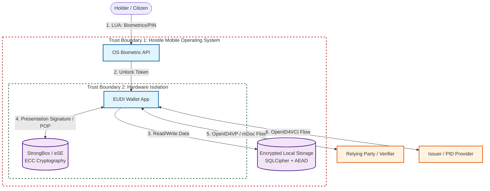

# PASTA Threat Model: EUDI Wallet

## Introduction

This document details the risk-centered threat modeling for the EUDI Wallet ecosystem, adopting the PASTA methodology (*Process for Attack Simulation and Threat Analysis*). The objective is to align security engineering with strategic goals and European regulatory impact (eIDAS 2.0).

---

#### Stage 1: Business Objectives and Impact Definition

Central focus of aligning security engineering with European strategy.

* **Primary Objective:** Enable cross-border authentication, issuance and presentation of Personal Identification Data (PID) and Qualified Electronic Attribute Attestations (QEAAs), ensuring High Assurance Level (LoA), while preserving privacy and exclusive holder control (Digital Sovereignty).
* **Unacceptable Impact (Organizational and Systemic Risk):**
    * **Contagion Effect:** Compromise of cryptographic material allowing identity takeover (creation of fraudulent QES signatures), resulting in irreversible loss of trust in the eIDAS ecosystem.
    * **Regulatory Failure:** Non-compliance with European certification schemes (e.g., EUCC dependent on Common Criteria AVA_VAN.5), culminating in revocation of recognized wallet status.
    * **Financial and Legal Impact:** Improper exposure of personal data triggering maximum GDPR penalties (Art. 83).

#### Stage 2: Technical Scope Definition

Taxonomic mapping of attack surface and dependencies.

* **In-Scope Components:**
    * Mobile Application Instance (Android/Kotlin or iOS/Swift).
    * Key Custody System: TEE (*Trusted Execution Environment*), StrongBox / eSE (*embedded Secure Element*).
    * Local User Authentication Module (LUA - biometrics/PIN).
    * Communication Layer for Proximity (BLE/NFC/Wi-Fi Aware for ISO 18013-5) and Remote (HTTPS/TLS 1.3 for OpenID4VP/OpenID4VCI).
    * Cryptographic Processing Engine (proof of possession / presentation signatures creation).
* **Out-of-Scope Components:**
    * Internal infrastructures of PID Providers and QTSPs (except front-to-back integration interface).
    * Internal validation mechanisms of trust lists on the verifier side.
* **Main Actors:** Holder/User, Verifier/Relying Party, Issuer/PID Provider, Attacker (passive on network or active on device).

#### Stage 3: Application Decomposition

Topological analysis based on trust boundaries and critical data flows.

